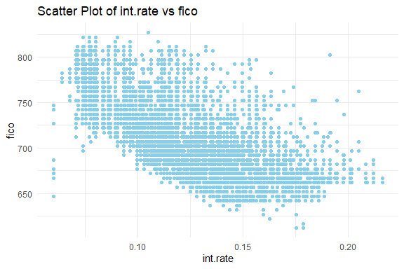
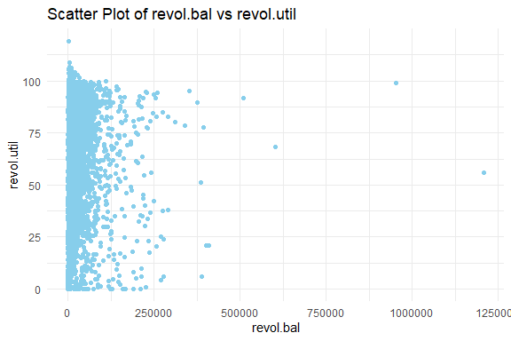

Loan Default Application Prediction
================
Trevor Okinda
2024

- [Student Details](#student-details)
- [Setup Chunk](#setup-chunk)
- [Understanding the Dataset (Exploratory Data Analysis
  (EDA))](#understanding-the-dataset-exploratory-data-analysis-eda)
  - [Loading the Dataset](#loading-the-dataset)
    - [Source:](#source)
    - [Reference:](#reference)
- [Exploratory Data Analysis](#exploratory-data-analysis)
  - [Load dataset](#load-dataset)
  - [Measures of Frequeuncy](#measures-of-frequeuncy)
  - [Measures of Central Tendency](#measures-of-central-tendency)
  - [Measures of Distribution](#measures-of-distribution)
  - [Measures of Relationship](#measures-of-relationship)
  - [ANOVA](#anova)
  - [Plots](#plots)
- [Preprocessing and Data
  Transformation](#preprocessing-and-data-transformation)
  - [Missing Values](#missing-values)
  - [Transformation](#transformation)
- [Training Model](#training-model)
  - [Data Splitting](#data-splitting)
  - [Bootstrapping](#bootstrapping)
  - [Cross-validation](#cross-validation)
  - [Train other models](#train-other-models)
  - [Model performance](#model-performance)
  - [Saving Model](#saving-model)

# Student Details

|                       |                         |
|-----------------------|-------------------------|
| **Student ID Number** | 134780                  |
| **Student Name**      | Trevor Okinda           |
| **BBIT 4.2 Group**    | C                       |
| **Project Name**      | Loan Default Prediction |

# Setup Chunk

**Note:** the following KnitR options have been set as the global
defaults: <BR>
`knitr::opts_chunk$set(echo = TRUE, warning = FALSE, eval = TRUE, collapse = FALSE, tidy = TRUE)`.

More KnitR options are documented here
<https://bookdown.org/yihui/rmarkdown-cookbook/chunk-options.html> and
here <https://yihui.org/knitr/options/>.

# Understanding the Dataset (Exploratory Data Analysis (EDA))

## Loading the Dataset

### Source:

The dataset that was used can be downloaded here: *\<<a
href="https://www.kaggle.com/datasets/urstrulyvikas/lending-club-loan-data-analysis/data\"
class="uri">https://www.kaggle.com/datasets/urstrulyvikas/lending-club-loan-data-analysis/data\</a>\>*

### Reference:

\*\<Chellaboina, V. (2020). Lending Club Loan Data Analysis \[Data
set\]. Kaggle. <a
href="https://www.kaggle.com/datasets/urstrulyvikas/lending-club-loan-data-analysis/datas\"
class="uri">https://www.kaggle.com/datasets/urstrulyvikas/lending-club-loan-data-analysis/datas\</a>\>  

Refer to the APA 7th edition manual for rules on how to cite datasets:
<https://apastyle.apa.org/style-grammar-guidelines/references/examples/data-set-references>\*

# Exploratory Data Analysis

## Load dataset

``` r
# Load the loan dataset
loan_data <-read.csv("loan_data.csv" , colClasses = c(
  credit.policy = "factor",
  purpose = "factor",
  int.rate = "numeric",
  installment = "numeric",
  log.annual.inc = "numeric",
  dti = "numeric",
  fico = "numeric",
  days.with.cr.line = "numeric",
  revol.bal = "numeric",
  revol.util = "numeric",
  inq.last.6mths = "numeric",
  delinq.2yrs = "numeric",
  pub.rec = "numeric",
  not.fully.paid = "factor"
), header = TRUE)

# Display the structure of the dataset
str(loan_data)
```

    ## 'data.frame':    9578 obs. of  14 variables:
    ##  $ credit.policy    : Factor w/ 2 levels "0","1": 2 2 2 2 2 2 2 2 2 2 ...
    ##  $ purpose          : Factor w/ 7 levels "all_other","credit_card",..: 3 2 3 3 2 2 3 1 5 3 ...
    ##  $ int.rate         : num  0.119 0.107 0.136 0.101 0.143 ...
    ##  $ installment      : num  829 228 367 162 103 ...
    ##  $ log.annual.inc   : num  11.4 11.1 10.4 11.4 11.3 ...
    ##  $ dti              : num  19.5 14.3 11.6 8.1 15 ...
    ##  $ fico             : num  737 707 682 712 667 727 667 722 682 707 ...
    ##  $ days.with.cr.line: num  5640 2760 4710 2700 4066 ...
    ##  $ revol.bal        : num  28854 33623 3511 33667 4740 ...
    ##  $ revol.util       : num  52.1 76.7 25.6 73.2 39.5 51 76.8 68.6 51.1 23 ...
    ##  $ inq.last.6mths   : num  0 0 1 1 0 0 0 0 1 1 ...
    ##  $ delinq.2yrs      : num  0 0 0 0 1 0 0 0 0 0 ...
    ##  $ pub.rec          : num  0 0 0 0 0 0 1 0 0 0 ...
    ##  $ not.fully.paid   : Factor w/ 2 levels "0","1": 1 1 1 1 1 1 2 2 1 1 ...

``` r
# View the first few rows of the dataset
head(loan_data)
```

    ##   credit.policy            purpose int.rate installment log.annual.inc   dti
    ## 1             1 debt_consolidation   0.1189      829.10       11.35041 19.48
    ## 2             1        credit_card   0.1071      228.22       11.08214 14.29
    ## 3             1 debt_consolidation   0.1357      366.86       10.37349 11.63
    ## 4             1 debt_consolidation   0.1008      162.34       11.35041  8.10
    ## 5             1        credit_card   0.1426      102.92       11.29973 14.97
    ## 6             1        credit_card   0.0788      125.13       11.90497 16.98
    ##   fico days.with.cr.line revol.bal revol.util inq.last.6mths delinq.2yrs
    ## 1  737          5639.958     28854       52.1              0           0
    ## 2  707          2760.000     33623       76.7              0           0
    ## 3  682          4710.000      3511       25.6              1           0
    ## 4  712          2699.958     33667       73.2              1           0
    ## 5  667          4066.000      4740       39.5              0           1
    ## 6  727          6120.042     50807       51.0              0           0
    ##   pub.rec not.fully.paid
    ## 1       0              0
    ## 2       0              0
    ## 3       0              0
    ## 4       0              0
    ## 5       0              0
    ## 6       0              0

``` r
#View the dataset
View(loan_data)
```

## Measures of Frequeuncy

``` r
# Measures of Frequency for Categorical Variables
cat_vars <- c("credit.policy", "purpose", "not.fully.paid")

cat_freq_summary <- lapply(cat_vars, function(var) {
  cat_freq <- table(loan_data[[var]])
  cat_freq_percentage <- prop.table(cat_freq) * 100
  cat_freq_summary <- data.frame(Frequency = cat_freq, Percentage = cat_freq_percentage)
  cat_freq_summary <- cat_freq_summary[order(-cat_freq), ]
  cat_freq_summary$Percentage <- paste0(format(cat_freq_summary$Percentage, digits = 2), "%")
  cat_freq_summary$Category <- factor(row.names(cat_freq_summary))
  
  return(cat_freq_summary)
})

names(cat_freq_summary) <- cat_vars

# Output results
cat_freq_summary
```

    ## $credit.policy
    ##   Frequency.Var1 Frequency.Freq Percentage.Var1 Percentage.Freq Percentage
    ## 2              1           7710               1        80.49697      NULL%
    ## 1              0           1868               0        19.50303      NULL%
    ##   Category
    ## 2        2
    ## 1        1
    ## 
    ## $purpose
    ##       Frequency.Var1 Frequency.Freq    Percentage.Var1 Percentage.Freq
    ## 3 debt_consolidation           3957 debt_consolidation       41.313427
    ## 1          all_other           2331          all_other       24.337022
    ## 2        credit_card           1262        credit_card       13.176028
    ## 5   home_improvement            629   home_improvement        6.567133
    ## 7     small_business            619     small_business        6.462727
    ## 6     major_purchase            437     major_purchase        4.562539
    ## 4        educational            343        educational        3.581123
    ##   Percentage Category
    ## 3      NULL%        3
    ## 1      NULL%        1
    ## 2      NULL%        2
    ## 5      NULL%        5
    ## 7      NULL%        7
    ## 6      NULL%        6
    ## 4      NULL%        4
    ## 
    ## $not.fully.paid
    ##   Frequency.Var1 Frequency.Freq Percentage.Var1 Percentage.Freq Percentage
    ## 1              0           8045               0        83.99457      NULL%
    ## 2              1           1533               1        16.00543      NULL%
    ##   Category
    ## 1        1
    ## 2        2

## Measures of Central Tendency

``` r
# Define numerical variables
num_vars <- c("int.rate", "installment", "log.annual.inc", "dti", "fico", 
              "days.with.cr.line", "revol.bal", "revol.util", 
              "inq.last.6mths", "delinq.2yrs", "pub.rec")

# Calculate measures of central tendency
central_tendency <- sapply(loan_data[num_vars], function(x) {
  mean_val <- mean(x, na.rm = TRUE)
  median_val <- median(x, na.rm = TRUE)
  mode_val <- as.numeric(names(sort(table(x), decreasing = TRUE)[1]))
  
  return(c(Mean = mean_val, Median = median_val, Mode = mode_val))
})

# Add variable names
rownames(central_tendency) <- c("Mean", "Median", "Mode")

# Output results
central_tendency
```

    ##         int.rate installment log.annual.inc      dti     fico days.with.cr.line
    ## Mean   0.1226401    319.0894       10.93212 12.60668 710.8463          4560.767
    ## Median 0.1221000    268.9500       10.92888 12.66500 707.0000          4139.958
    ## Mode   0.1253000    317.7200       11.00210  0.00000 687.0000          3660.000
    ##        revol.bal revol.util inq.last.6mths delinq.2yrs    pub.rec
    ## Mean    16913.96   46.79924       1.577469   0.1637085 0.06212153
    ## Median   8596.00   46.30000       1.000000   0.0000000 0.00000000
    ## Mode        0.00    0.00000       0.000000   0.0000000 0.00000000

## Measures of Distribution

``` r
# Define numerical variables
num_vars <- c("int.rate", "installment", "log.annual.inc", "dti", "fico", 
              "days.with.cr.line", "revol.bal", "revol.util", 
              "inq.last.6mths", "delinq.2yrs", "pub.rec")

# Calculate measures of distribution
distribution_measures <- sapply(loan_data[num_vars], function(x) {
  range_val <- range(x, na.rm = TRUE)
  variance_val <- var(x, na.rm = TRUE)
  sd_val <- sd(x, na.rm = TRUE)
  
  return(c(Range = paste(range_val, collapse = " - "), 
           Variance = variance_val, 
           SD = sd_val))
})

# Output results
distribution_measures
```

    ##          int.rate              installment        log.annual.inc             
    ## Range    "0.06 - 0.2164"       "15.67 - 940.14"   "7.547501683 - 14.52835448"
    ## Variance "0.00072076072243551" "42878.5239048452" "0.377994719228204"        
    ## SD       "0.0268469872133822"  "207.071301499858" "0.614812751354592"        
    ##          dti                fico               days.with.cr.line          
    ## Range    "0 - 29.96"        "612 - 827"        "178.9583333 - 17639.95833"
    ## Variance "47.3890366350772" "1441.76169728525" "6234661.30664326"         
    ## SD       "6.88396954053962" "37.9705372267137" "2496.93037681135"         
    ##          revol.bal          revol.util         inq.last.6mths    
    ## Range    "0 - 1207359"      "0 - 119"          "0 - 33"          
    ## Variance "1139480333.42503" "841.83639185608"  "4.84107944590311"
    ## SD       "33756.1895572505" "29.0144169656411" "2.2002453149372" 
    ##          delinq.2yrs         pub.rec             
    ## Range    "0 - 13"            "0 - 5"             
    ## Variance "0.298350743878898" "0.0687102109784716"
    ## SD       "0.546214924621159" "0.262126326374272"

## Measures of Relationship

``` r
# Define numerical variables
num_vars <- c("int.rate", "installment", "log.annual.inc", "dti", "fico", 
              "days.with.cr.line", "revol.bal", "revol.util", 
              "inq.last.6mths", "delinq.2yrs", "pub.rec")

# Calculate correlation matrix
correlation_matrix <- cor(loan_data[num_vars], use = "pairwise.complete.obs")

# Output results
correlation_matrix
```

    ##                      int.rate  installment log.annual.inc          dti
    ## int.rate           1.00000000  0.276140176     0.05638254  0.220005629
    ## installment        0.27614018  1.000000000     0.44810215  0.050201841
    ## log.annual.inc     0.05638254  0.448102154     1.00000000 -0.054064762
    ## dti                0.22000563  0.050201841    -0.05406476  1.000000000
    ## fico              -0.71482077  0.086039394     0.11457595 -0.241190985
    ## days.with.cr.line -0.12402216  0.183297427     0.33689639  0.060101120
    ## revol.bal          0.09252705  0.233625400     0.37213960  0.188747784
    ## revol.util         0.46483728  0.081356217     0.05488106  0.337109179
    ## inq.last.6mths     0.20278026 -0.010418675     0.02917129  0.029189016
    ## delinq.2yrs        0.15607873 -0.004367654     0.02920327 -0.021792180
    ## pub.rec            0.09816221 -0.032759675     0.01650648  0.006208759
    ##                          fico days.with.cr.line   revol.bal  revol.util
    ## int.rate          -0.71482077       -0.12402216  0.09252705  0.46483728
    ## installment        0.08603939        0.18329743  0.23362540  0.08135622
    ## log.annual.inc     0.11457595        0.33689639  0.37213960  0.05488106
    ## dti               -0.24119099        0.06010112  0.18874778  0.33710918
    ## fico               1.00000000        0.26387975 -0.01555250 -0.54128934
    ## days.with.cr.line  0.26387975        1.00000000  0.22934416 -0.02423925
    ## revol.bal         -0.01555250        0.22934416  1.00000000  0.20377904
    ## revol.util        -0.54128934       -0.02423925  0.20377904  1.00000000
    ## inq.last.6mths    -0.18529299       -0.04173642  0.02239448 -0.01387989
    ## delinq.2yrs       -0.21633953        0.08137375 -0.03324306 -0.04273999
    ## pub.rec           -0.14759196        0.07182617 -0.03100964  0.06671655
    ##                   inq.last.6mths  delinq.2yrs      pub.rec
    ## int.rate              0.20278026  0.156078730  0.098162208
    ## installment          -0.01041868 -0.004367654 -0.032759675
    ## log.annual.inc        0.02917129  0.029203269  0.016506475
    ## dti                   0.02918902 -0.021792180  0.006208759
    ## fico                 -0.18529299 -0.216339530 -0.147591956
    ## days.with.cr.line    -0.04173642  0.081373752  0.071826169
    ## revol.bal             0.02239448 -0.033243065 -0.031009638
    ## revol.util           -0.01387989 -0.042739992  0.066716548
    ## inq.last.6mths        1.00000000  0.021245402  0.072672891
    ## delinq.2yrs           0.02124540  1.000000000  0.009184189
    ## pub.rec               0.07267289  0.009184189  1.000000000

## ANOVA

``` r
# Perform ANOVA
anova_result <- aov(int.rate ~ purpose, data = loan_data)

# Summary of ANOVA results
summary(anova_result)
```

    ##               Df Sum Sq Mean Sq F value Pr(>F)    
    ## purpose        6  0.351 0.05850   85.46 <2e-16 ***
    ## Residuals   9571  6.552 0.00068                   
    ## ---
    ## Signif. codes:  0 '***' 0.001 '**' 0.01 '*' 0.05 '.' 0.1 ' ' 1

## Plots

``` r
# Load necessary libraries
library(ggplot2)
# Univariate Plots
# Histograms for numerical variables
num_vars <- c("int.rate", "installment", "log.annual.inc", "dti", "fico", 
              "days.with.cr.line", "revol.bal", "revol.util", 
              "inq.last.6mths", "delinq.2yrs", "pub.rec")

for (var in num_vars) {
  p <- ggplot(loan_data, aes(x = loan_data[[var]])) +
    geom_histogram(fill = "skyblue", color = "black", bins = 30) +
    labs(title = paste("Histogram of", var), x = var, y = "Frequency") +
    theme_minimal()
  
  print(p)
}
```

<!-- --><!-- --><!-- --><!-- --><!-- --><!-- --><!-- --><!-- --><!-- --><!-- --><!-- -->

``` r
# Bar plots for categorical variables
cat_vars <- c("credit.policy", "purpose", "not.fully.paid")

for (var in cat_vars) {
  p <- ggplot(loan_data, aes(x = loan_data[[var]])) +
    geom_bar(fill = "skyblue", color = "black") +
    labs(title = paste("Bar Plot of", var), x = var, y = "Frequency") +
    theme_minimal()
  
  print(p)
}
```

<!-- --><!-- --><!-- -->

``` r
# Multivariate Plots
# Scatter plots for pairs of numerical variables
num_vars <- c("int.rate", "installment", "log.annual.inc", "dti", "fico", 
              "days.with.cr.line", "revol.bal", "revol.util", 
              "inq.last.6mths", "delinq.2yrs", "pub.rec")

num_plots <- combn(num_vars, 2, simplify = FALSE)

scatter_plots <- lapply(num_plots, function(vars) {
  p <- ggplot(loan_data, aes(x = .data[[vars[1]]], y = .data[[vars[2]]])) +
    geom_point(color = "skyblue") +
    labs(title = paste("Scatter Plot of", vars[1], "vs", vars[2]),
         x = vars[1], y = vars[2]) +
    theme_minimal()
  
  return(p)
})

# Grouped bar plots for pairs of categorical variables
cat_vars <- c("credit.policy", "purpose", "not.fully.paid")

cat_plots <- lapply(cat_vars, function(cat_var) {
  p <- ggplot(loan_data, aes(x = .data[[cat_var]], fill = .data[[cat_vars[1]]])) +
    geom_bar(position = "dodge") +
    labs(title = paste("Grouped Bar Plot of", cat_var, "vs", cat_vars[1]),
         x = cat_var, y = "Frequency") +
    theme_minimal() +
    facet_grid(~ cat_vars[2], scales = "free_y")
  
  return(p)
})

# Output results
print(scatter_plots)
```

    ## [[1]]

<!-- -->

    ## 
    ## [[2]]

<!-- -->

    ## 
    ## [[3]]

<!-- -->

    ## 
    ## [[4]]

<!-- -->

    ## 
    ## [[5]]

<!-- -->

    ## 
    ## [[6]]

<!-- -->

    ## 
    ## [[7]]

<!-- -->

    ## 
    ## [[8]]

<!-- -->

    ## 
    ## [[9]]

<!-- -->

    ## 
    ## [[10]]

<!-- -->

    ## 
    ## [[11]]

<!-- -->

    ## 
    ## [[12]]

<!-- -->

    ## 
    ## [[13]]

<!-- -->

    ## 
    ## [[14]]

<!-- -->

    ## 
    ## [[15]]

<!-- -->

    ## 
    ## [[16]]

<!-- -->

    ## 
    ## [[17]]

<!-- -->

    ## 
    ## [[18]]

<!-- -->

    ## 
    ## [[19]]

<!-- -->

    ## 
    ## [[20]]

<!-- -->

    ## 
    ## [[21]]

<!-- -->

    ## 
    ## [[22]]

<!-- -->

    ## 
    ## [[23]]

<!-- -->

    ## 
    ## [[24]]

<!-- -->

    ## 
    ## [[25]]

<!-- -->

    ## 
    ## [[26]]

<!-- -->

    ## 
    ## [[27]]

<!-- -->

    ## 
    ## [[28]]

<!-- -->

    ## 
    ## [[29]]

<!-- -->

    ## 
    ## [[30]]

<!-- -->

    ## 
    ## [[31]]

<!-- -->

    ## 
    ## [[32]]

<!-- -->

    ## 
    ## [[33]]

<!-- -->

    ## 
    ## [[34]]

<!-- -->

    ## 
    ## [[35]]

<!-- -->

    ## 
    ## [[36]]

<!-- -->

    ## 
    ## [[37]]

<!-- -->

    ## 
    ## [[38]]

<!-- -->

    ## 
    ## [[39]]

<!-- -->

    ## 
    ## [[40]]

<!-- -->

    ## 
    ## [[41]]

<!-- -->

    ## 
    ## [[42]]

<!-- -->

    ## 
    ## [[43]]

<!-- -->

    ## 
    ## [[44]]

<!-- -->

    ## 
    ## [[45]]

<!-- -->

    ## 
    ## [[46]]

<!-- -->

    ## 
    ## [[47]]

<!-- -->

    ## 
    ## [[48]]

<!-- -->

    ## 
    ## [[49]]

<!-- -->

    ## 
    ## [[50]]

<!-- -->

    ## 
    ## [[51]]

<!-- -->

    ## 
    ## [[52]]

<!-- -->

    ## 
    ## [[53]]

<!-- -->

    ## 
    ## [[54]]

<!-- -->

    ## 
    ## [[55]]

<!-- -->

``` r
print(cat_plots)
```

    ## [[1]]

<!-- -->

    ## 
    ## [[2]]

<!-- -->

    ## 
    ## [[3]]

<!-- -->

# Preprocessing and Data Transformation

## Missing Values

``` r
# Check for missing values
missing_values <- colSums(is.na(loan_data))

# Display the presence of missing values
print(missing_values)
```

    ##     credit.policy           purpose          int.rate       installment 
    ##                 0                 0                 0                 0 
    ##    log.annual.inc               dti              fico days.with.cr.line 
    ##                 0                 0                 0                 0 
    ##         revol.bal        revol.util    inq.last.6mths       delinq.2yrs 
    ##                 0                 0                 0                 0 
    ##           pub.rec    not.fully.paid 
    ##                 0                 0

## Transformation

``` r
# Convert categorical variables to factors
loan_data$credit.policy <- as.factor(loan_data$credit.policy)
loan_data$purpose <- as.factor(loan_data$purpose)
loan_data$not.fully.paid <- as.factor(loan_data$not.fully.paid)

# Apply label encoding
loan_data$credit.policy <- as.numeric(loan_data$credit.policy)
loan_data$purpose <- as.numeric(loan_data$purpose)
loan_data$not.fully.paid <- as.numeric(loan_data$not.fully.paid)

# Display the transformed dataset
head(loan_data)
```

    ##   credit.policy purpose int.rate installment log.annual.inc   dti fico
    ## 1             2       3   0.1189      829.10       11.35041 19.48  737
    ## 2             2       2   0.1071      228.22       11.08214 14.29  707
    ## 3             2       3   0.1357      366.86       10.37349 11.63  682
    ## 4             2       3   0.1008      162.34       11.35041  8.10  712
    ## 5             2       2   0.1426      102.92       11.29973 14.97  667
    ## 6             2       2   0.0788      125.13       11.90497 16.98  727
    ##   days.with.cr.line revol.bal revol.util inq.last.6mths delinq.2yrs pub.rec
    ## 1          5639.958     28854       52.1              0           0       0
    ## 2          2760.000     33623       76.7              0           0       0
    ## 3          4710.000      3511       25.6              1           0       0
    ## 4          2699.958     33667       73.2              1           0       0
    ## 5          4066.000      4740       39.5              0           1       0
    ## 6          6120.042     50807       51.0              0           0       0
    ##   not.fully.paid
    ## 1              1
    ## 2              1
    ## 3              1
    ## 4              1
    ## 5              1
    ## 6              1

# Training Model

## Data Splitting

``` r
# Load necessary libraries
library(caret)
```

    ## Loading required package: lattice

``` r
# Convert categorical variables to factors
loan_data$credit.policy <- as.factor(loan_data$credit.policy)
loan_data$purpose <- as.factor(loan_data$purpose)
loan_data$not.fully.paid <- as.factor(loan_data$not.fully.paid)

# Split the dataset into training and testing sets
set.seed(123)  # Set seed for reproducibility
train_index <- createDataPartition(loan_data$not.fully.paid, p = 0.7, list = FALSE)
train_data <- loan_data[train_index, ]
test_data <- loan_data[-train_index, ]

# Display the dimensions of the training and testing sets
cat("Training set size:", nrow(train_data), "\n")
```

    ## Training set size: 6706

``` r
cat("Testing set size:", nrow(test_data), "\n")
```

    ## Testing set size: 2872

## Bootstrapping

``` r
library(boot)
```

    ## 
    ## Attaching package: 'boot'

    ## The following object is masked from 'package:lattice':
    ## 
    ##     melanoma

``` r
# Define a function to compute the statistic of interest
# For example, let's calculate the mean of the 'int.rate' variable
mean_statistic <- function(data, indices) {
  return(mean(data[indices, "int.rate"], na.rm = TRUE))
}

# Perform bootstrapping
set.seed(123)  # Set seed for reproducibility
boot_result <- boot(data = loan_data, statistic = mean_statistic, R = 1000)

# Display the bootstrap results
print(boot_result)
```

    ## 
    ## ORDINARY NONPARAMETRIC BOOTSTRAP
    ## 
    ## 
    ## Call:
    ## boot(data = loan_data, statistic = mean_statistic, R = 1000)
    ## 
    ## 
    ## Bootstrap Statistics :
    ##      original       bias     std. error
    ## t1* 0.1226401 6.511349e-06 0.0002781236

## Cross-validation

``` r
# Define control parameters for repeated k-fold cross-validation
ctrl <- trainControl(method = "repeatedcv",  # Use repeated k-fold cross-validation
                     number = 10,            # Number of folds
                     repeats = 3,            # Number of repeats
                     verboseIter = TRUE)     # Show iteration progress

# Train a classification model using repeated k-fold cross-validation
set.seed(123)  # Set seed for reproducibility
model <- train(not.fully.paid ~ .,         # Predict 'not.fully.paid' based on all other variables
               data = loan_data,           # Training data
               method = "glm",             # Use Generalized Linear Model (logistic regression)
               trControl = ctrl)           # Use defined control parameters
```

    ## + Fold01.Rep1: parameter=none 
    ## - Fold01.Rep1: parameter=none 
    ## + Fold02.Rep1: parameter=none 
    ## - Fold02.Rep1: parameter=none 
    ## + Fold03.Rep1: parameter=none 
    ## - Fold03.Rep1: parameter=none 
    ## + Fold04.Rep1: parameter=none 
    ## - Fold04.Rep1: parameter=none 
    ## + Fold05.Rep1: parameter=none 
    ## - Fold05.Rep1: parameter=none 
    ## + Fold06.Rep1: parameter=none 
    ## - Fold06.Rep1: parameter=none 
    ## + Fold07.Rep1: parameter=none 
    ## - Fold07.Rep1: parameter=none 
    ## + Fold08.Rep1: parameter=none 
    ## - Fold08.Rep1: parameter=none 
    ## + Fold09.Rep1: parameter=none 
    ## - Fold09.Rep1: parameter=none 
    ## + Fold10.Rep1: parameter=none 
    ## - Fold10.Rep1: parameter=none 
    ## + Fold01.Rep2: parameter=none 
    ## - Fold01.Rep2: parameter=none 
    ## + Fold02.Rep2: parameter=none 
    ## - Fold02.Rep2: parameter=none 
    ## + Fold03.Rep2: parameter=none 
    ## - Fold03.Rep2: parameter=none 
    ## + Fold04.Rep2: parameter=none 
    ## - Fold04.Rep2: parameter=none 
    ## + Fold05.Rep2: parameter=none 
    ## - Fold05.Rep2: parameter=none 
    ## + Fold06.Rep2: parameter=none 
    ## - Fold06.Rep2: parameter=none 
    ## + Fold07.Rep2: parameter=none 
    ## - Fold07.Rep2: parameter=none 
    ## + Fold08.Rep2: parameter=none 
    ## - Fold08.Rep2: parameter=none 
    ## + Fold09.Rep2: parameter=none 
    ## - Fold09.Rep2: parameter=none 
    ## + Fold10.Rep2: parameter=none 
    ## - Fold10.Rep2: parameter=none 
    ## + Fold01.Rep3: parameter=none 
    ## - Fold01.Rep3: parameter=none 
    ## + Fold02.Rep3: parameter=none 
    ## - Fold02.Rep3: parameter=none 
    ## + Fold03.Rep3: parameter=none 
    ## - Fold03.Rep3: parameter=none 
    ## + Fold04.Rep3: parameter=none 
    ## - Fold04.Rep3: parameter=none 
    ## + Fold05.Rep3: parameter=none 
    ## - Fold05.Rep3: parameter=none 
    ## + Fold06.Rep3: parameter=none 
    ## - Fold06.Rep3: parameter=none 
    ## + Fold07.Rep3: parameter=none 
    ## - Fold07.Rep3: parameter=none 
    ## + Fold08.Rep3: parameter=none 
    ## - Fold08.Rep3: parameter=none 
    ## + Fold09.Rep3: parameter=none 
    ## - Fold09.Rep3: parameter=none 
    ## + Fold10.Rep3: parameter=none 
    ## - Fold10.Rep3: parameter=none 
    ## Aggregating results
    ## Fitting final model on full training set

``` r
# Display the model
print(model)
```

    ## Generalized Linear Model 
    ## 
    ## 9578 samples
    ##   13 predictor
    ##    2 classes: '1', '2' 
    ## 
    ## No pre-processing
    ## Resampling: Cross-Validated (10 fold, repeated 3 times) 
    ## Summary of sample sizes: 8620, 8619, 8621, 8620, 8620, 8620, ... 
    ## Resampling results:
    ## 
    ##   Accuracy   Kappa     
    ##   0.8397019  0.03771484

## Train other models

``` r
# Train gradient boosting model
set.seed(123)  # Set seed for reproducibility
gbm_model <- train(not.fully.paid ~ .,         # Predict 'not.fully.paid' based on all other variables
                   data = loan_data,           # Training data
                   method = "gbm",            # Use Gradient Boosting Machine
                   trControl = ctrl,          # Use defined control parameters
                   verbose = FALSE)           # Suppress verbose output
```

    ## + Fold01.Rep1: shrinkage=0.1, interaction.depth=1, n.minobsinnode=10, n.trees=150 
    ## - Fold01.Rep1: shrinkage=0.1, interaction.depth=1, n.minobsinnode=10, n.trees=150 
    ## + Fold01.Rep1: shrinkage=0.1, interaction.depth=2, n.minobsinnode=10, n.trees=150 
    ## - Fold01.Rep1: shrinkage=0.1, interaction.depth=2, n.minobsinnode=10, n.trees=150 
    ## + Fold01.Rep1: shrinkage=0.1, interaction.depth=3, n.minobsinnode=10, n.trees=150 
    ## - Fold01.Rep1: shrinkage=0.1, interaction.depth=3, n.minobsinnode=10, n.trees=150 
    ## + Fold02.Rep1: shrinkage=0.1, interaction.depth=1, n.minobsinnode=10, n.trees=150 
    ## - Fold02.Rep1: shrinkage=0.1, interaction.depth=1, n.minobsinnode=10, n.trees=150 
    ## + Fold02.Rep1: shrinkage=0.1, interaction.depth=2, n.minobsinnode=10, n.trees=150 
    ## - Fold02.Rep1: shrinkage=0.1, interaction.depth=2, n.minobsinnode=10, n.trees=150 
    ## + Fold02.Rep1: shrinkage=0.1, interaction.depth=3, n.minobsinnode=10, n.trees=150 
    ## - Fold02.Rep1: shrinkage=0.1, interaction.depth=3, n.minobsinnode=10, n.trees=150 
    ## + Fold03.Rep1: shrinkage=0.1, interaction.depth=1, n.minobsinnode=10, n.trees=150 
    ## - Fold03.Rep1: shrinkage=0.1, interaction.depth=1, n.minobsinnode=10, n.trees=150 
    ## + Fold03.Rep1: shrinkage=0.1, interaction.depth=2, n.minobsinnode=10, n.trees=150 
    ## - Fold03.Rep1: shrinkage=0.1, interaction.depth=2, n.minobsinnode=10, n.trees=150 
    ## + Fold03.Rep1: shrinkage=0.1, interaction.depth=3, n.minobsinnode=10, n.trees=150 
    ## - Fold03.Rep1: shrinkage=0.1, interaction.depth=3, n.minobsinnode=10, n.trees=150 
    ## + Fold04.Rep1: shrinkage=0.1, interaction.depth=1, n.minobsinnode=10, n.trees=150 
    ## - Fold04.Rep1: shrinkage=0.1, interaction.depth=1, n.minobsinnode=10, n.trees=150 
    ## + Fold04.Rep1: shrinkage=0.1, interaction.depth=2, n.minobsinnode=10, n.trees=150 
    ## - Fold04.Rep1: shrinkage=0.1, interaction.depth=2, n.minobsinnode=10, n.trees=150 
    ## + Fold04.Rep1: shrinkage=0.1, interaction.depth=3, n.minobsinnode=10, n.trees=150 
    ## - Fold04.Rep1: shrinkage=0.1, interaction.depth=3, n.minobsinnode=10, n.trees=150 
    ## + Fold05.Rep1: shrinkage=0.1, interaction.depth=1, n.minobsinnode=10, n.trees=150 
    ## - Fold05.Rep1: shrinkage=0.1, interaction.depth=1, n.minobsinnode=10, n.trees=150 
    ## + Fold05.Rep1: shrinkage=0.1, interaction.depth=2, n.minobsinnode=10, n.trees=150 
    ## - Fold05.Rep1: shrinkage=0.1, interaction.depth=2, n.minobsinnode=10, n.trees=150 
    ## + Fold05.Rep1: shrinkage=0.1, interaction.depth=3, n.minobsinnode=10, n.trees=150 
    ## - Fold05.Rep1: shrinkage=0.1, interaction.depth=3, n.minobsinnode=10, n.trees=150 
    ## + Fold06.Rep1: shrinkage=0.1, interaction.depth=1, n.minobsinnode=10, n.trees=150 
    ## - Fold06.Rep1: shrinkage=0.1, interaction.depth=1, n.minobsinnode=10, n.trees=150 
    ## + Fold06.Rep1: shrinkage=0.1, interaction.depth=2, n.minobsinnode=10, n.trees=150 
    ## - Fold06.Rep1: shrinkage=0.1, interaction.depth=2, n.minobsinnode=10, n.trees=150 
    ## + Fold06.Rep1: shrinkage=0.1, interaction.depth=3, n.minobsinnode=10, n.trees=150 
    ## - Fold06.Rep1: shrinkage=0.1, interaction.depth=3, n.minobsinnode=10, n.trees=150 
    ## + Fold07.Rep1: shrinkage=0.1, interaction.depth=1, n.minobsinnode=10, n.trees=150 
    ## - Fold07.Rep1: shrinkage=0.1, interaction.depth=1, n.minobsinnode=10, n.trees=150 
    ## + Fold07.Rep1: shrinkage=0.1, interaction.depth=2, n.minobsinnode=10, n.trees=150 
    ## - Fold07.Rep1: shrinkage=0.1, interaction.depth=2, n.minobsinnode=10, n.trees=150 
    ## + Fold07.Rep1: shrinkage=0.1, interaction.depth=3, n.minobsinnode=10, n.trees=150 
    ## - Fold07.Rep1: shrinkage=0.1, interaction.depth=3, n.minobsinnode=10, n.trees=150 
    ## + Fold08.Rep1: shrinkage=0.1, interaction.depth=1, n.minobsinnode=10, n.trees=150 
    ## - Fold08.Rep1: shrinkage=0.1, interaction.depth=1, n.minobsinnode=10, n.trees=150 
    ## + Fold08.Rep1: shrinkage=0.1, interaction.depth=2, n.minobsinnode=10, n.trees=150 
    ## - Fold08.Rep1: shrinkage=0.1, interaction.depth=2, n.minobsinnode=10, n.trees=150 
    ## + Fold08.Rep1: shrinkage=0.1, interaction.depth=3, n.minobsinnode=10, n.trees=150 
    ## - Fold08.Rep1: shrinkage=0.1, interaction.depth=3, n.minobsinnode=10, n.trees=150 
    ## + Fold09.Rep1: shrinkage=0.1, interaction.depth=1, n.minobsinnode=10, n.trees=150 
    ## - Fold09.Rep1: shrinkage=0.1, interaction.depth=1, n.minobsinnode=10, n.trees=150 
    ## + Fold09.Rep1: shrinkage=0.1, interaction.depth=2, n.minobsinnode=10, n.trees=150 
    ## - Fold09.Rep1: shrinkage=0.1, interaction.depth=2, n.minobsinnode=10, n.trees=150 
    ## + Fold09.Rep1: shrinkage=0.1, interaction.depth=3, n.minobsinnode=10, n.trees=150 
    ## - Fold09.Rep1: shrinkage=0.1, interaction.depth=3, n.minobsinnode=10, n.trees=150 
    ## + Fold10.Rep1: shrinkage=0.1, interaction.depth=1, n.minobsinnode=10, n.trees=150 
    ## - Fold10.Rep1: shrinkage=0.1, interaction.depth=1, n.minobsinnode=10, n.trees=150 
    ## + Fold10.Rep1: shrinkage=0.1, interaction.depth=2, n.minobsinnode=10, n.trees=150 
    ## - Fold10.Rep1: shrinkage=0.1, interaction.depth=2, n.minobsinnode=10, n.trees=150 
    ## + Fold10.Rep1: shrinkage=0.1, interaction.depth=3, n.minobsinnode=10, n.trees=150 
    ## - Fold10.Rep1: shrinkage=0.1, interaction.depth=3, n.minobsinnode=10, n.trees=150 
    ## + Fold01.Rep2: shrinkage=0.1, interaction.depth=1, n.minobsinnode=10, n.trees=150 
    ## - Fold01.Rep2: shrinkage=0.1, interaction.depth=1, n.minobsinnode=10, n.trees=150 
    ## + Fold01.Rep2: shrinkage=0.1, interaction.depth=2, n.minobsinnode=10, n.trees=150 
    ## - Fold01.Rep2: shrinkage=0.1, interaction.depth=2, n.minobsinnode=10, n.trees=150 
    ## + Fold01.Rep2: shrinkage=0.1, interaction.depth=3, n.minobsinnode=10, n.trees=150 
    ## - Fold01.Rep2: shrinkage=0.1, interaction.depth=3, n.minobsinnode=10, n.trees=150 
    ## + Fold02.Rep2: shrinkage=0.1, interaction.depth=1, n.minobsinnode=10, n.trees=150 
    ## - Fold02.Rep2: shrinkage=0.1, interaction.depth=1, n.minobsinnode=10, n.trees=150 
    ## + Fold02.Rep2: shrinkage=0.1, interaction.depth=2, n.minobsinnode=10, n.trees=150 
    ## - Fold02.Rep2: shrinkage=0.1, interaction.depth=2, n.minobsinnode=10, n.trees=150 
    ## + Fold02.Rep2: shrinkage=0.1, interaction.depth=3, n.minobsinnode=10, n.trees=150 
    ## - Fold02.Rep2: shrinkage=0.1, interaction.depth=3, n.minobsinnode=10, n.trees=150 
    ## + Fold03.Rep2: shrinkage=0.1, interaction.depth=1, n.minobsinnode=10, n.trees=150 
    ## - Fold03.Rep2: shrinkage=0.1, interaction.depth=1, n.minobsinnode=10, n.trees=150 
    ## + Fold03.Rep2: shrinkage=0.1, interaction.depth=2, n.minobsinnode=10, n.trees=150 
    ## - Fold03.Rep2: shrinkage=0.1, interaction.depth=2, n.minobsinnode=10, n.trees=150 
    ## + Fold03.Rep2: shrinkage=0.1, interaction.depth=3, n.minobsinnode=10, n.trees=150 
    ## - Fold03.Rep2: shrinkage=0.1, interaction.depth=3, n.minobsinnode=10, n.trees=150 
    ## + Fold04.Rep2: shrinkage=0.1, interaction.depth=1, n.minobsinnode=10, n.trees=150 
    ## - Fold04.Rep2: shrinkage=0.1, interaction.depth=1, n.minobsinnode=10, n.trees=150 
    ## + Fold04.Rep2: shrinkage=0.1, interaction.depth=2, n.minobsinnode=10, n.trees=150 
    ## - Fold04.Rep2: shrinkage=0.1, interaction.depth=2, n.minobsinnode=10, n.trees=150 
    ## + Fold04.Rep2: shrinkage=0.1, interaction.depth=3, n.minobsinnode=10, n.trees=150 
    ## - Fold04.Rep2: shrinkage=0.1, interaction.depth=3, n.minobsinnode=10, n.trees=150 
    ## + Fold05.Rep2: shrinkage=0.1, interaction.depth=1, n.minobsinnode=10, n.trees=150 
    ## - Fold05.Rep2: shrinkage=0.1, interaction.depth=1, n.minobsinnode=10, n.trees=150 
    ## + Fold05.Rep2: shrinkage=0.1, interaction.depth=2, n.minobsinnode=10, n.trees=150 
    ## - Fold05.Rep2: shrinkage=0.1, interaction.depth=2, n.minobsinnode=10, n.trees=150 
    ## + Fold05.Rep2: shrinkage=0.1, interaction.depth=3, n.minobsinnode=10, n.trees=150 
    ## - Fold05.Rep2: shrinkage=0.1, interaction.depth=3, n.minobsinnode=10, n.trees=150 
    ## + Fold06.Rep2: shrinkage=0.1, interaction.depth=1, n.minobsinnode=10, n.trees=150 
    ## - Fold06.Rep2: shrinkage=0.1, interaction.depth=1, n.minobsinnode=10, n.trees=150 
    ## + Fold06.Rep2: shrinkage=0.1, interaction.depth=2, n.minobsinnode=10, n.trees=150 
    ## - Fold06.Rep2: shrinkage=0.1, interaction.depth=2, n.minobsinnode=10, n.trees=150 
    ## + Fold06.Rep2: shrinkage=0.1, interaction.depth=3, n.minobsinnode=10, n.trees=150 
    ## - Fold06.Rep2: shrinkage=0.1, interaction.depth=3, n.minobsinnode=10, n.trees=150 
    ## + Fold07.Rep2: shrinkage=0.1, interaction.depth=1, n.minobsinnode=10, n.trees=150 
    ## - Fold07.Rep2: shrinkage=0.1, interaction.depth=1, n.minobsinnode=10, n.trees=150 
    ## + Fold07.Rep2: shrinkage=0.1, interaction.depth=2, n.minobsinnode=10, n.trees=150 
    ## - Fold07.Rep2: shrinkage=0.1, interaction.depth=2, n.minobsinnode=10, n.trees=150 
    ## + Fold07.Rep2: shrinkage=0.1, interaction.depth=3, n.minobsinnode=10, n.trees=150 
    ## - Fold07.Rep2: shrinkage=0.1, interaction.depth=3, n.minobsinnode=10, n.trees=150 
    ## + Fold08.Rep2: shrinkage=0.1, interaction.depth=1, n.minobsinnode=10, n.trees=150 
    ## - Fold08.Rep2: shrinkage=0.1, interaction.depth=1, n.minobsinnode=10, n.trees=150 
    ## + Fold08.Rep2: shrinkage=0.1, interaction.depth=2, n.minobsinnode=10, n.trees=150 
    ## - Fold08.Rep2: shrinkage=0.1, interaction.depth=2, n.minobsinnode=10, n.trees=150 
    ## + Fold08.Rep2: shrinkage=0.1, interaction.depth=3, n.minobsinnode=10, n.trees=150 
    ## - Fold08.Rep2: shrinkage=0.1, interaction.depth=3, n.minobsinnode=10, n.trees=150 
    ## + Fold09.Rep2: shrinkage=0.1, interaction.depth=1, n.minobsinnode=10, n.trees=150 
    ## - Fold09.Rep2: shrinkage=0.1, interaction.depth=1, n.minobsinnode=10, n.trees=150 
    ## + Fold09.Rep2: shrinkage=0.1, interaction.depth=2, n.minobsinnode=10, n.trees=150 
    ## - Fold09.Rep2: shrinkage=0.1, interaction.depth=2, n.minobsinnode=10, n.trees=150 
    ## + Fold09.Rep2: shrinkage=0.1, interaction.depth=3, n.minobsinnode=10, n.trees=150 
    ## - Fold09.Rep2: shrinkage=0.1, interaction.depth=3, n.minobsinnode=10, n.trees=150 
    ## + Fold10.Rep2: shrinkage=0.1, interaction.depth=1, n.minobsinnode=10, n.trees=150 
    ## - Fold10.Rep2: shrinkage=0.1, interaction.depth=1, n.minobsinnode=10, n.trees=150 
    ## + Fold10.Rep2: shrinkage=0.1, interaction.depth=2, n.minobsinnode=10, n.trees=150 
    ## - Fold10.Rep2: shrinkage=0.1, interaction.depth=2, n.minobsinnode=10, n.trees=150 
    ## + Fold10.Rep2: shrinkage=0.1, interaction.depth=3, n.minobsinnode=10, n.trees=150 
    ## - Fold10.Rep2: shrinkage=0.1, interaction.depth=3, n.minobsinnode=10, n.trees=150 
    ## + Fold01.Rep3: shrinkage=0.1, interaction.depth=1, n.minobsinnode=10, n.trees=150 
    ## - Fold01.Rep3: shrinkage=0.1, interaction.depth=1, n.minobsinnode=10, n.trees=150 
    ## + Fold01.Rep3: shrinkage=0.1, interaction.depth=2, n.minobsinnode=10, n.trees=150 
    ## - Fold01.Rep3: shrinkage=0.1, interaction.depth=2, n.minobsinnode=10, n.trees=150 
    ## + Fold01.Rep3: shrinkage=0.1, interaction.depth=3, n.minobsinnode=10, n.trees=150 
    ## - Fold01.Rep3: shrinkage=0.1, interaction.depth=3, n.minobsinnode=10, n.trees=150 
    ## + Fold02.Rep3: shrinkage=0.1, interaction.depth=1, n.minobsinnode=10, n.trees=150 
    ## - Fold02.Rep3: shrinkage=0.1, interaction.depth=1, n.minobsinnode=10, n.trees=150 
    ## + Fold02.Rep3: shrinkage=0.1, interaction.depth=2, n.minobsinnode=10, n.trees=150 
    ## - Fold02.Rep3: shrinkage=0.1, interaction.depth=2, n.minobsinnode=10, n.trees=150 
    ## + Fold02.Rep3: shrinkage=0.1, interaction.depth=3, n.minobsinnode=10, n.trees=150 
    ## - Fold02.Rep3: shrinkage=0.1, interaction.depth=3, n.minobsinnode=10, n.trees=150 
    ## + Fold03.Rep3: shrinkage=0.1, interaction.depth=1, n.minobsinnode=10, n.trees=150 
    ## - Fold03.Rep3: shrinkage=0.1, interaction.depth=1, n.minobsinnode=10, n.trees=150 
    ## + Fold03.Rep3: shrinkage=0.1, interaction.depth=2, n.minobsinnode=10, n.trees=150 
    ## - Fold03.Rep3: shrinkage=0.1, interaction.depth=2, n.minobsinnode=10, n.trees=150 
    ## + Fold03.Rep3: shrinkage=0.1, interaction.depth=3, n.minobsinnode=10, n.trees=150 
    ## - Fold03.Rep3: shrinkage=0.1, interaction.depth=3, n.minobsinnode=10, n.trees=150 
    ## + Fold04.Rep3: shrinkage=0.1, interaction.depth=1, n.minobsinnode=10, n.trees=150 
    ## - Fold04.Rep3: shrinkage=0.1, interaction.depth=1, n.minobsinnode=10, n.trees=150 
    ## + Fold04.Rep3: shrinkage=0.1, interaction.depth=2, n.minobsinnode=10, n.trees=150 
    ## - Fold04.Rep3: shrinkage=0.1, interaction.depth=2, n.minobsinnode=10, n.trees=150 
    ## + Fold04.Rep3: shrinkage=0.1, interaction.depth=3, n.minobsinnode=10, n.trees=150 
    ## - Fold04.Rep3: shrinkage=0.1, interaction.depth=3, n.minobsinnode=10, n.trees=150 
    ## + Fold05.Rep3: shrinkage=0.1, interaction.depth=1, n.minobsinnode=10, n.trees=150 
    ## - Fold05.Rep3: shrinkage=0.1, interaction.depth=1, n.minobsinnode=10, n.trees=150 
    ## + Fold05.Rep3: shrinkage=0.1, interaction.depth=2, n.minobsinnode=10, n.trees=150 
    ## - Fold05.Rep3: shrinkage=0.1, interaction.depth=2, n.minobsinnode=10, n.trees=150 
    ## + Fold05.Rep3: shrinkage=0.1, interaction.depth=3, n.minobsinnode=10, n.trees=150 
    ## - Fold05.Rep3: shrinkage=0.1, interaction.depth=3, n.minobsinnode=10, n.trees=150 
    ## + Fold06.Rep3: shrinkage=0.1, interaction.depth=1, n.minobsinnode=10, n.trees=150 
    ## - Fold06.Rep3: shrinkage=0.1, interaction.depth=1, n.minobsinnode=10, n.trees=150 
    ## + Fold06.Rep3: shrinkage=0.1, interaction.depth=2, n.minobsinnode=10, n.trees=150 
    ## - Fold06.Rep3: shrinkage=0.1, interaction.depth=2, n.minobsinnode=10, n.trees=150 
    ## + Fold06.Rep3: shrinkage=0.1, interaction.depth=3, n.minobsinnode=10, n.trees=150 
    ## - Fold06.Rep3: shrinkage=0.1, interaction.depth=3, n.minobsinnode=10, n.trees=150 
    ## + Fold07.Rep3: shrinkage=0.1, interaction.depth=1, n.minobsinnode=10, n.trees=150 
    ## - Fold07.Rep3: shrinkage=0.1, interaction.depth=1, n.minobsinnode=10, n.trees=150 
    ## + Fold07.Rep3: shrinkage=0.1, interaction.depth=2, n.minobsinnode=10, n.trees=150 
    ## - Fold07.Rep3: shrinkage=0.1, interaction.depth=2, n.minobsinnode=10, n.trees=150 
    ## + Fold07.Rep3: shrinkage=0.1, interaction.depth=3, n.minobsinnode=10, n.trees=150 
    ## - Fold07.Rep3: shrinkage=0.1, interaction.depth=3, n.minobsinnode=10, n.trees=150 
    ## + Fold08.Rep3: shrinkage=0.1, interaction.depth=1, n.minobsinnode=10, n.trees=150 
    ## - Fold08.Rep3: shrinkage=0.1, interaction.depth=1, n.minobsinnode=10, n.trees=150 
    ## + Fold08.Rep3: shrinkage=0.1, interaction.depth=2, n.minobsinnode=10, n.trees=150 
    ## - Fold08.Rep3: shrinkage=0.1, interaction.depth=2, n.minobsinnode=10, n.trees=150 
    ## + Fold08.Rep3: shrinkage=0.1, interaction.depth=3, n.minobsinnode=10, n.trees=150 
    ## - Fold08.Rep3: shrinkage=0.1, interaction.depth=3, n.minobsinnode=10, n.trees=150 
    ## + Fold09.Rep3: shrinkage=0.1, interaction.depth=1, n.minobsinnode=10, n.trees=150 
    ## - Fold09.Rep3: shrinkage=0.1, interaction.depth=1, n.minobsinnode=10, n.trees=150 
    ## + Fold09.Rep3: shrinkage=0.1, interaction.depth=2, n.minobsinnode=10, n.trees=150 
    ## - Fold09.Rep3: shrinkage=0.1, interaction.depth=2, n.minobsinnode=10, n.trees=150 
    ## + Fold09.Rep3: shrinkage=0.1, interaction.depth=3, n.minobsinnode=10, n.trees=150 
    ## - Fold09.Rep3: shrinkage=0.1, interaction.depth=3, n.minobsinnode=10, n.trees=150 
    ## + Fold10.Rep3: shrinkage=0.1, interaction.depth=1, n.minobsinnode=10, n.trees=150 
    ## - Fold10.Rep3: shrinkage=0.1, interaction.depth=1, n.minobsinnode=10, n.trees=150 
    ## + Fold10.Rep3: shrinkage=0.1, interaction.depth=2, n.minobsinnode=10, n.trees=150 
    ## - Fold10.Rep3: shrinkage=0.1, interaction.depth=2, n.minobsinnode=10, n.trees=150 
    ## + Fold10.Rep3: shrinkage=0.1, interaction.depth=3, n.minobsinnode=10, n.trees=150 
    ## - Fold10.Rep3: shrinkage=0.1, interaction.depth=3, n.minobsinnode=10, n.trees=150 
    ## Aggregating results
    ## Selecting tuning parameters
    ## Fitting n.trees = 50, interaction.depth = 1, shrinkage = 0.1, n.minobsinnode = 10 on full training set

``` r
# Display the gradient boosting model
print(gbm_model)
```

    ## Stochastic Gradient Boosting 
    ## 
    ## 9578 samples
    ##   13 predictor
    ##    2 classes: '1', '2' 
    ## 
    ## No pre-processing
    ## Resampling: Cross-Validated (10 fold, repeated 3 times) 
    ## Summary of sample sizes: 8620, 8619, 8621, 8620, 8620, 8620, ... 
    ## Resampling results across tuning parameters:
    ## 
    ##   interaction.depth  n.trees  Accuracy   Kappa       
    ##   1                   50      0.8398762  0.0007394184
    ##   1                  100      0.8386926  0.0080093306
    ##   1                  150      0.8378922  0.0129350667
    ##   2                   50      0.8395278  0.0064738080
    ##   2                  100      0.8389710  0.0230560065
    ##   2                  150      0.8389360  0.0337698655
    ##   3                   50      0.8391452  0.0109105649
    ##   3                  100      0.8385182  0.0284906731
    ##   3                  150      0.8384485  0.0397723563
    ## 
    ## Tuning parameter 'shrinkage' was held constant at a value of 0.1
    ## 
    ## Tuning parameter 'n.minobsinnode' was held constant at a value of 10
    ## Accuracy was used to select the optimal model using the largest value.
    ## The final values used for the model were n.trees = 50, interaction.depth =
    ##  1, shrinkage = 0.1 and n.minobsinnode = 10.

``` r
# Train neural network model
set.seed(123)  # Set seesd for reproducibility
nnet_model <- train(not.fully.paid ~ .,       # Predict 'not.fully.paid' based on all other variables
                    data = loan_data,         # Training data
                    method = "nnet",          # Use Neural Networks
                    trControl = ctrl)        # Use defined control parameters
```

    ## + Fold01.Rep1: size=1, decay=0e+00 
    ## # weights:  21
    ## initial  value 4607.964152 
    ## iter  10 value 3790.065952
    ## iter  20 value 3786.528790
    ## iter  30 value 3786.328478
    ## iter  40 value 3786.116860
    ## iter  50 value 3786.042711
    ## final  value 3786.042392 
    ## converged
    ## - Fold01.Rep1: size=1, decay=0e+00 
    ## + Fold01.Rep1: size=3, decay=0e+00 
    ## # weights:  61
    ## initial  value 6283.468858 
    ## iter  10 value 3782.342702
    ## iter  20 value 3782.120050
    ## final  value 3782.109660 
    ## converged
    ## - Fold01.Rep1: size=3, decay=0e+00 
    ## + Fold01.Rep1: size=5, decay=0e+00 
    ## # weights:  101
    ## initial  value 7781.669602 
    ## iter  10 value 3786.683666
    ## iter  20 value 3783.334935
    ## iter  30 value 3782.287281
    ## iter  40 value 3782.035502
    ## final  value 3782.032116 
    ## converged
    ## - Fold01.Rep1: size=5, decay=0e+00 
    ## + Fold01.Rep1: size=1, decay=1e-01 
    ## # weights:  21
    ## initial  value 4058.528164 
    ## iter  10 value 3791.420759
    ## final  value 3791.420621 
    ## converged
    ## - Fold01.Rep1: size=1, decay=1e-01 
    ## + Fold01.Rep1: size=3, decay=1e-01 
    ## # weights:  61
    ## initial  value 6313.042959 
    ## iter  10 value 3787.510330
    ## iter  20 value 3784.747754
    ## iter  30 value 3783.170322
    ## iter  40 value 3766.093392
    ## iter  50 value 3762.305662
    ## iter  60 value 3756.859332
    ## iter  70 value 3745.833622
    ## iter  80 value 3711.938338
    ## iter  90 value 3670.789431
    ## iter 100 value 3619.492890
    ## final  value 3619.492890 
    ## stopped after 100 iterations
    ## - Fold01.Rep1: size=3, decay=1e-01 
    ## + Fold01.Rep1: size=5, decay=1e-01 
    ## # weights:  101
    ## initial  value 6137.249377 
    ## iter  10 value 3796.781892
    ## iter  20 value 3782.013241
    ## iter  30 value 3778.380252
    ## iter  40 value 3775.183471
    ## iter  50 value 3774.837744
    ## iter  60 value 3773.633833
    ## iter  70 value 3772.947851
    ## iter  80 value 3771.905417
    ## iter  90 value 3769.068950
    ## iter 100 value 3765.690873
    ## final  value 3765.690873 
    ## stopped after 100 iterations
    ## - Fold01.Rep1: size=5, decay=1e-01 
    ## + Fold01.Rep1: size=1, decay=1e-04 
    ## # weights:  21
    ## initial  value 3871.255858 
    ## iter  10 value 3778.663409
    ## iter  20 value 3776.025342
    ## iter  30 value 3775.113235
    ## iter  40 value 3775.031495
    ## iter  50 value 3775.020697
    ## final  value 3775.018032 
    ## converged
    ## - Fold01.Rep1: size=1, decay=1e-04 
    ## + Fold01.Rep1: size=3, decay=1e-04 
    ## # weights:  61
    ## initial  value 4179.603947 
    ## iter  10 value 3790.423078
    ## iter  20 value 3787.691113
    ## iter  30 value 3786.968063
    ## iter  40 value 3786.700829
    ## iter  50 value 3786.501572
    ## iter  60 value 3786.363884
    ## iter  70 value 3786.301888
    ## iter  80 value 3786.214398
    ## iter  90 value 3786.203833
    ## iter  90 value 3786.203808
    ## iter  90 value 3786.203806
    ## final  value 3786.203806 
    ## converged
    ## - Fold01.Rep1: size=3, decay=1e-04 
    ## + Fold01.Rep1: size=5, decay=1e-04 
    ## # weights:  101
    ## initial  value 7633.271606 
    ## iter  10 value 3781.730953
    ## iter  20 value 3776.962791
    ## iter  30 value 3775.948028
    ## iter  40 value 3774.842999
    ## iter  50 value 3774.723065
    ## iter  60 value 3774.635320
    ## iter  70 value 3774.599186
    ## final  value 3774.582705 
    ## converged
    ## - Fold01.Rep1: size=5, decay=1e-04 
    ## + Fold02.Rep1: size=1, decay=0e+00 
    ## # weights:  21
    ## initial  value 6791.821493 
    ## final  value 3789.448361 
    ## converged
    ## - Fold02.Rep1: size=1, decay=0e+00 
    ## + Fold02.Rep1: size=3, decay=0e+00 
    ## # weights:  61
    ## initial  value 9284.603665 
    ## final  value 3789.448361 
    ## converged
    ## - Fold02.Rep1: size=3, decay=0e+00 
    ## + Fold02.Rep1: size=5, decay=0e+00 
    ## # weights:  101
    ## initial  value 6341.910361 
    ## final  value 3789.448361 
    ## converged
    ## - Fold02.Rep1: size=5, decay=0e+00 
    ## + Fold02.Rep1: size=1, decay=1e-01 
    ## # weights:  21
    ## initial  value 4801.860584 
    ## iter  10 value 3786.571445
    ## iter  20 value 3785.711168
    ## final  value 3785.702780 
    ## converged
    ## - Fold02.Rep1: size=1, decay=1e-01 
    ## + Fold02.Rep1: size=3, decay=1e-01 
    ## # weights:  61
    ## initial  value 8265.477390 
    ## iter  10 value 3794.863769
    ## iter  20 value 3784.206136
    ## iter  30 value 3782.351639
    ## iter  40 value 3781.359187
    ## iter  50 value 3780.519748
    ## iter  60 value 3780.346179
    ## iter  70 value 3780.070403
    ## iter  80 value 3779.287193
    ## iter  90 value 3778.973140
    ## iter 100 value 3778.876056
    ## final  value 3778.876056 
    ## stopped after 100 iterations
    ## - Fold02.Rep1: size=3, decay=1e-01 
    ## + Fold02.Rep1: size=5, decay=1e-01 
    ## # weights:  101
    ## initial  value 9388.210565 
    ## iter  10 value 3967.029115
    ## iter  20 value 3820.897413
    ## iter  30 value 3780.859645
    ## iter  40 value 3776.721679
    ## iter  50 value 3775.454159
    ## iter  60 value 3774.412799
    ## iter  70 value 3772.947716
    ## iter  80 value 3767.346561
    ## iter  90 value 3761.906786
    ## iter 100 value 3756.970553
    ## final  value 3756.970553 
    ## stopped after 100 iterations
    ## - Fold02.Rep1: size=5, decay=1e-01 
    ## + Fold02.Rep1: size=1, decay=1e-04 
    ## # weights:  21
    ## initial  value 6267.636545 
    ## final  value 3789.484921 
    ## converged
    ## - Fold02.Rep1: size=1, decay=1e-04 
    ## + Fold02.Rep1: size=3, decay=1e-04 
    ## # weights:  61
    ## initial  value 4610.131631 
    ## iter  10 value 3779.348310
    ## iter  20 value 3777.636562
    ## iter  30 value 3777.051340
    ## iter  40 value 3776.449792
    ## iter  50 value 3775.806822
    ## iter  60 value 3775.777578
    ## iter  60 value 3775.777546
    ## iter  60 value 3775.777533
    ## final  value 3775.777533 
    ## converged
    ## - Fold02.Rep1: size=3, decay=1e-04 
    ## + Fold02.Rep1: size=5, decay=1e-04 
    ## # weights:  101
    ## initial  value 7183.963297 
    ## final  value 3789.503594 
    ## converged
    ## - Fold02.Rep1: size=5, decay=1e-04 
    ## + Fold03.Rep1: size=1, decay=0e+00 
    ## # weights:  21
    ## initial  value 5158.629814 
    ## iter  10 value 3789.825891
    ## iter  20 value 3785.129058
    ## iter  30 value 3784.348321
    ## iter  40 value 3784.019314
    ## iter  50 value 3783.972740
    ## final  value 3783.972619 
    ## converged
    ## - Fold03.Rep1: size=1, decay=0e+00 
    ## + Fold03.Rep1: size=3, decay=0e+00 
    ## # weights:  61
    ## initial  value 8233.041094 
    ## final  value 3791.455120 
    ## converged
    ## - Fold03.Rep1: size=3, decay=0e+00 
    ## + Fold03.Rep1: size=5, decay=0e+00 
    ## # weights:  101
    ## initial  value 5611.319133 
    ## iter  10 value 3791.841485
    ## iter  20 value 3779.377245
    ## iter  30 value 3778.406228
    ## iter  40 value 3772.433434
    ## iter  50 value 3771.254070
    ## iter  60 value 3769.238382
    ## iter  70 value 3769.152267
    ## final  value 3769.151923 
    ## converged
    ## - Fold03.Rep1: size=5, decay=0e+00 
    ## + Fold03.Rep1: size=1, decay=1e-01 
    ## # weights:  21
    ## initial  value 7145.980351 
    ## iter  10 value 3790.681765
    ## iter  20 value 3789.762193
    ## iter  30 value 3789.552927
    ## iter  40 value 3788.922986
    ## iter  50 value 3787.576151
    ## iter  60 value 3787.513046
    ## final  value 3787.511465 
    ## converged
    ## - Fold03.Rep1: size=1, decay=1e-01 
    ## + Fold03.Rep1: size=3, decay=1e-01 
    ## # weights:  61
    ## initial  value 4388.784914 
    ## iter  10 value 3786.369587
    ## iter  20 value 3784.448265
    ## iter  30 value 3783.357524
    ## iter  40 value 3781.651811
    ## iter  50 value 3781.282576
    ## iter  60 value 3780.478989
    ## iter  70 value 3780.318533
    ## iter  80 value 3780.115188
    ## iter  90 value 3779.629941
    ## iter 100 value 3779.022421
    ## final  value 3779.022421 
    ## stopped after 100 iterations
    ## - Fold03.Rep1: size=3, decay=1e-01 
    ## + Fold03.Rep1: size=5, decay=1e-01 
    ## # weights:  101
    ## initial  value 5961.247319 
    ## iter  10 value 3811.278758
    ## iter  20 value 3792.093198
    ## iter  30 value 3782.855538
    ## iter  40 value 3774.779379
    ## iter  50 value 3769.821543
    ## iter  60 value 3759.750034
    ## iter  70 value 3720.873495
    ## iter  80 value 3710.271375
    ## iter  90 value 3703.678591
    ## iter 100 value 3673.157256
    ## final  value 3673.157256 
    ## stopped after 100 iterations
    ## - Fold03.Rep1: size=5, decay=1e-01 
    ## + Fold03.Rep1: size=1, decay=1e-04 
    ## # weights:  21
    ## initial  value 7347.907170 
    ## final  value 3791.458299 
    ## converged
    ## - Fold03.Rep1: size=1, decay=1e-04 
    ## + Fold03.Rep1: size=3, decay=1e-04 
    ## # weights:  61
    ## initial  value 7949.589288 
    ## iter  10 value 3791.968612
    ## iter  20 value 3791.018706
    ## iter  30 value 3790.832609
    ## iter  40 value 3790.749570
    ## final  value 3790.748372 
    ## converged
    ## - Fold03.Rep1: size=3, decay=1e-04 
    ## + Fold03.Rep1: size=5, decay=1e-04 
    ## # weights:  101
    ## initial  value 10831.214001 
    ## iter  10 value 3791.715285
    ## iter  20 value 3790.867948
    ## iter  30 value 3784.184944
    ## iter  40 value 3782.507472
    ## iter  50 value 3781.942093
    ## iter  60 value 3781.500913
    ## iter  70 value 3781.263628
    ## final  value 3781.261782 
    ## converged
    ## - Fold03.Rep1: size=5, decay=1e-04 
    ## + Fold04.Rep1: size=1, decay=0e+00 
    ## # weights:  21
    ## initial  value 5697.876611 
    ## iter  10 value 3788.581013
    ## iter  20 value 3785.574137
    ## iter  30 value 3785.484084
    ## iter  40 value 3779.063081
    ## iter  50 value 3778.653406
    ## iter  60 value 3778.625603
    ## final  value 3778.621995 
    ## converged
    ## - Fold04.Rep1: size=1, decay=0e+00 
    ## + Fold04.Rep1: size=3, decay=0e+00 
    ## # weights:  61
    ## initial  value 6837.629203 
    ## iter  10 value 3787.109735
    ## iter  20 value 3783.325216
    ## iter  30 value 3782.035114
    ## iter  40 value 3781.938323
    ## final  value 3781.934797 
    ## converged
    ## - Fold04.Rep1: size=3, decay=0e+00 
    ## + Fold04.Rep1: size=5, decay=0e+00 
    ## # weights:  101
    ## initial  value 5147.575656 
    ## iter  10 value 3795.194922
    ## iter  20 value 3793.310056
    ## iter  30 value 3787.334835
    ## iter  40 value 3786.484515
    ## iter  50 value 3785.125123
    ## iter  60 value 3784.879427
    ## iter  70 value 3784.043774
    ## iter  80 value 3782.994659
    ## iter  90 value 3782.576145
    ## iter 100 value 3781.773037
    ## final  value 3781.773037 
    ## stopped after 100 iterations
    ## - Fold04.Rep1: size=5, decay=0e+00 
    ## + Fold04.Rep1: size=1, decay=1e-01 
    ## # weights:  21
    ## initial  value 5027.649500 
    ## iter  10 value 3779.535175
    ## iter  20 value 3778.390445
    ## iter  30 value 3778.044645
    ## final  value 3778.044279 
    ## converged
    ## - Fold04.Rep1: size=1, decay=1e-01 
    ## + Fold04.Rep1: size=3, decay=1e-01 
    ## # weights:  61
    ## initial  value 4191.478889 
    ## iter  10 value 3789.801166
    ## iter  20 value 3786.399611
    ## iter  30 value 3782.298772
    ## iter  40 value 3778.639000
    ## iter  50 value 3767.935912
    ## iter  60 value 3765.242457
    ## iter  70 value 3763.251579
    ## iter  80 value 3762.241507
    ## iter  90 value 3760.810409
    ## iter 100 value 3751.808770
    ## final  value 3751.808770 
    ## stopped after 100 iterations
    ## - Fold04.Rep1: size=3, decay=1e-01 
    ## + Fold04.Rep1: size=5, decay=1e-01 
    ## # weights:  101
    ## initial  value 4669.035206 
    ## iter  10 value 3794.058889
    ## iter  20 value 3790.795218
    ## iter  30 value 3788.368756
    ## iter  40 value 3787.716710
    ## iter  50 value 3786.990405
    ## iter  60 value 3785.526941
    ## iter  70 value 3782.832772
    ## iter  80 value 3770.407491
    ## iter  90 value 3768.701271
    ## iter 100 value 3762.466655
    ## final  value 3762.466655 
    ## stopped after 100 iterations
    ## - Fold04.Rep1: size=5, decay=1e-01 
    ## + Fold04.Rep1: size=1, decay=1e-04 
    ## # weights:  21
    ## initial  value 6708.171396 
    ## final  value 3789.623265 
    ## converged
    ## - Fold04.Rep1: size=1, decay=1e-04 
    ## + Fold04.Rep1: size=3, decay=1e-04 
    ## # weights:  61
    ## initial  value 11249.606726 
    ## iter  10 value 3784.307694
    ## iter  20 value 3783.957427
    ## final  value 3783.954948 
    ## converged
    ## - Fold04.Rep1: size=3, decay=1e-04 
    ## + Fold04.Rep1: size=5, decay=1e-04 
    ## # weights:  101
    ## initial  value 7854.851120 
    ## iter  10 value 3782.782946
    ## final  value 3782.311447 
    ## converged
    ## - Fold04.Rep1: size=5, decay=1e-04 
    ## + Fold05.Rep1: size=1, decay=0e+00 
    ## # weights:  21
    ## initial  value 6549.430781 
    ## iter  10 value 3786.517414
    ## iter  20 value 3785.494050
    ## final  value 3785.493884 
    ## converged
    ## - Fold05.Rep1: size=1, decay=0e+00 
    ## + Fold05.Rep1: size=3, decay=0e+00 
    ## # weights:  61
    ## initial  value 6412.716695 
    ## iter  10 value 3789.212266
    ## iter  20 value 3787.847114
    ## iter  30 value 3786.221265
    ## iter  40 value 3786.151848
    ## iter  50 value 3786.023506
    ## iter  60 value 3785.917368
    ## iter  70 value 3785.909987
    ## final  value 3785.909221 
    ## converged
    ## - Fold05.Rep1: size=3, decay=0e+00 
    ## + Fold05.Rep1: size=5, decay=0e+00 
    ## # weights:  101
    ## initial  value 4774.575784 
    ## iter  10 value 3785.297297
    ## iter  20 value 3783.660566
    ## iter  30 value 3782.755252
    ## iter  40 value 3782.612738
    ## iter  50 value 3782.196880
    ## final  value 3782.195912 
    ## converged
    ## - Fold05.Rep1: size=5, decay=0e+00 
    ## + Fold05.Rep1: size=1, decay=1e-01 
    ## # weights:  21
    ## initial  value 6229.926032 
    ## iter  10 value 3784.013907
    ## iter  20 value 3779.478393
    ## iter  30 value 3779.055876
    ## iter  40 value 3779.014795
    ## iter  40 value 3779.014778
    ## iter  40 value 3779.014778
    ## final  value 3779.014778 
    ## converged
    ## - Fold05.Rep1: size=1, decay=1e-01 
    ## + Fold05.Rep1: size=3, decay=1e-01 
    ## # weights:  61
    ## initial  value 9667.375599 
    ## iter  10 value 3830.140115
    ## iter  20 value 3779.322161
    ## iter  30 value 3762.410154
    ## iter  40 value 3752.485362
    ## iter  50 value 3750.074061
    ## iter  60 value 3743.255002
    ## iter  70 value 3734.644720
    ## iter  80 value 3730.849396
    ## iter  90 value 3728.182627
    ## iter 100 value 3715.276978
    ## final  value 3715.276978 
    ## stopped after 100 iterations
    ## - Fold05.Rep1: size=3, decay=1e-01 
    ## + Fold05.Rep1: size=5, decay=1e-01 
    ## # weights:  101
    ## initial  value 8037.702944 
    ## iter  10 value 3792.919820
    ## iter  20 value 3786.682534
    ## iter  30 value 3785.115751
    ## iter  40 value 3784.287703
    ## iter  50 value 3783.895567
    ## iter  60 value 3780.995951
    ## iter  70 value 3779.853397
    ## iter  80 value 3774.980744
    ## iter  90 value 3774.573254
    ## iter 100 value 3770.937153
    ## final  value 3770.937153 
    ## stopped after 100 iterations
    ## - Fold05.Rep1: size=5, decay=1e-01 
    ## + Fold05.Rep1: size=1, decay=1e-04 
    ## # weights:  21
    ## initial  value 5197.972485 
    ## iter  10 value 3789.918622
    ## iter  20 value 3788.076585
    ## iter  30 value 3780.158526
    ## iter  40 value 3776.854651
    ## iter  50 value 3775.468356
    ## iter  60 value 3775.070314
    ## iter  70 value 3774.751370
    ## iter  80 value 3774.669507
    ## iter  90 value 3774.652754
    ## iter 100 value 3774.649897
    ## final  value 3774.649897 
    ## stopped after 100 iterations
    ## - Fold05.Rep1: size=1, decay=1e-04 
    ## + Fold05.Rep1: size=3, decay=1e-04 
    ## # weights:  61
    ## initial  value 4747.579952 
    ## iter  10 value 3784.316553
    ## iter  20 value 3779.231814
    ## iter  30 value 3774.587633
    ## iter  40 value 3773.494198
    ## iter  50 value 3772.967145
    ## iter  60 value 3772.943535
    ## iter  70 value 3772.922845
    ## iter  80 value 3772.912934
    ## iter  90 value 3772.905799
    ## iter  90 value 3772.905764
    ## iter  90 value 3772.905764
    ## final  value 3772.905764 
    ## converged
    ## - Fold05.Rep1: size=3, decay=1e-04 
    ## + Fold05.Rep1: size=5, decay=1e-04 
    ## # weights:  101
    ## initial  value 5474.395666 
    ## iter  10 value 3806.049635
    ## iter  20 value 3780.913384
    ## iter  30 value 3776.378444
    ## iter  40 value 3772.165746
    ## iter  50 value 3772.041301
    ## iter  50 value 3772.041289
    ## final  value 3772.041137 
    ## converged
    ## - Fold05.Rep1: size=5, decay=1e-04 
    ## + Fold06.Rep1: size=1, decay=0e+00 
    ## # weights:  21
    ## initial  value 5191.401363 
    ## final  value 3789.622698 
    ## converged
    ## - Fold06.Rep1: size=1, decay=0e+00 
    ## + Fold06.Rep1: size=3, decay=0e+00 
    ## # weights:  61
    ## initial  value 6486.803571 
    ## iter  10 value 3784.700054
    ## final  value 3784.157010 
    ## converged
    ## - Fold06.Rep1: size=3, decay=0e+00 
    ## + Fold06.Rep1: size=5, decay=0e+00 
    ## # weights:  101
    ## initial  value 8727.527371 
    ## iter  10 value 3827.386008
    ## iter  20 value 3788.849888
    ## iter  30 value 3781.461301
    ## iter  40 value 3778.541269
    ## iter  50 value 3776.509516
    ## iter  60 value 3776.148268
    ## iter  70 value 3776.142042
    ## final  value 3776.141762 
    ## converged
    ## - Fold06.Rep1: size=5, decay=0e+00 
    ## + Fold06.Rep1: size=1, decay=1e-01 
    ## # weights:  21
    ## initial  value 6844.611469 
    ## iter  10 value 3778.090412
    ## iter  20 value 3769.514762
    ## iter  30 value 3753.511539
    ## iter  40 value 3683.045676
    ## iter  50 value 3584.317335
    ## iter  60 value 3553.383505
    ## iter  70 value 3541.497248
    ## iter  80 value 3535.388008
    ## iter  90 value 3530.895262
    ## iter 100 value 3529.682961
    ## final  value 3529.682961 
    ## stopped after 100 iterations
    ## - Fold06.Rep1: size=1, decay=1e-01 
    ## + Fold06.Rep1: size=3, decay=1e-01 
    ## # weights:  61
    ## initial  value 3979.349835 
    ## iter  10 value 3789.917117
    ## iter  20 value 3776.251837
    ## iter  30 value 3770.580017
    ## iter  40 value 3758.921020
    ## iter  50 value 3736.670998
    ## iter  60 value 3704.437030
    ## iter  70 value 3655.329513
    ## iter  80 value 3648.865707
    ## iter  90 value 3639.826737
    ## iter 100 value 3603.501694
    ## final  value 3603.501694 
    ## stopped after 100 iterations
    ## - Fold06.Rep1: size=3, decay=1e-01 
    ## + Fold06.Rep1: size=5, decay=1e-01 
    ## # weights:  101
    ## initial  value 7258.066956 
    ## iter  10 value 3786.093945
    ## iter  20 value 3783.174068
    ## iter  30 value 3777.385431
    ## iter  40 value 3773.297482
    ## iter  50 value 3771.043743
    ## iter  60 value 3770.022273
    ## iter  70 value 3769.275759
    ## iter  80 value 3769.001088
    ## iter  90 value 3768.568398
    ## iter 100 value 3768.096979
    ## final  value 3768.096979 
    ## stopped after 100 iterations
    ## - Fold06.Rep1: size=5, decay=1e-01 
    ## + Fold06.Rep1: size=1, decay=1e-04 
    ## # weights:  21
    ## initial  value 5909.897515 
    ## iter  10 value 3790.381699
    ## iter  20 value 3789.627980
    ## iter  30 value 3789.622990
    ## iter  30 value 3789.622975
    ## iter  30 value 3789.622973
    ## final  value 3789.622973 
    ## converged
    ## - Fold06.Rep1: size=1, decay=1e-04 
    ## + Fold06.Rep1: size=3, decay=1e-04 
    ## # weights:  61
    ## initial  value 4770.506095 
    ## iter  10 value 3785.529042
    ## iter  20 value 3782.190605
    ## final  value 3781.795692 
    ## converged
    ## - Fold06.Rep1: size=3, decay=1e-04 
    ## + Fold06.Rep1: size=5, decay=1e-04 
    ## # weights:  101
    ## initial  value 4146.893449 
    ## iter  10 value 3772.633274
    ## iter  20 value 3770.411676
    ## iter  30 value 3769.760686
    ## iter  40 value 3767.102598
    ## iter  50 value 3766.399861
    ## iter  60 value 3765.918120
    ## iter  70 value 3765.844940
    ## iter  80 value 3765.662437
    ## iter  90 value 3765.515509
    ## iter 100 value 3765.489554
    ## final  value 3765.489554 
    ## stopped after 100 iterations
    ## - Fold06.Rep1: size=5, decay=1e-04 
    ## + Fold07.Rep1: size=1, decay=0e+00 
    ## # weights:  21
    ## initial  value 4901.033550 
    ## final  value 3791.455120 
    ## converged
    ## - Fold07.Rep1: size=1, decay=0e+00 
    ## + Fold07.Rep1: size=3, decay=0e+00 
    ## # weights:  61
    ## initial  value 10363.689698 
    ## iter  10 value 3772.748895
    ## iter  20 value 3771.578838
    ## iter  30 value 3771.338567
    ## final  value 3771.316285 
    ## converged
    ## - Fold07.Rep1: size=3, decay=0e+00 
    ## + Fold07.Rep1: size=5, decay=0e+00 
    ## # weights:  101
    ## initial  value 5809.723973 
    ## final  value 3791.455120 
    ## converged
    ## - Fold07.Rep1: size=5, decay=0e+00 
    ## + Fold07.Rep1: size=1, decay=1e-01 
    ## # weights:  21
    ## initial  value 10158.045575 
    ## iter  10 value 3791.593715
    ## iter  20 value 3785.416639
    ## iter  30 value 3781.037818
    ## iter  40 value 3780.793571
    ## iter  50 value 3780.755575
    ## final  value 3780.753115 
    ## converged
    ## - Fold07.Rep1: size=1, decay=1e-01 
    ## + Fold07.Rep1: size=3, decay=1e-01 
    ## # weights:  61
    ## initial  value 4330.362495 
    ## iter  10 value 3788.906871
    ## iter  20 value 3787.761506
    ## iter  30 value 3782.742810
    ## iter  40 value 3780.205958
    ## iter  50 value 3779.307214
    ## iter  60 value 3778.311467
    ## iter  70 value 3777.986627
    ## iter  80 value 3771.746940
    ## iter  90 value 3769.395085
    ## iter 100 value 3754.283957
    ## final  value 3754.283957 
    ## stopped after 100 iterations
    ## - Fold07.Rep1: size=3, decay=1e-01 
    ## + Fold07.Rep1: size=5, decay=1e-01 
    ## # weights:  101
    ## initial  value 6363.964879 
    ## iter  10 value 3789.065190
    ## iter  20 value 3785.700260
    ## iter  30 value 3781.505416
    ## iter  40 value 3780.241167
    ## iter  50 value 3775.461574
    ## iter  60 value 3769.478844
    ## iter  70 value 3767.281523
    ## iter  80 value 3765.957939
    ## iter  90 value 3765.641898
    ## iter 100 value 3765.478175
    ## final  value 3765.478175 
    ## stopped after 100 iterations
    ## - Fold07.Rep1: size=5, decay=1e-01 
    ## + Fold07.Rep1: size=1, decay=1e-04 
    ## # weights:  21
    ## initial  value 5428.734456 
    ## iter  10 value 3784.946520
    ## final  value 3784.946351 
    ## converged
    ## - Fold07.Rep1: size=1, decay=1e-04 
    ## + Fold07.Rep1: size=3, decay=1e-04 
    ## # weights:  61
    ## initial  value 5094.687188 
    ## iter  10 value 3783.144476
    ## iter  20 value 3780.429195
    ## iter  30 value 3780.402161
    ## final  value 3780.398806 
    ## converged
    ## - Fold07.Rep1: size=3, decay=1e-04 
    ## + Fold07.Rep1: size=5, decay=1e-04 
    ## # weights:  101
    ## initial  value 6517.636566 
    ## final  value 3791.458293 
    ## converged
    ## - Fold07.Rep1: size=5, decay=1e-04 
    ## + Fold08.Rep1: size=1, decay=0e+00 
    ## # weights:  21
    ## initial  value 6836.280146 
    ## iter  10 value 3788.345701
    ## iter  20 value 3786.935767
    ## iter  30 value 3786.675023
    ## final  value 3786.672342 
    ## converged
    ## - Fold08.Rep1: size=1, decay=0e+00 
    ## + Fold08.Rep1: size=3, decay=0e+00 
    ## # weights:  61
    ## initial  value 6812.625845 
    ## iter  10 value 3789.936800
    ## iter  20 value 3789.266720
    ## iter  30 value 3788.755255
    ## iter  40 value 3784.203257
    ## iter  50 value 3782.780896
    ## iter  60 value 3782.039305
    ## iter  70 value 3781.812878
    ## iter  80 value 3781.675808
    ## iter  90 value 3781.671435
    ## iter  90 value 3781.671413
    ## iter  90 value 3781.671408
    ## final  value 3781.671408 
    ## converged
    ## - Fold08.Rep1: size=3, decay=0e+00 
    ## + Fold08.Rep1: size=5, decay=0e+00 
    ## # weights:  101
    ## initial  value 6178.822536 
    ## iter  10 value 3792.132134
    ## iter  20 value 3790.332034
    ## iter  30 value 3780.376757
    ## iter  40 value 3769.891303
    ## iter  50 value 3769.259413
    ## iter  60 value 3768.805797
    ## iter  70 value 3768.698411
    ## iter  80 value 3768.157354
    ## iter  90 value 3768.001106
    ## iter 100 value 3767.993478
    ## final  value 3767.993478 
    ## stopped after 100 iterations
    ## - Fold08.Rep1: size=5, decay=0e+00 
    ## + Fold08.Rep1: size=1, decay=1e-01 
    ## # weights:  21
    ## initial  value 6231.953851 
    ## iter  10 value 3783.632633
    ## iter  20 value 3782.222863
    ## iter  30 value 3781.805959
    ## final  value 3781.781878 
    ## converged
    ## - Fold08.Rep1: size=1, decay=1e-01 
    ## + Fold08.Rep1: size=3, decay=1e-01 
    ## # weights:  61
    ## initial  value 6654.989724 
    ## iter  10 value 3792.610047
    ## iter  20 value 3792.486501
    ## iter  30 value 3791.966823
    ## iter  40 value 3781.537126
    ## iter  50 value 3780.653948
    ## iter  60 value 3774.588135
    ## iter  70 value 3762.939463
    ## iter  80 value 3746.992397
    ## iter  90 value 3698.879115
    ## iter 100 value 3663.031793
    ## final  value 3663.031793 
    ## stopped after 100 iterations
    ## - Fold08.Rep1: size=3, decay=1e-01 
    ## + Fold08.Rep1: size=5, decay=1e-01 
    ## # weights:  101
    ## initial  value 5461.247642 
    ## iter  10 value 3791.169981
    ## iter  20 value 3782.848681
    ## iter  30 value 3776.303245
    ## iter  40 value 3771.282145
    ## final  value 3771.200003 
    ## converged
    ## - Fold08.Rep1: size=5, decay=1e-01 
    ## + Fold08.Rep1: size=1, decay=1e-04 
    ## # weights:  21
    ## initial  value 6874.571675 
    ## iter  10 value 3792.415459
    ## iter  20 value 3791.382519
    ## iter  30 value 3791.083374
    ## iter  40 value 3790.974295
    ## iter  40 value 3790.974271
    ## iter  40 value 3790.974268
    ## final  value 3790.974268 
    ## converged
    ## - Fold08.Rep1: size=1, decay=1e-04 
    ## + Fold08.Rep1: size=3, decay=1e-04 
    ## # weights:  61
    ## initial  value 4861.460186 
    ## iter  10 value 3803.264404
    ## iter  20 value 3790.893642
    ## iter  30 value 3789.790022
    ## iter  40 value 3787.792528
    ## iter  50 value 3787.634440
    ## iter  60 value 3787.622493
    ## iter  70 value 3787.601303
    ## iter  80 value 3787.526519
    ## iter  90 value 3787.471188
    ## final  value 3787.468799 
    ## converged
    ## - Fold08.Rep1: size=3, decay=1e-04 
    ## + Fold08.Rep1: size=5, decay=1e-04 
    ## # weights:  101
    ## initial  value 11584.116843 
    ## iter  10 value 3938.125063
    ## iter  20 value 3782.821705
    ## iter  30 value 3781.180066
    ## iter  40 value 3780.516301
    ## iter  50 value 3780.395960
    ## iter  60 value 3779.841132
    ## iter  70 value 3779.292249
    ## iter  80 value 3778.738734
    ## iter  90 value 3777.826934
    ## iter 100 value 3777.685319
    ## final  value 3777.685319 
    ## stopped after 100 iterations
    ## - Fold08.Rep1: size=5, decay=1e-04 
    ## + Fold09.Rep1: size=1, decay=0e+00 
    ## # weights:  21
    ## initial  value 4298.051359 
    ## final  value 3791.455120 
    ## converged
    ## - Fold09.Rep1: size=1, decay=0e+00 
    ## + Fold09.Rep1: size=3, decay=0e+00 
    ## # weights:  61
    ## initial  value 7709.402750 
    ## iter  10 value 3785.613356
    ## iter  20 value 3785.298050
    ## iter  30 value 3782.769239
    ## iter  40 value 3782.703613
    ## iter  40 value 3782.703592
    ## iter  40 value 3782.703566
    ## final  value 3782.703566 
    ## converged
    ## - Fold09.Rep1: size=3, decay=0e+00 
    ## + Fold09.Rep1: size=5, decay=0e+00 
    ## # weights:  101
    ## initial  value 3881.070028 
    ## iter  10 value 3784.821036
    ## iter  20 value 3782.191214
    ## iter  30 value 3779.753743
    ## iter  40 value 3778.929084
    ## iter  50 value 3773.826675
    ## iter  60 value 3769.736490
    ## iter  70 value 3768.577104
    ## iter  80 value 3767.628427
    ## iter  90 value 3767.085402
    ## iter 100 value 3766.729392
    ## final  value 3766.729392 
    ## stopped after 100 iterations
    ## - Fold09.Rep1: size=5, decay=0e+00 
    ## + Fold09.Rep1: size=1, decay=1e-01 
    ## # weights:  21
    ## initial  value 5191.694101 
    ## final  value 3791.660379 
    ## converged
    ## - Fold09.Rep1: size=1, decay=1e-01 
    ## + Fold09.Rep1: size=3, decay=1e-01 
    ## # weights:  61
    ## initial  value 7061.366955 
    ## iter  10 value 3779.424151
    ## iter  20 value 3777.415085
    ## iter  30 value 3775.150549
    ## iter  40 value 3773.224163
    ## iter  50 value 3771.753894
    ## iter  60 value 3771.343424
    ## iter  70 value 3771.033327
    ## iter  80 value 3769.260515
    ## iter  90 value 3765.431357
    ## iter 100 value 3761.269543
    ## final  value 3761.269543 
    ## stopped after 100 iterations
    ## - Fold09.Rep1: size=3, decay=1e-01 
    ## + Fold09.Rep1: size=5, decay=1e-01 
    ## # weights:  101
    ## initial  value 4317.742657 
    ## iter  10 value 3787.634250
    ## iter  20 value 3781.854543
    ## iter  30 value 3779.643749
    ## iter  40 value 3777.261120
    ## iter  50 value 3774.168622
    ## iter  60 value 3773.848710
    ## iter  70 value 3773.015840
    ## iter  80 value 3771.487482
    ## iter  90 value 3770.922747
    ## iter 100 value 3770.093362
    ## final  value 3770.093362 
    ## stopped after 100 iterations
    ## - Fold09.Rep1: size=5, decay=1e-01 
    ## + Fold09.Rep1: size=1, decay=1e-04 
    ## # weights:  21
    ## initial  value 6643.603392 
    ## final  value 3791.455999 
    ## converged
    ## - Fold09.Rep1: size=1, decay=1e-04 
    ## + Fold09.Rep1: size=3, decay=1e-04 
    ## # weights:  61
    ## initial  value 5109.490368 
    ## iter  10 value 3785.933756
    ## iter  20 value 3784.615284
    ## iter  30 value 3783.458398
    ## final  value 3783.446667 
    ## converged
    ## - Fold09.Rep1: size=3, decay=1e-04 
    ## + Fold09.Rep1: size=5, decay=1e-04 
    ## # weights:  101
    ## initial  value 8471.368082 
    ## iter  10 value 3786.170456
    ## iter  20 value 3784.584169
    ## iter  30 value 3784.579005
    ## iter  40 value 3784.533330
    ## iter  50 value 3782.681663
    ## iter  60 value 3781.450002
    ## iter  70 value 3781.439362
    ## final  value 3781.438326 
    ## converged
    ## - Fold09.Rep1: size=5, decay=1e-04 
    ## + Fold10.Rep1: size=1, decay=0e+00 
    ## # weights:  21
    ## initial  value 5217.627697 
    ## final  value 3791.280667 
    ## converged
    ## - Fold10.Rep1: size=1, decay=0e+00 
    ## + Fold10.Rep1: size=3, decay=0e+00 
    ## # weights:  61
    ## initial  value 5248.262348 
    ## iter  10 value 3787.914539
    ## iter  20 value 3781.483746
    ## iter  30 value 3780.794686
    ## iter  40 value 3780.765553
    ## iter  50 value 3779.803184
    ## iter  60 value 3773.068847
    ## iter  70 value 3772.112840
    ## iter  80 value 3771.093913
    ## iter  90 value 3770.727691
    ## iter 100 value 3770.720172
    ## final  value 3770.720172 
    ## stopped after 100 iterations
    ## - Fold10.Rep1: size=3, decay=0e+00 
    ## + Fold10.Rep1: size=5, decay=0e+00 
    ## # weights:  101
    ## initial  value 10881.414025 
    ## final  value 3791.280667 
    ## converged
    ## - Fold10.Rep1: size=5, decay=0e+00 
    ## + Fold10.Rep1: size=1, decay=1e-01 
    ## # weights:  21
    ## initial  value 4837.397456 
    ## iter  10 value 3786.864674
    ## iter  20 value 3786.525042
    ## iter  30 value 3786.161455
    ## iter  40 value 3785.713888
    ## iter  50 value 3785.639277
    ## final  value 3785.519513 
    ## converged
    ## - Fold10.Rep1: size=1, decay=1e-01 
    ## + Fold10.Rep1: size=3, decay=1e-01 
    ## # weights:  61
    ## initial  value 8648.203694 
    ## iter  10 value 3791.713938
    ## iter  20 value 3776.661469
    ## iter  30 value 3771.627297
    ## iter  40 value 3768.802598
    ## iter  50 value 3765.189106
    ## iter  60 value 3763.808511
    ## iter  70 value 3763.676888
    ## iter  80 value 3763.672433
    ## final  value 3763.669264 
    ## converged
    ## - Fold10.Rep1: size=3, decay=1e-01 
    ## + Fold10.Rep1: size=5, decay=1e-01 
    ## # weights:  101
    ## initial  value 4075.959034 
    ## iter  10 value 3786.920298
    ## iter  20 value 3784.002207
    ## iter  30 value 3782.535508
    ## iter  40 value 3777.333457
    ## iter  50 value 3776.530942
    ## iter  60 value 3774.972575
    ## iter  70 value 3774.528517
    ## iter  80 value 3774.259723
    ## iter  90 value 3773.301134
    ## iter 100 value 3771.442379
    ## final  value 3771.442379 
    ## stopped after 100 iterations
    ## - Fold10.Rep1: size=5, decay=1e-01 
    ## + Fold10.Rep1: size=1, decay=1e-04 
    ## # weights:  21
    ## initial  value 4413.318679 
    ## final  value 3791.281241 
    ## converged
    ## - Fold10.Rep1: size=1, decay=1e-04 
    ## + Fold10.Rep1: size=3, decay=1e-04 
    ## # weights:  61
    ## initial  value 4151.361279 
    ## iter  10 value 3786.227870
    ## iter  20 value 3780.363283
    ## iter  30 value 3779.864111
    ## iter  40 value 3779.818650
    ## iter  50 value 3779.763348
    ## iter  60 value 3779.758596
    ## final  value 3779.758134 
    ## converged
    ## - Fold10.Rep1: size=3, decay=1e-04 
    ## + Fold10.Rep1: size=5, decay=1e-04 
    ## # weights:  101
    ## initial  value 7413.481491 
    ## iter  10 value 3794.150103
    ## iter  20 value 3785.471460
    ## iter  30 value 3781.889597
    ## iter  40 value 3779.895904
    ## iter  50 value 3775.925714
    ## iter  60 value 3773.800611
    ## iter  70 value 3773.513875
    ## iter  80 value 3773.222960
    ## iter  90 value 3773.209270
    ## iter 100 value 3770.515066
    ## final  value 3770.515066 
    ## stopped after 100 iterations
    ## - Fold10.Rep1: size=5, decay=1e-04 
    ## + Fold01.Rep2: size=1, decay=0e+00 
    ## # weights:  21
    ## initial  value 5580.108868 
    ## final  value 3789.622698 
    ## converged
    ## - Fold01.Rep2: size=1, decay=0e+00 
    ## + Fold01.Rep2: size=3, decay=0e+00 
    ## # weights:  61
    ## initial  value 6516.903241 
    ## iter  10 value 3805.294328
    ## iter  20 value 3788.619601
    ## final  value 3788.594829 
    ## converged
    ## - Fold01.Rep2: size=3, decay=0e+00 
    ## + Fold01.Rep2: size=5, decay=0e+00 
    ## # weights:  101
    ## initial  value 6098.755660 
    ## iter  10 value 3784.179243
    ## iter  20 value 3782.855616
    ## final  value 3782.855017 
    ## converged
    ## - Fold01.Rep2: size=5, decay=0e+00 
    ## + Fold01.Rep2: size=1, decay=1e-01 
    ## # weights:  21
    ## initial  value 8585.240162 
    ## iter  10 value 3789.920713
    ## iter  10 value 3789.920694
    ## iter  10 value 3789.920685
    ## final  value 3789.920685 
    ## converged
    ## - Fold01.Rep2: size=1, decay=1e-01 
    ## + Fold01.Rep2: size=3, decay=1e-01 
    ## # weights:  61
    ## initial  value 5242.268538 
    ## iter  10 value 3786.771574
    ## iter  20 value 3781.198470
    ## iter  30 value 3780.962885
    ## iter  40 value 3780.121550
    ## iter  50 value 3780.033583
    ## iter  60 value 3779.542165
    ## iter  70 value 3778.250104
    ## iter  80 value 3770.891479
    ## iter  90 value 3758.368975
    ## iter 100 value 3752.736880
    ## final  value 3752.736880 
    ## stopped after 100 iterations
    ## - Fold01.Rep2: size=3, decay=1e-01 
    ## + Fold01.Rep2: size=5, decay=1e-01 
    ## # weights:  101
    ## initial  value 4966.125554 
    ## iter  10 value 3789.416570
    ## iter  20 value 3781.362695
    ## iter  30 value 3778.103616
    ## iter  40 value 3768.019047
    ## iter  50 value 3755.418038
    ## iter  60 value 3739.012074
    ## iter  70 value 3736.068321
    ## iter  80 value 3727.418128
    ## iter  90 value 3721.740235
    ## iter 100 value 3719.293130
    ## final  value 3719.293130 
    ## stopped after 100 iterations
    ## - Fold01.Rep2: size=5, decay=1e-01 
    ## + Fold01.Rep2: size=1, decay=1e-04 
    ## # weights:  21
    ## initial  value 4638.992422 
    ## final  value 3789.623268 
    ## converged
    ## - Fold01.Rep2: size=1, decay=1e-04 
    ## + Fold01.Rep2: size=3, decay=1e-04 
    ## # weights:  61
    ## initial  value 7795.797737 
    ## final  value 3789.624129 
    ## converged
    ## - Fold01.Rep2: size=3, decay=1e-04 
    ## + Fold01.Rep2: size=5, decay=1e-04 
    ## # weights:  101
    ## initial  value 7733.016128 
    ## final  value 3789.631367 
    ## converged
    ## - Fold01.Rep2: size=5, decay=1e-04 
    ## + Fold02.Rep2: size=1, decay=0e+00 
    ## # weights:  21
    ## initial  value 5140.169229 
    ## iter  10 value 3795.582092
    ## iter  20 value 3786.924213
    ## iter  30 value 3785.145514
    ## iter  40 value 3777.046059
    ## iter  50 value 3775.193222
    ## iter  60 value 3774.598308
    ## iter  70 value 3774.470389
    ## final  value 3774.470010 
    ## converged
    ## - Fold02.Rep2: size=1, decay=0e+00 
    ## + Fold02.Rep2: size=3, decay=0e+00 
    ## # weights:  61
    ## initial  value 6172.308000 
    ## iter  10 value 3786.430187
    ## iter  20 value 3785.091653
    ## iter  20 value 3785.091642
    ## iter  20 value 3785.091642
    ## final  value 3785.091642 
    ## converged
    ## - Fold02.Rep2: size=3, decay=0e+00 
    ## + Fold02.Rep2: size=5, decay=0e+00 
    ## # weights:  101
    ## initial  value 5134.460361 
    ## iter  10 value 3788.908221
    ## iter  20 value 3787.530696
    ## iter  30 value 3787.124095
    ## iter  40 value 3787.112340
    ## iter  50 value 3787.068477
    ## iter  50 value 3787.068473
    ## final  value 3787.068473 
    ## converged
    ## - Fold02.Rep2: size=5, decay=0e+00 
    ## + Fold02.Rep2: size=1, decay=1e-01 
    ## # weights:  21
    ## initial  value 6711.080463 
    ## iter  10 value 3791.849882
    ## iter  20 value 3791.564216
    ## iter  30 value 3791.480817
    ## final  value 3791.461747 
    ## converged
    ## - Fold02.Rep2: size=1, decay=1e-01 
    ## + Fold02.Rep2: size=3, decay=1e-01 
    ## # weights:  61
    ## initial  value 9534.811128 
    ## iter  10 value 3792.869712
    ## iter  20 value 3784.952463
    ## iter  30 value 3783.625529
    ## iter  40 value 3782.270762
    ## iter  50 value 3769.186770
    ## iter  60 value 3765.425410
    ## iter  70 value 3763.885947
    ## iter  80 value 3763.471281
    ## iter  90 value 3763.264450
    ## iter 100 value 3763.214219
    ## final  value 3763.214219 
    ## stopped after 100 iterations
    ## - Fold02.Rep2: size=3, decay=1e-01 
    ## + Fold02.Rep2: size=5, decay=1e-01 
    ## # weights:  101
    ## initial  value 4602.736521 
    ## iter  10 value 3785.096869
    ## iter  20 value 3782.110688
    ## iter  30 value 3780.488741
    ## iter  40 value 3773.064409
    ## iter  50 value 3770.142804
    ## iter  60 value 3763.417536
    ## iter  70 value 3748.881659
    ## iter  80 value 3739.257374
    ## iter  90 value 3727.277702
    ## iter 100 value 3703.376261
    ## final  value 3703.376261 
    ## stopped after 100 iterations
    ## - Fold02.Rep2: size=5, decay=1e-01 
    ## + Fold02.Rep2: size=1, decay=1e-04 
    ## # weights:  21
    ## initial  value 8276.967887 
    ## final  value 3791.446181 
    ## converged
    ## - Fold02.Rep2: size=1, decay=1e-04 
    ## + Fold02.Rep2: size=3, decay=1e-04 
    ## # weights:  61
    ## initial  value 5154.801989 
    ## iter  10 value 3792.608798
    ## iter  20 value 3791.209951
    ## iter  30 value 3789.046868
    ## iter  40 value 3788.742767
    ## iter  50 value 3788.651406
    ## iter  60 value 3788.650010
    ## final  value 3788.649359 
    ## converged
    ## - Fold02.Rep2: size=3, decay=1e-04 
    ## + Fold02.Rep2: size=5, decay=1e-04 
    ## # weights:  101
    ## initial  value 4200.101557 
    ## iter  10 value 3789.401071
    ## iter  20 value 3778.185297
    ## iter  30 value 3770.417099
    ## iter  40 value 3769.196573
    ## iter  50 value 3768.374888
    ## iter  60 value 3767.881999
    ## iter  70 value 3767.448426
    ## iter  80 value 3767.423094
    ## iter  90 value 3766.509554
    ## iter 100 value 3766.030925
    ## final  value 3766.030925 
    ## stopped after 100 iterations
    ## - Fold02.Rep2: size=5, decay=1e-04 
    ## + Fold03.Rep2: size=1, decay=0e+00 
    ## # weights:  21
    ## initial  value 4404.645038 
    ## final  value 3791.280667 
    ## converged
    ## - Fold03.Rep2: size=1, decay=0e+00 
    ## + Fold03.Rep2: size=3, decay=0e+00 
    ## # weights:  61
    ## initial  value 8219.892399 
    ## iter  10 value 3788.433108
    ## iter  20 value 3775.939088
    ## iter  30 value 3774.897907
    ## iter  40 value 3773.870112
    ## iter  50 value 3772.153369
    ## iter  60 value 3766.500136
    ## iter  70 value 3764.744813
    ## iter  80 value 3764.091178
    ## iter  90 value 3763.496531
    ## iter 100 value 3763.087803
    ## final  value 3763.087803 
    ## stopped after 100 iterations
    ## - Fold03.Rep2: size=3, decay=0e+00 
    ## + Fold03.Rep2: size=5, decay=0e+00 
    ## # weights:  101
    ## initial  value 11106.341823 
    ## iter  10 value 3808.950140
    ## iter  20 value 3779.447282
    ## iter  30 value 3770.408395
    ## iter  40 value 3768.653082
    ## iter  50 value 3767.879457
    ## iter  60 value 3767.162263
    ## iter  70 value 3766.991044
    ## iter  80 value 3766.964320
    ## iter  90 value 3766.863815
    ## final  value 3766.862716 
    ## converged
    ## - Fold03.Rep2: size=5, decay=0e+00 
    ## + Fold03.Rep2: size=1, decay=1e-01 
    ## # weights:  21
    ## initial  value 8437.997009 
    ## iter  10 value 3792.727195
    ## iter  20 value 3787.004719
    ## iter  30 value 3783.621211
    ## iter  40 value 3782.530079
    ## iter  50 value 3781.560503
    ## iter  60 value 3769.534643
    ## iter  70 value 3766.329317
    ## iter  80 value 3765.694515
    ## iter  90 value 3765.154835
    ## iter 100 value 3765.001473
    ## final  value 3765.001473 
    ## stopped after 100 iterations
    ## - Fold03.Rep2: size=1, decay=1e-01 
    ## + Fold03.Rep2: size=3, decay=1e-01 
    ## # weights:  61
    ## initial  value 7621.379421 
    ## iter  10 value 3792.656051
    ## iter  20 value 3792.123633
    ## iter  30 value 3791.964867
    ## iter  40 value 3786.351940
    ## iter  50 value 3777.734829
    ## iter  60 value 3773.332214
    ## iter  70 value 3757.615731
    ## iter  80 value 3719.336670
    ## iter  90 value 3699.907769
    ## iter 100 value 3680.488347
    ## final  value 3680.488347 
    ## stopped after 100 iterations
    ## - Fold03.Rep2: size=3, decay=1e-01 
    ## + Fold03.Rep2: size=5, decay=1e-01 
    ## # weights:  101
    ## initial  value 8519.176459 
    ## iter  10 value 3789.207422
    ## iter  20 value 3769.105218
    ## iter  30 value 3745.872014
    ## iter  40 value 3721.687090
    ## iter  50 value 3696.128045
    ## iter  60 value 3649.695075
    ## iter  70 value 3645.887605
    ## iter  80 value 3634.596967
    ## iter  90 value 3631.122788
    ## iter 100 value 3630.799462
    ## final  value 3630.799462 
    ## stopped after 100 iterations
    ## - Fold03.Rep2: size=5, decay=1e-01 
    ## + Fold03.Rep2: size=1, decay=1e-04 
    ## # weights:  21
    ## initial  value 5053.339191 
    ## iter  10 value 3786.997501
    ## final  value 3786.177950 
    ## converged
    ## - Fold03.Rep2: size=1, decay=1e-04 
    ## + Fold03.Rep2: size=3, decay=1e-04 
    ## # weights:  61
    ## initial  value 4185.494029 
    ## iter  10 value 3796.188661
    ## iter  20 value 3787.589069
    ## iter  30 value 3784.864238
    ## iter  40 value 3783.804222
    ## iter  50 value 3783.751965
    ## final  value 3783.750037 
    ## converged
    ## - Fold03.Rep2: size=3, decay=1e-04 
    ## + Fold03.Rep2: size=5, decay=1e-04 
    ## # weights:  101
    ## initial  value 7526.041535 
    ## final  value 3791.283361 
    ## converged
    ## - Fold03.Rep2: size=5, decay=1e-04 
    ## + Fold04.Rep2: size=1, decay=0e+00 
    ## # weights:  21
    ## initial  value 6084.519903 
    ## iter  10 value 3782.557867
    ## iter  20 value 3777.480189
    ## iter  30 value 3777.361770
    ## iter  40 value 3777.173273
    ## final  value 3777.092184 
    ## converged
    ## - Fold04.Rep2: size=1, decay=0e+00 
    ## + Fold04.Rep2: size=3, decay=0e+00 
    ## # weights:  61
    ## initial  value 9133.057935 
    ## iter  10 value 3783.160321
    ## iter  20 value 3778.540745
    ## iter  30 value 3777.461797
    ## iter  40 value 3776.415763
    ## iter  50 value 3776.289850
    ## iter  60 value 3776.251493
    ## iter  70 value 3776.195821
    ## iter  80 value 3776.181111
    ## iter  90 value 3776.170682
    ## iter 100 value 3776.161226
    ## final  value 3776.161226 
    ## stopped after 100 iterations
    ## - Fold04.Rep2: size=3, decay=0e+00 
    ## + Fold04.Rep2: size=5, decay=0e+00 
    ## # weights:  101
    ## initial  value 9169.337309 
    ## iter  10 value 3782.296803
    ## iter  20 value 3781.071265
    ## iter  30 value 3780.249468
    ## iter  40 value 3780.038590
    ## iter  50 value 3779.851837
    ## iter  60 value 3779.565604
    ## iter  70 value 3779.554992
    ## iter  80 value 3779.526504
    ## final  value 3779.519981 
    ## converged
    ## - Fold04.Rep2: size=5, decay=0e+00 
    ## + Fold04.Rep2: size=1, decay=1e-01 
    ## # weights:  21
    ## initial  value 5224.401241 
    ## iter  10 value 3799.134049
    ## iter  20 value 3787.820800
    ## iter  30 value 3786.915292
    ## iter  40 value 3786.683039
    ## iter  50 value 3786.630673
    ## final  value 3786.630381 
    ## converged
    ## - Fold04.Rep2: size=1, decay=1e-01 
    ## + Fold04.Rep2: size=3, decay=1e-01 
    ## # weights:  61
    ## initial  value 6881.222950 
    ## iter  10 value 3817.531405
    ## iter  20 value 3791.056830
    ## iter  30 value 3790.719898
    ## iter  40 value 3777.671316
    ## iter  50 value 3766.734784
    ## iter  60 value 3764.405109
    ## iter  70 value 3764.220780
    ## iter  80 value 3763.484839
    ## iter  90 value 3753.879631
    ## iter 100 value 3697.267432
    ## final  value 3697.267432 
    ## stopped after 100 iterations
    ## - Fold04.Rep2: size=3, decay=1e-01 
    ## + Fold04.Rep2: size=5, decay=1e-01 
    ## # weights:  101
    ## initial  value 8266.469403 
    ## iter  10 value 3818.286863
    ## iter  20 value 3788.186621
    ## iter  30 value 3782.780672
    ## iter  40 value 3781.027854
    ## iter  50 value 3779.695315
    ## iter  60 value 3778.671455
    ## iter  70 value 3774.192712
    ## iter  80 value 3770.060584
    ## iter  90 value 3768.490597
    ## iter 100 value 3766.270890
    ## final  value 3766.270890 
    ## stopped after 100 iterations
    ## - Fold04.Rep2: size=5, decay=1e-01 
    ## + Fold04.Rep2: size=1, decay=1e-04 
    ## # weights:  21
    ## initial  value 7838.433382 
    ## final  value 3791.284408 
    ## converged
    ## - Fold04.Rep2: size=1, decay=1e-04 
    ## + Fold04.Rep2: size=3, decay=1e-04 
    ## # weights:  61
    ## initial  value 5960.405862 
    ## iter  10 value 3779.464532
    ## iter  20 value 3778.043062
    ## final  value 3778.041396 
    ## converged
    ## - Fold04.Rep2: size=3, decay=1e-04 
    ## + Fold04.Rep2: size=5, decay=1e-04 
    ## # weights:  101
    ## initial  value 4892.632375 
    ## iter  10 value 3783.555301
    ## iter  20 value 3780.408256
    ## iter  30 value 3778.394020
    ## iter  40 value 3777.656993
    ## iter  50 value 3777.569581
    ## final  value 3777.565534 
    ## converged
    ## - Fold04.Rep2: size=5, decay=1e-04 
    ## + Fold05.Rep2: size=1, decay=0e+00 
    ## # weights:  21
    ## initial  value 7147.358504 
    ## final  value 3791.455120 
    ## converged
    ## - Fold05.Rep2: size=1, decay=0e+00 
    ## + Fold05.Rep2: size=3, decay=0e+00 
    ## # weights:  61
    ## initial  value 4595.716536 
    ## iter  10 value 3792.812029
    ## iter  20 value 3790.929481
    ## iter  30 value 3788.172908
    ## iter  40 value 3787.886872
    ## iter  50 value 3787.791372
    ## iter  60 value 3787.754506
    ## final  value 3787.753202 
    ## converged
    ## - Fold05.Rep2: size=3, decay=0e+00 
    ## + Fold05.Rep2: size=5, decay=0e+00 
    ## # weights:  101
    ## initial  value 4567.075313 
    ## iter  10 value 3784.923281
    ## iter  20 value 3781.292459
    ## iter  30 value 3779.463537
    ## iter  40 value 3778.392563
    ## iter  50 value 3778.139999
    ## final  value 3778.138415 
    ## converged
    ## - Fold05.Rep2: size=5, decay=0e+00 
    ## + Fold05.Rep2: size=1, decay=1e-01 
    ## # weights:  21
    ## initial  value 7907.610547 
    ## iter  10 value 3791.720400
    ## iter  20 value 3790.747278
    ## iter  30 value 3788.944148
    ## iter  40 value 3788.549481
    ## iter  50 value 3785.041804
    ## iter  60 value 3772.161248
    ## iter  70 value 3729.617314
    ## iter  80 value 3673.886786
    ## iter  90 value 3611.122819
    ## iter 100 value 3576.852307
    ## final  value 3576.852307 
    ## stopped after 100 iterations
    ## - Fold05.Rep2: size=1, decay=1e-01 
    ## + Fold05.Rep2: size=3, decay=1e-01 
    ## # weights:  61
    ## initial  value 6869.660538 
    ## iter  10 value 3794.757722
    ## iter  20 value 3786.839053
    ## iter  30 value 3782.957283
    ## iter  40 value 3780.700653
    ## iter  50 value 3779.984606
    ## iter  60 value 3776.828448
    ## iter  70 value 3773.954293
    ## iter  80 value 3771.482371
    ## iter  90 value 3770.353694
    ## iter 100 value 3769.882001
    ## final  value 3769.882001 
    ## stopped after 100 iterations
    ## - Fold05.Rep2: size=3, decay=1e-01 
    ## + Fold05.Rep2: size=5, decay=1e-01 
    ## # weights:  101
    ## initial  value 7978.672242 
    ## iter  10 value 3790.765223
    ## iter  20 value 3785.308214
    ## iter  30 value 3783.823616
    ## iter  40 value 3783.243063
    ## iter  50 value 3778.636667
    ## iter  60 value 3748.849313
    ## iter  70 value 3736.140971
    ## iter  80 value 3721.612947
    ## iter  90 value 3713.060187
    ## iter 100 value 3661.595163
    ## final  value 3661.595163 
    ## stopped after 100 iterations
    ## - Fold05.Rep2: size=5, decay=1e-01 
    ## + Fold05.Rep2: size=1, decay=1e-04 
    ## # weights:  21
    ## initial  value 5518.843907 
    ## final  value 3791.455533 
    ## converged
    ## - Fold05.Rep2: size=1, decay=1e-04 
    ## + Fold05.Rep2: size=3, decay=1e-04 
    ## # weights:  61
    ## initial  value 5631.886674 
    ## iter  10 value 3787.122534
    ## iter  20 value 3783.383658
    ## iter  30 value 3780.835506
    ## iter  40 value 3779.051894
    ## iter  50 value 3772.017187
    ## iter  60 value 3758.015589
    ## iter  70 value 3750.873696
    ## iter  80 value 3748.208904
    ## iter  90 value 3741.553272
    ## iter 100 value 3737.587772
    ## final  value 3737.587772 
    ## stopped after 100 iterations
    ## - Fold05.Rep2: size=3, decay=1e-04 
    ## + Fold05.Rep2: size=5, decay=1e-04 
    ## # weights:  101
    ## initial  value 6568.522564 
    ## iter  10 value 3784.947982
    ## iter  20 value 3782.282837
    ## final  value 3782.282173 
    ## converged
    ## - Fold05.Rep2: size=5, decay=1e-04 
    ## + Fold06.Rep2: size=1, decay=0e+00 
    ## # weights:  21
    ## initial  value 5890.001876 
    ## iter  10 value 3787.927080
    ## iter  20 value 3787.117239
    ## iter  30 value 3787.030125
    ## iter  40 value 3781.858683
    ## iter  50 value 3779.945147
    ## iter  60 value 3779.261989
    ## final  value 3779.261120 
    ## converged
    ## - Fold06.Rep2: size=1, decay=0e+00 
    ## + Fold06.Rep2: size=3, decay=0e+00 
    ## # weights:  61
    ## initial  value 9013.974351 
    ## iter  10 value 3787.908136
    ## iter  20 value 3776.289650
    ## iter  30 value 3775.670642
    ## iter  40 value 3775.516390
    ## final  value 3775.516097 
    ## converged
    ## - Fold06.Rep2: size=3, decay=0e+00 
    ## + Fold06.Rep2: size=5, decay=0e+00 
    ## # weights:  101
    ## initial  value 4300.232094 
    ## iter  10 value 3777.521370
    ## iter  20 value 3773.883255
    ## iter  30 value 3773.449214
    ## iter  40 value 3772.261879
    ## final  value 3772.258445 
    ## converged
    ## - Fold06.Rep2: size=5, decay=0e+00 
    ## + Fold06.Rep2: size=1, decay=1e-01 
    ## # weights:  21
    ## initial  value 6323.691446 
    ## iter  10 value 3789.038839
    ## iter  20 value 3786.959444
    ## iter  30 value 3785.501275
    ## iter  40 value 3784.422151
    ## final  value 3784.415212 
    ## converged
    ## - Fold06.Rep2: size=1, decay=1e-01 
    ## + Fold06.Rep2: size=3, decay=1e-01 
    ## # weights:  61
    ## initial  value 6879.589705 
    ## iter  10 value 3787.706371
    ## iter  20 value 3786.563431
    ## iter  30 value 3785.983168
    ## iter  40 value 3785.712144
    ## iter  50 value 3784.414974
    ## iter  60 value 3784.223993
    ## iter  70 value 3784.171402
    ## iter  80 value 3784.167895
    ## iter  90 value 3784.165851
    ## iter  90 value 3784.165821
    ## iter  90 value 3784.165821
    ## final  value 3784.165821 
    ## converged
    ## - Fold06.Rep2: size=3, decay=1e-01 
    ## + Fold06.Rep2: size=5, decay=1e-01 
    ## # weights:  101
    ## initial  value 6816.629489 
    ## iter  10 value 3794.496119
    ## iter  20 value 3792.798137
    ## iter  30 value 3788.010839
    ## iter  40 value 3772.191509
    ## iter  50 value 3766.615847
    ## iter  60 value 3761.090397
    ## iter  70 value 3760.443073
    ## iter  80 value 3759.816702
    ## iter  90 value 3758.992239
    ## iter 100 value 3757.387280
    ## final  value 3757.387280 
    ## stopped after 100 iterations
    ## - Fold06.Rep2: size=5, decay=1e-01 
    ## + Fold06.Rep2: size=1, decay=1e-04 
    ## # weights:  21
    ## initial  value 4395.544721 
    ## iter  10 value 3790.814320
    ## final  value 3788.799591 
    ## converged
    ## - Fold06.Rep2: size=1, decay=1e-04 
    ## + Fold06.Rep2: size=3, decay=1e-04 
    ## # weights:  61
    ## initial  value 9215.454682 
    ## final  value 3791.622971 
    ## converged
    ## - Fold06.Rep2: size=3, decay=1e-04 
    ## + Fold06.Rep2: size=5, decay=1e-04 
    ## # weights:  101
    ## initial  value 6163.223140 
    ## iter  10 value 3787.887541
    ## iter  20 value 3785.735186
    ## final  value 3785.733898 
    ## converged
    ## - Fold06.Rep2: size=5, decay=1e-04 
    ## + Fold07.Rep2: size=1, decay=0e+00 
    ## # weights:  21
    ## initial  value 8257.290972 
    ## final  value 3789.448361 
    ## converged
    ## - Fold07.Rep2: size=1, decay=0e+00 
    ## + Fold07.Rep2: size=3, decay=0e+00 
    ## # weights:  61
    ## initial  value 7346.489790 
    ## iter  10 value 3787.017320
    ## iter  20 value 3785.245037
    ## iter  30 value 3783.902515
    ## iter  40 value 3776.379834
    ## iter  50 value 3775.957509
    ## iter  60 value 3775.781548
    ## iter  70 value 3775.735546
    ## iter  80 value 3775.675281
    ## iter  90 value 3775.664335
    ## final  value 3775.659552 
    ## converged
    ## - Fold07.Rep2: size=3, decay=0e+00 
    ## + Fold07.Rep2: size=5, decay=0e+00 
    ## # weights:  101
    ## initial  value 6730.928936 
    ## iter  10 value 3793.686629
    ## iter  20 value 3787.760290
    ## iter  30 value 3780.981076
    ## iter  40 value 3779.154848
    ## iter  50 value 3776.970917
    ## iter  60 value 3772.812188
    ## iter  70 value 3770.680547
    ## iter  80 value 3769.537724
    ## iter  90 value 3769.403120
    ## iter 100 value 3769.204168
    ## final  value 3769.204168 
    ## stopped after 100 iterations
    ## - Fold07.Rep2: size=5, decay=0e+00 
    ## + Fold07.Rep2: size=1, decay=1e-01 
    ## # weights:  21
    ## initial  value 4177.778306 
    ## iter  10 value 3789.888965
    ## iter  20 value 3789.731250
    ## final  value 3789.730724 
    ## converged
    ## - Fold07.Rep2: size=1, decay=1e-01 
    ## + Fold07.Rep2: size=3, decay=1e-01 
    ## # weights:  61
    ## initial  value 7058.743687 
    ## iter  10 value 3808.565071
    ## iter  20 value 3804.523076
    ## iter  30 value 3783.858422
    ## iter  40 value 3782.192420
    ## iter  50 value 3780.888783
    ## iter  60 value 3771.798770
    ## iter  70 value 3769.693561
    ## iter  80 value 3768.886636
    ## iter  90 value 3768.823148
    ## iter 100 value 3768.086032
    ## final  value 3768.086032 
    ## stopped after 100 iterations
    ## - Fold07.Rep2: size=3, decay=1e-01 
    ## + Fold07.Rep2: size=5, decay=1e-01 
    ## # weights:  101
    ## initial  value 4543.543575 
    ## iter  10 value 3791.080627
    ## iter  20 value 3785.659063
    ## iter  30 value 3784.206807
    ## iter  40 value 3780.778756
    ## iter  50 value 3778.431372
    ## iter  60 value 3777.198887
    ## iter  70 value 3776.907290
    ## iter  80 value 3776.768217
    ## iter  90 value 3776.502211
    ## iter 100 value 3775.444697
    ## final  value 3775.444697 
    ## stopped after 100 iterations
    ## - Fold07.Rep2: size=5, decay=1e-01 
    ## + Fold07.Rep2: size=1, decay=1e-04 
    ## # weights:  21
    ## initial  value 4507.348129 
    ## iter  10 value 3789.285416
    ## iter  20 value 3789.187179
    ## iter  30 value 3780.033938
    ## iter  40 value 3779.812860
    ## iter  50 value 3778.373651
    ## iter  60 value 3778.128381
    ## iter  70 value 3778.039850
    ## iter  80 value 3777.776456
    ## iter  90 value 3777.736255
    ## final  value 3777.735525 
    ## converged
    ## - Fold07.Rep2: size=1, decay=1e-04 
    ## + Fold07.Rep2: size=3, decay=1e-04 
    ## # weights:  61
    ## initial  value 7846.964386 
    ## iter  10 value 3815.374939
    ## iter  20 value 3779.720679
    ## iter  30 value 3777.804529
    ## iter  40 value 3776.050699
    ## iter  50 value 3775.918581
    ## final  value 3775.918097 
    ## converged
    ## - Fold07.Rep2: size=3, decay=1e-04 
    ## + Fold07.Rep2: size=5, decay=1e-04 
    ## # weights:  101
    ## initial  value 4414.793947 
    ## iter  10 value 3782.330457
    ## iter  20 value 3780.493103
    ## iter  30 value 3778.499764
    ## iter  40 value 3776.963045
    ## iter  50 value 3775.403803
    ## iter  60 value 3775.151698
    ## iter  70 value 3774.872873
    ## iter  80 value 3774.200448
    ## iter  90 value 3774.156267
    ## iter 100 value 3774.151172
    ## final  value 3774.151172 
    ## stopped after 100 iterations
    ## - Fold07.Rep2: size=5, decay=1e-04 
    ## + Fold08.Rep2: size=1, decay=0e+00 
    ## # weights:  21
    ## initial  value 5013.885399 
    ## iter  10 value 3789.636754
    ## final  value 3789.622724 
    ## converged
    ## - Fold08.Rep2: size=1, decay=0e+00 
    ## + Fold08.Rep2: size=3, decay=0e+00 
    ## # weights:  61
    ## initial  value 8055.627184 
    ## iter  10 value 3789.730606
    ## iter  20 value 3789.622794
    ## final  value 3789.622722 
    ## converged
    ## - Fold08.Rep2: size=3, decay=0e+00 
    ## + Fold08.Rep2: size=5, decay=0e+00 
    ## # weights:  101
    ## initial  value 10348.735725 
    ## iter  10 value 3792.862557
    ## iter  20 value 3791.360055
    ## iter  30 value 3791.297329
    ## iter  40 value 3791.266727
    ## iter  50 value 3791.245201
    ## iter  60 value 3791.229447
    ## iter  60 value 3791.229430
    ## iter  60 value 3791.229418
    ## final  value 3791.229418 
    ## converged
    ## - Fold08.Rep2: size=5, decay=0e+00 
    ## + Fold08.Rep2: size=1, decay=1e-01 
    ## # weights:  21
    ## initial  value 4975.832699 
    ## iter  10 value 3786.182854
    ## iter  20 value 3776.498991
    ## iter  30 value 3771.594117
    ## iter  40 value 3732.509273
    ## iter  50 value 3633.870423
    ## iter  60 value 3592.551479
    ## iter  70 value 3559.389414
    ## iter  80 value 3547.084292
    ## iter  90 value 3540.488926
    ## iter 100 value 3535.612949
    ## final  value 3535.612949 
    ## stopped after 100 iterations
    ## - Fold08.Rep2: size=1, decay=1e-01 
    ## + Fold08.Rep2: size=3, decay=1e-01 
    ## # weights:  61
    ## initial  value 6537.944174 
    ## iter  10 value 3810.097258
    ## iter  20 value 3789.889144
    ## iter  30 value 3784.811815
    ## iter  40 value 3780.436869
    ## iter  50 value 3777.096974
    ## iter  60 value 3772.419927
    ## iter  70 value 3770.467532
    ## iter  80 value 3767.346365
    ## iter  90 value 3762.375309
    ## iter 100 value 3761.442223
    ## final  value 3761.442223 
    ## stopped after 100 iterations
    ## - Fold08.Rep2: size=3, decay=1e-01 
    ## + Fold08.Rep2: size=5, decay=1e-01 
    ## # weights:  101
    ## initial  value 3836.926654 
    ## iter  10 value 3791.182340
    ## iter  20 value 3790.464864
    ## iter  30 value 3782.765313
    ## iter  40 value 3778.945196
    ## iter  50 value 3777.615443
    ## iter  60 value 3775.595219
    ## iter  70 value 3774.003805
    ## iter  80 value 3772.600135
    ## iter  90 value 3769.596445
    ## iter 100 value 3766.230234
    ## final  value 3766.230234 
    ## stopped after 100 iterations
    ## - Fold08.Rep2: size=5, decay=1e-01 
    ## + Fold08.Rep2: size=1, decay=1e-04 
    ## # weights:  21
    ## initial  value 5040.233736 
    ## final  value 3791.455637 
    ## converged
    ## - Fold08.Rep2: size=1, decay=1e-04 
    ## + Fold08.Rep2: size=3, decay=1e-04 
    ## # weights:  61
    ## initial  value 6304.531470 
    ## final  value 3791.467701 
    ## converged
    ## - Fold08.Rep2: size=3, decay=1e-04 
    ## + Fold08.Rep2: size=5, decay=1e-04 
    ## # weights:  101
    ## initial  value 6845.535519 
    ## iter  10 value 3785.875333
    ## iter  20 value 3783.693657
    ## iter  30 value 3781.603690
    ## iter  40 value 3781.177870
    ## iter  50 value 3781.085683
    ## iter  60 value 3780.235398
    ## iter  70 value 3780.089006
    ## iter  80 value 3780.053447
    ## iter  90 value 3779.857102
    ## iter 100 value 3779.576369
    ## final  value 3779.576369 
    ## stopped after 100 iterations
    ## - Fold08.Rep2: size=5, decay=1e-04 
    ## + Fold09.Rep2: size=1, decay=0e+00 
    ## # weights:  21
    ## initial  value 7465.952307 
    ## final  value 3791.455120 
    ## converged
    ## - Fold09.Rep2: size=1, decay=0e+00 
    ## + Fold09.Rep2: size=3, decay=0e+00 
    ## # weights:  61
    ## initial  value 6886.312516 
    ## final  value 3791.455120 
    ## converged
    ## - Fold09.Rep2: size=3, decay=0e+00 
    ## + Fold09.Rep2: size=5, decay=0e+00 
    ## # weights:  101
    ## initial  value 7363.750378 
    ## final  value 3791.455120 
    ## converged
    ## - Fold09.Rep2: size=5, decay=0e+00 
    ## + Fold09.Rep2: size=1, decay=1e-01 
    ## # weights:  21
    ## initial  value 8323.424542 
    ## iter  10 value 3791.730897
    ## iter  20 value 3789.837166
    ## iter  30 value 3783.281264
    ## iter  40 value 3783.177280
    ## iter  50 value 3783.164455
    ## final  value 3783.162861 
    ## converged
    ## - Fold09.Rep2: size=1, decay=1e-01 
    ## + Fold09.Rep2: size=3, decay=1e-01 
    ## # weights:  61
    ## initial  value 5203.229203 
    ## iter  10 value 3791.965923
    ## iter  20 value 3787.246434
    ## iter  30 value 3783.792079
    ## iter  40 value 3783.293133
    ## iter  50 value 3779.822255
    ## iter  60 value 3773.706235
    ## iter  70 value 3771.529037
    ## iter  80 value 3770.871488
    ## iter  90 value 3770.731175
    ## iter 100 value 3770.719283
    ## final  value 3770.719283 
    ## stopped after 100 iterations
    ## - Fold09.Rep2: size=3, decay=1e-01 
    ## + Fold09.Rep2: size=5, decay=1e-01 
    ## # weights:  101
    ## initial  value 7872.066888 
    ## iter  10 value 3793.744158
    ## iter  20 value 3787.319113
    ## iter  30 value 3785.621295
    ## iter  40 value 3783.372396
    ## iter  50 value 3774.455035
    ## iter  60 value 3772.911796
    ## iter  70 value 3772.346769
    ## iter  80 value 3768.461117
    ## iter  90 value 3767.299499
    ## iter 100 value 3763.609098
    ## final  value 3763.609098 
    ## stopped after 100 iterations
    ## - Fold09.Rep2: size=5, decay=1e-01 
    ## + Fold09.Rep2: size=1, decay=1e-04 
    ## # weights:  21
    ## initial  value 6075.511797 
    ## final  value 3791.455658 
    ## converged
    ## - Fold09.Rep2: size=1, decay=1e-04 
    ## + Fold09.Rep2: size=3, decay=1e-04 
    ## # weights:  61
    ## initial  value 5129.034202 
    ## iter  10 value 3789.088699
    ## iter  20 value 3788.231714
    ## final  value 3788.209643 
    ## converged
    ## - Fold09.Rep2: size=3, decay=1e-04 
    ## + Fold09.Rep2: size=5, decay=1e-04 
    ## # weights:  101
    ## initial  value 4898.639392 
    ## iter  10 value 3789.059846
    ## iter  20 value 3788.423447
    ## iter  30 value 3788.380083
    ## final  value 3788.375949 
    ## converged
    ## - Fold09.Rep2: size=5, decay=1e-04 
    ## + Fold10.Rep2: size=1, decay=0e+00 
    ## # weights:  21
    ## initial  value 6730.826284 
    ## final  value 3789.622698 
    ## converged
    ## - Fold10.Rep2: size=1, decay=0e+00 
    ## + Fold10.Rep2: size=3, decay=0e+00 
    ## # weights:  61
    ## initial  value 8047.187272 
    ## iter  10 value 3787.835152
    ## iter  20 value 3787.789737
    ## iter  20 value 3787.789700
    ## iter  20 value 3787.789700
    ## final  value 3787.789700 
    ## converged
    ## - Fold10.Rep2: size=3, decay=0e+00 
    ## + Fold10.Rep2: size=5, decay=0e+00 
    ## # weights:  101
    ## initial  value 3841.651211 
    ## iter  10 value 3791.867298
    ## iter  20 value 3784.856014
    ## iter  30 value 3784.107037
    ## iter  40 value 3783.821697
    ## iter  50 value 3783.790557
    ## iter  60 value 3783.777007
    ## iter  60 value 3783.776977
    ## iter  60 value 3783.776954
    ## final  value 3783.776954 
    ## converged
    ## - Fold10.Rep2: size=5, decay=0e+00 
    ## + Fold10.Rep2: size=1, decay=1e-01 
    ## # weights:  21
    ## initial  value 5185.974345 
    ## iter  10 value 3795.539437
    ## iter  20 value 3786.799446
    ## iter  30 value 3783.954383
    ## iter  40 value 3782.981413
    ## iter  50 value 3782.142208
    ## iter  60 value 3781.963870
    ## iter  70 value 3781.230702
    ## iter  80 value 3781.198862
    ## iter  90 value 3781.062076
    ## iter 100 value 3780.128979
    ## final  value 3780.128979 
    ## stopped after 100 iterations
    ## - Fold10.Rep2: size=1, decay=1e-01 
    ## + Fold10.Rep2: size=3, decay=1e-01 
    ## # weights:  61
    ## initial  value 5005.159670 
    ## iter  10 value 3789.905522
    ## iter  20 value 3777.595018
    ## iter  30 value 3774.792517
    ## iter  40 value 3773.744645
    ## iter  50 value 3773.233417
    ## iter  60 value 3772.819587
    ## iter  70 value 3769.966378
    ## iter  80 value 3766.220490
    ## iter  90 value 3762.101028
    ## iter 100 value 3759.224339
    ## final  value 3759.224339 
    ## stopped after 100 iterations
    ## - Fold10.Rep2: size=3, decay=1e-01 
    ## + Fold10.Rep2: size=5, decay=1e-01 
    ## # weights:  101
    ## initial  value 6410.685016 
    ## iter  10 value 3788.776312
    ## iter  20 value 3786.416510
    ## iter  30 value 3783.133235
    ## iter  40 value 3781.236005
    ## iter  50 value 3779.461437
    ## iter  60 value 3778.979787
    ## iter  70 value 3777.999064
    ## iter  80 value 3776.935362
    ## iter  90 value 3769.332147
    ## iter 100 value 3765.897603
    ## final  value 3765.897603 
    ## stopped after 100 iterations
    ## - Fold10.Rep2: size=5, decay=1e-01 
    ## + Fold10.Rep2: size=1, decay=1e-04 
    ## # weights:  21
    ## initial  value 4148.095671 
    ## final  value 3789.623121 
    ## converged
    ## - Fold10.Rep2: size=1, decay=1e-04 
    ## + Fold10.Rep2: size=3, decay=1e-04 
    ## # weights:  61
    ## initial  value 8127.576564 
    ## iter  10 value 3785.679496
    ## iter  20 value 3785.173085
    ## iter  20 value 3785.173051
    ## iter  20 value 3785.173051
    ## final  value 3785.173051 
    ## converged
    ## - Fold10.Rep2: size=3, decay=1e-04 
    ## + Fold10.Rep2: size=5, decay=1e-04 
    ## # weights:  101
    ## initial  value 4137.903645 
    ## iter  10 value 3788.165245
    ## iter  20 value 3780.916242
    ## iter  30 value 3778.691373
    ## iter  40 value 3772.407896
    ## iter  50 value 3761.899739
    ## iter  60 value 3747.285560
    ## iter  70 value 3743.585347
    ## iter  80 value 3741.016494
    ## iter  90 value 3739.454927
    ## iter 100 value 3732.076943
    ## final  value 3732.076943 
    ## stopped after 100 iterations
    ## - Fold10.Rep2: size=5, decay=1e-04 
    ## + Fold01.Rep3: size=1, decay=0e+00 
    ## # weights:  21
    ## initial  value 6757.058552 
    ## final  value 3791.455120 
    ## converged
    ## - Fold01.Rep3: size=1, decay=0e+00 
    ## + Fold01.Rep3: size=3, decay=0e+00 
    ## # weights:  61
    ## initial  value 6827.062631 
    ## iter  10 value 3791.102593
    ## final  value 3790.845501 
    ## converged
    ## - Fold01.Rep3: size=3, decay=0e+00 
    ## + Fold01.Rep3: size=5, decay=0e+00 
    ## # weights:  101
    ## initial  value 4371.911905 
    ## iter  10 value 3788.881241
    ## iter  20 value 3785.377728
    ## iter  30 value 3783.886578
    ## iter  40 value 3782.485192
    ## iter  50 value 3780.039780
    ## iter  60 value 3778.046335
    ## iter  70 value 3776.957552
    ## iter  80 value 3776.328920
    ## iter  90 value 3776.257731
    ## iter 100 value 3776.196095
    ## final  value 3776.196095 
    ## stopped after 100 iterations
    ## - Fold01.Rep3: size=5, decay=0e+00 
    ## + Fold01.Rep3: size=1, decay=1e-01 
    ## # weights:  21
    ## initial  value 5278.879448 
    ## iter  10 value 3791.733736
    ## iter  20 value 3781.784350
    ## iter  30 value 3775.741862
    ## iter  40 value 3774.887104
    ## iter  50 value 3770.823075
    ## iter  60 value 3748.309974
    ## iter  70 value 3674.837549
    ## iter  80 value 3618.216966
    ## iter  90 value 3586.754124
    ## iter 100 value 3563.620499
    ## final  value 3563.620499 
    ## stopped after 100 iterations
    ## - Fold01.Rep3: size=1, decay=1e-01 
    ## + Fold01.Rep3: size=3, decay=1e-01 
    ## # weights:  61
    ## initial  value 5072.126107 
    ## iter  10 value 3797.692130
    ## iter  20 value 3786.725226
    ## iter  30 value 3785.198801
    ## iter  40 value 3783.643396
    ## iter  50 value 3782.791534
    ## iter  60 value 3777.683077
    ## iter  70 value 3751.122134
    ## iter  80 value 3737.468137
    ## iter  90 value 3731.824838
    ## iter 100 value 3714.179961
    ## final  value 3714.179961 
    ## stopped after 100 iterations
    ## - Fold01.Rep3: size=3, decay=1e-01 
    ## + Fold01.Rep3: size=5, decay=1e-01 
    ## # weights:  101
    ## initial  value 5758.269901 
    ## iter  10 value 3791.315437
    ## iter  20 value 3787.960370
    ## iter  30 value 3780.414126
    ## iter  40 value 3775.747421
    ## iter  50 value 3775.549228
    ## iter  60 value 3771.290481
    ## iter  70 value 3764.984731
    ## iter  80 value 3729.686747
    ## iter  90 value 3605.126003
    ## iter 100 value 3596.187565
    ## final  value 3596.187565 
    ## stopped after 100 iterations
    ## - Fold01.Rep3: size=5, decay=1e-01 
    ## + Fold01.Rep3: size=1, decay=1e-04 
    ## # weights:  21
    ## initial  value 7861.246887 
    ## final  value 3791.455467 
    ## converged
    ## - Fold01.Rep3: size=1, decay=1e-04 
    ## + Fold01.Rep3: size=3, decay=1e-04 
    ## # weights:  61
    ## initial  value 7557.847804 
    ## final  value 3791.456592 
    ## converged
    ## - Fold01.Rep3: size=3, decay=1e-04 
    ## + Fold01.Rep3: size=5, decay=1e-04 
    ## # weights:  101
    ## initial  value 6883.712264 
    ## final  value 3791.461202 
    ## converged
    ## - Fold01.Rep3: size=5, decay=1e-04 
    ## + Fold02.Rep3: size=1, decay=0e+00 
    ## # weights:  21
    ## initial  value 5248.836801 
    ## iter  10 value 3807.059058
    ## iter  20 value 3772.988401
    ## iter  30 value 3771.683059
    ## iter  40 value 3771.464096
    ## iter  50 value 3771.076147
    ## iter  60 value 3770.591704
    ## iter  70 value 3770.437840
    ## iter  80 value 3770.324006
    ## iter  90 value 3770.203911
    ## iter 100 value 3770.128849
    ## final  value 3770.128849 
    ## stopped after 100 iterations
    ## - Fold02.Rep3: size=1, decay=0e+00 
    ## + Fold02.Rep3: size=3, decay=0e+00 
    ## # weights:  61
    ## initial  value 4258.279290 
    ## iter  10 value 3788.113670
    ## iter  20 value 3787.150803
    ## iter  30 value 3787.095731
    ## iter  40 value 3787.069083
    ## iter  50 value 3787.032236
    ## final  value 3787.032138 
    ## converged
    ## - Fold02.Rep3: size=3, decay=0e+00 
    ## + Fold02.Rep3: size=5, decay=0e+00 
    ## # weights:  101
    ## initial  value 4424.881778 
    ## iter  10 value 3789.368210
    ## iter  20 value 3772.653878
    ## iter  30 value 3770.625271
    ## final  value 3769.401587 
    ## converged
    ## - Fold02.Rep3: size=5, decay=0e+00 
    ## + Fold02.Rep3: size=1, decay=1e-01 
    ## # weights:  21
    ## initial  value 5466.140395 
    ## iter  10 value 3790.099700
    ## iter  20 value 3789.944524
    ## iter  30 value 3789.897829
    ## iter  40 value 3787.544071
    ## iter  50 value 3781.530476
    ## iter  60 value 3718.746118
    ## iter  70 value 3610.572126
    ## iter  80 value 3575.540048
    ## iter  90 value 3555.929927
    ## iter 100 value 3538.561981
    ## final  value 3538.561981 
    ## stopped after 100 iterations
    ## - Fold02.Rep3: size=1, decay=1e-01 
    ## + Fold02.Rep3: size=3, decay=1e-01 
    ## # weights:  61
    ## initial  value 7022.457014 
    ## iter  10 value 3809.199491
    ## iter  20 value 3787.277795
    ## iter  30 value 3786.134074
    ## iter  40 value 3783.843114
    ## iter  50 value 3772.246332
    ## iter  60 value 3770.656873
    ## iter  70 value 3769.447939
    ## iter  80 value 3768.664411
    ## iter  90 value 3765.685936
    ## iter 100 value 3765.182379
    ## final  value 3765.182379 
    ## stopped after 100 iterations
    ## - Fold02.Rep3: size=3, decay=1e-01 
    ## + Fold02.Rep3: size=5, decay=1e-01 
    ## # weights:  101
    ## initial  value 7157.774178 
    ## iter  10 value 3790.373218
    ## iter  20 value 3783.129488
    ## iter  30 value 3780.491365
    ## iter  40 value 3777.557270
    ## iter  50 value 3771.984197
    ## iter  60 value 3759.223907
    ## iter  70 value 3737.001762
    ## iter  80 value 3732.933126
    ## iter  90 value 3720.077218
    ## iter 100 value 3701.574794
    ## final  value 3701.574794 
    ## stopped after 100 iterations
    ## - Fold02.Rep3: size=5, decay=1e-01 
    ## + Fold02.Rep3: size=1, decay=1e-04 
    ## # weights:  21
    ## initial  value 4454.938944 
    ## final  value 3789.623316 
    ## converged
    ## - Fold02.Rep3: size=1, decay=1e-04 
    ## + Fold02.Rep3: size=3, decay=1e-04 
    ## # weights:  61
    ## initial  value 6107.993101 
    ## iter  10 value 3797.115448
    ## iter  20 value 3780.152228
    ## iter  30 value 3776.762166
    ## iter  40 value 3776.249383
    ## iter  50 value 3776.033059
    ## iter  60 value 3775.987675
    ## iter  70 value 3775.981344
    ## final  value 3775.980302 
    ## converged
    ## - Fold02.Rep3: size=3, decay=1e-04 
    ## + Fold02.Rep3: size=5, decay=1e-04 
    ## # weights:  101
    ## initial  value 12815.177287 
    ## final  value 3789.667974 
    ## converged
    ## - Fold02.Rep3: size=5, decay=1e-04 
    ## + Fold03.Rep3: size=1, decay=0e+00 
    ## # weights:  21
    ## initial  value 6530.672068 
    ## final  value 3791.280667 
    ## converged
    ## - Fold03.Rep3: size=1, decay=0e+00 
    ## + Fold03.Rep3: size=3, decay=0e+00 
    ## # weights:  61
    ## initial  value 7217.894957 
    ## iter  10 value 3790.312968
    ## iter  20 value 3784.225975
    ## iter  30 value 3783.140312
    ## iter  40 value 3782.106850
    ## iter  50 value 3781.570415
    ## final  value 3781.570349 
    ## converged
    ## - Fold03.Rep3: size=3, decay=0e+00 
    ## + Fold03.Rep3: size=5, decay=0e+00 
    ## # weights:  101
    ## initial  value 4578.904860 
    ## iter  10 value 3792.112868
    ## iter  20 value 3789.298716
    ## iter  30 value 3787.626139
    ## iter  40 value 3787.008101
    ## iter  50 value 3786.895139
    ## iter  60 value 3786.735388
    ## iter  70 value 3786.719005
    ## final  value 3786.718419 
    ## converged
    ## - Fold03.Rep3: size=5, decay=0e+00 
    ## + Fold03.Rep3: size=1, decay=1e-01 
    ## # weights:  21
    ## initial  value 4546.412981 
    ## iter  10 value 3794.062488
    ## iter  20 value 3790.225446
    ## iter  30 value 3780.181034
    ## iter  40 value 3770.631439
    ## iter  50 value 3752.373900
    ## iter  60 value 3710.015665
    ## iter  70 value 3663.499659
    ## iter  80 value 3626.653493
    ## iter  90 value 3598.484777
    ## iter 100 value 3587.690707
    ## final  value 3587.690707 
    ## stopped after 100 iterations
    ## - Fold03.Rep3: size=1, decay=1e-01 
    ## + Fold03.Rep3: size=3, decay=1e-01 
    ## # weights:  61
    ## initial  value 4743.353276 
    ## iter  10 value 3814.068036
    ## iter  20 value 3790.738699
    ## iter  30 value 3788.607315
    ## iter  40 value 3786.773179
    ## iter  50 value 3771.912737
    ## iter  60 value 3749.142279
    ## iter  70 value 3713.875017
    ## iter  80 value 3697.635698
    ## iter  90 value 3686.946426
    ## iter 100 value 3661.497703
    ## final  value 3661.497703 
    ## stopped after 100 iterations
    ## - Fold03.Rep3: size=3, decay=1e-01 
    ## + Fold03.Rep3: size=5, decay=1e-01 
    ## # weights:  101
    ## initial  value 5228.699926 
    ## iter  10 value 3797.812149
    ## iter  20 value 3792.028463
    ## iter  30 value 3788.719455
    ## iter  40 value 3775.214872
    ## iter  50 value 3763.248888
    ## iter  60 value 3760.458284
    ## iter  70 value 3756.640248
    ## iter  80 value 3752.885833
    ## iter  90 value 3749.856583
    ## iter 100 value 3748.067173
    ## final  value 3748.067173 
    ## stopped after 100 iterations
    ## - Fold03.Rep3: size=5, decay=1e-01 
    ## + Fold03.Rep3: size=1, decay=1e-04 
    ## # weights:  21
    ## initial  value 6531.142845 
    ## final  value 3791.281235 
    ## converged
    ## - Fold03.Rep3: size=1, decay=1e-04 
    ## + Fold03.Rep3: size=3, decay=1e-04 
    ## # weights:  61
    ## initial  value 7290.872145 
    ## iter  10 value 3790.890554
    ## iter  20 value 3790.536777
    ## iter  30 value 3790.358346
    ## iter  40 value 3790.273041
    ## iter  50 value 3790.206350
    ## iter  60 value 3790.160269
    ## iter  70 value 3790.122947
    ## iter  80 value 3790.095329
    ## iter  90 value 3790.088094
    ## final  value 3790.087942 
    ## converged
    ## - Fold03.Rep3: size=3, decay=1e-04 
    ## + Fold03.Rep3: size=5, decay=1e-04 
    ## # weights:  101
    ## initial  value 5827.168279 
    ## iter  10 value 3781.412563
    ## iter  20 value 3780.554833
    ## final  value 3780.548071 
    ## converged
    ## - Fold03.Rep3: size=5, decay=1e-04 
    ## + Fold04.Rep3: size=1, decay=0e+00 
    ## # weights:  21
    ## initial  value 6807.284892 
    ## iter  10 value 3779.241648
    ## iter  20 value 3777.263219
    ## final  value 3777.257923 
    ## converged
    ## - Fold04.Rep3: size=1, decay=0e+00 
    ## + Fold04.Rep3: size=3, decay=0e+00 
    ## # weights:  61
    ## initial  value 6143.900026 
    ## final  value 3789.622698 
    ## converged
    ## - Fold04.Rep3: size=3, decay=0e+00 
    ## + Fold04.Rep3: size=5, decay=0e+00 
    ## # weights:  101
    ## initial  value 6140.501106 
    ## iter  10 value 3787.244151
    ## iter  20 value 3780.330879
    ## iter  30 value 3778.217894
    ## iter  40 value 3774.237078
    ## iter  50 value 3773.142557
    ## iter  60 value 3772.627897
    ## iter  70 value 3772.586606
    ## iter  80 value 3772.573018
    ## iter  90 value 3772.555728
    ## iter 100 value 3772.536055
    ## final  value 3772.536055 
    ## stopped after 100 iterations
    ## - Fold04.Rep3: size=5, decay=0e+00 
    ## + Fold04.Rep3: size=1, decay=1e-01 
    ## # weights:  21
    ## initial  value 6081.299713 
    ## iter  10 value 3783.508874
    ## iter  20 value 3782.469762
    ## iter  30 value 3782.319228
    ## final  value 3782.318999 
    ## converged
    ## - Fold04.Rep3: size=1, decay=1e-01 
    ## + Fold04.Rep3: size=3, decay=1e-01 
    ## # weights:  61
    ## initial  value 6855.992216 
    ## iter  10 value 3780.305823
    ## iter  20 value 3776.716421
    ## iter  30 value 3773.402888
    ## iter  40 value 3772.125572
    ## iter  50 value 3771.140631
    ## iter  60 value 3769.994274
    ## iter  70 value 3769.108947
    ## iter  80 value 3766.326438
    ## iter  90 value 3762.848990
    ## iter 100 value 3761.485517
    ## final  value 3761.485517 
    ## stopped after 100 iterations
    ## - Fold04.Rep3: size=3, decay=1e-01 
    ## + Fold04.Rep3: size=5, decay=1e-01 
    ## # weights:  101
    ## initial  value 6081.755954 
    ## iter  10 value 3783.471455
    ## iter  20 value 3774.628633
    ## iter  30 value 3769.927191
    ## iter  40 value 3767.655732
    ## iter  50 value 3765.537567
    ## iter  60 value 3764.188299
    ## iter  70 value 3764.068278
    ## iter  80 value 3763.991813
    ## iter  90 value 3763.594975
    ## iter 100 value 3762.802840
    ## final  value 3762.802840 
    ## stopped after 100 iterations
    ## - Fold04.Rep3: size=5, decay=1e-01 
    ## + Fold04.Rep3: size=1, decay=1e-04 
    ## # weights:  21
    ## initial  value 6975.060697 
    ## final  value 3789.646911 
    ## converged
    ## - Fold04.Rep3: size=1, decay=1e-04 
    ## + Fold04.Rep3: size=3, decay=1e-04 
    ## # weights:  61
    ## initial  value 6619.795308 
    ## final  value 3789.629269 
    ## converged
    ## - Fold04.Rep3: size=3, decay=1e-04 
    ## + Fold04.Rep3: size=5, decay=1e-04 
    ## # weights:  101
    ## initial  value 12016.032125 
    ## final  value 3789.635578 
    ## converged
    ## - Fold04.Rep3: size=5, decay=1e-04 
    ## + Fold05.Rep3: size=1, decay=0e+00 
    ## # weights:  21
    ## initial  value 4584.809919 
    ## final  value 3791.455120 
    ## converged
    ## - Fold05.Rep3: size=1, decay=0e+00 
    ## + Fold05.Rep3: size=3, decay=0e+00 
    ## # weights:  61
    ## initial  value 8890.187924 
    ## iter  10 value 3778.374760
    ## iter  20 value 3774.302256
    ## final  value 3774.297997 
    ## converged
    ## - Fold05.Rep3: size=3, decay=0e+00 
    ## + Fold05.Rep3: size=5, decay=0e+00 
    ## # weights:  101
    ## initial  value 8715.630132 
    ## iter  10 value 3791.455120
    ## iter  10 value 3791.455120
    ## iter  10 value 3791.455120
    ## final  value 3791.455120 
    ## converged
    ## - Fold05.Rep3: size=5, decay=0e+00 
    ## + Fold05.Rep3: size=1, decay=1e-01 
    ## # weights:  21
    ## initial  value 7320.416000 
    ## iter  10 value 3791.730465
    ## iter  20 value 3784.368085
    ## iter  30 value 3782.377246
    ## iter  40 value 3781.851472
    ## iter  50 value 3781.635179
    ## iter  60 value 3781.262925
    ## final  value 3781.240597 
    ## converged
    ## - Fold05.Rep3: size=1, decay=1e-01 
    ## + Fold05.Rep3: size=3, decay=1e-01 
    ## # weights:  61
    ## initial  value 7234.814709 
    ## iter  10 value 3782.221187
    ## iter  20 value 3779.230703
    ## iter  30 value 3777.785695
    ## iter  40 value 3776.744689
    ## iter  50 value 3775.693685
    ## iter  60 value 3775.196929
    ## iter  70 value 3775.049825
    ## iter  80 value 3769.722085
    ## iter  90 value 3763.579563
    ## iter 100 value 3755.799403
    ## final  value 3755.799403 
    ## stopped after 100 iterations
    ## - Fold05.Rep3: size=3, decay=1e-01 
    ## + Fold05.Rep3: size=5, decay=1e-01 
    ## # weights:  101
    ## initial  value 5284.415750 
    ## iter  10 value 3790.703295
    ## iter  20 value 3788.984578
    ## iter  30 value 3776.741159
    ## iter  40 value 3770.350559
    ## iter  50 value 3764.922909
    ## iter  60 value 3737.264519
    ## iter  70 value 3703.888220
    ## iter  80 value 3689.628885
    ## iter  90 value 3665.132435
    ## iter 100 value 3622.680839
    ## final  value 3622.680839 
    ## stopped after 100 iterations
    ## - Fold05.Rep3: size=5, decay=1e-01 
    ## + Fold05.Rep3: size=1, decay=1e-04 
    ## # weights:  21
    ## initial  value 8049.240865 
    ## final  value 3791.455461 
    ## converged
    ## - Fold05.Rep3: size=1, decay=1e-04 
    ## + Fold05.Rep3: size=3, decay=1e-04 
    ## # weights:  61
    ## initial  value 4167.353765 
    ## iter  10 value 3777.549490
    ## iter  20 value 3775.637198
    ## iter  30 value 3773.849932
    ## iter  40 value 3773.675378
    ## iter  50 value 3773.457998
    ## iter  60 value 3773.129580
    ## iter  70 value 3773.092911
    ## iter  80 value 3773.088704
    ## final  value 3773.087834 
    ## converged
    ## - Fold05.Rep3: size=3, decay=1e-04 
    ## + Fold05.Rep3: size=5, decay=1e-04 
    ## # weights:  101
    ## initial  value 7042.274431 
    ## iter  10 value 3791.563866
    ## iter  20 value 3788.892404
    ## iter  30 value 3786.388673
    ## iter  40 value 3784.804445
    ## iter  50 value 3783.294194
    ## iter  60 value 3783.282577
    ## iter  70 value 3781.679103
    ## iter  80 value 3781.309005
    ## iter  90 value 3779.612666
    ## iter 100 value 3779.265709
    ## final  value 3779.265709 
    ## stopped after 100 iterations
    ## - Fold05.Rep3: size=5, decay=1e-04 
    ## + Fold06.Rep3: size=1, decay=0e+00 
    ## # weights:  21
    ## initial  value 7702.929342 
    ## final  value 3791.280667 
    ## converged
    ## - Fold06.Rep3: size=1, decay=0e+00 
    ## + Fold06.Rep3: size=3, decay=0e+00 
    ## # weights:  61
    ## initial  value 5606.244911 
    ## iter  10 value 3789.650487
    ## iter  20 value 3780.786645
    ## iter  30 value 3779.883739
    ## iter  40 value 3779.438445
    ## final  value 3779.399358 
    ## converged
    ## - Fold06.Rep3: size=3, decay=0e+00 
    ## + Fold06.Rep3: size=5, decay=0e+00 
    ## # weights:  101
    ## initial  value 6166.763411 
    ## iter  10 value 3783.103989
    ## iter  20 value 3779.964958
    ## final  value 3779.914765 
    ## converged
    ## - Fold06.Rep3: size=5, decay=0e+00 
    ## + Fold06.Rep3: size=1, decay=1e-01 
    ## # weights:  21
    ## initial  value 4361.407804 
    ## iter  10 value 3791.419169
    ## iter  20 value 3787.754731
    ## iter  30 value 3776.965083
    ## iter  40 value 3772.579515
    ## iter  50 value 3752.181141
    ## iter  60 value 3586.911004
    ## iter  70 value 3555.823688
    ## iter  80 value 3544.476516
    ## iter  90 value 3542.458606
    ## iter 100 value 3540.599537
    ## final  value 3540.599537 
    ## stopped after 100 iterations
    ## - Fold06.Rep3: size=1, decay=1e-01 
    ## + Fold06.Rep3: size=3, decay=1e-01 
    ## # weights:  61
    ## initial  value 10009.203634 
    ## iter  10 value 3788.790705
    ## iter  20 value 3786.783913
    ## iter  30 value 3786.247156
    ## iter  40 value 3785.985530
    ## iter  50 value 3783.126153
    ## iter  60 value 3765.797847
    ## iter  70 value 3726.727718
    ## iter  80 value 3695.636771
    ## iter  90 value 3669.095530
    ## iter 100 value 3637.282706
    ## final  value 3637.282706 
    ## stopped after 100 iterations
    ## - Fold06.Rep3: size=3, decay=1e-01 
    ## + Fold06.Rep3: size=5, decay=1e-01 
    ## # weights:  101
    ## initial  value 4298.870820 
    ## iter  10 value 3790.675180
    ## iter  20 value 3775.646878
    ## iter  30 value 3741.775224
    ## iter  40 value 3718.838284
    ## iter  50 value 3691.387283
    ## iter  60 value 3656.019759
    ## iter  70 value 3638.178630
    ## iter  80 value 3624.665168
    ## iter  90 value 3594.417330
    ## iter 100 value 3569.833582
    ## final  value 3569.833582 
    ## stopped after 100 iterations
    ## - Fold06.Rep3: size=5, decay=1e-01 
    ## + Fold06.Rep3: size=1, decay=1e-04 
    ## # weights:  21
    ## initial  value 7331.169741 
    ## iter  10 value 3791.521507
    ## iter  20 value 3786.268418
    ## iter  30 value 3786.135113
    ## final  value 3786.133516 
    ## converged
    ## - Fold06.Rep3: size=1, decay=1e-04 
    ## + Fold06.Rep3: size=3, decay=1e-04 
    ## # weights:  61
    ## initial  value 4844.459995 
    ## iter  10 value 3786.625279
    ## iter  20 value 3782.031517
    ## iter  30 value 3780.785198
    ## iter  40 value 3780.316347
    ## iter  50 value 3780.027042
    ## final  value 3780.005851 
    ## converged
    ## - Fold06.Rep3: size=3, decay=1e-04 
    ## + Fold06.Rep3: size=5, decay=1e-04 
    ## # weights:  101
    ## initial  value 3927.348129 
    ## iter  10 value 3792.017030
    ## iter  20 value 3786.105340
    ## iter  30 value 3783.898135
    ## iter  40 value 3783.880292
    ## iter  50 value 3783.676835
    ## final  value 3783.676319 
    ## converged
    ## - Fold06.Rep3: size=5, decay=1e-04 
    ## + Fold07.Rep3: size=1, decay=0e+00 
    ## # weights:  21
    ## initial  value 8307.069467 
    ## iter  10 value 3788.558046
    ## final  value 3785.124272 
    ## converged
    ## - Fold07.Rep3: size=1, decay=0e+00 
    ## + Fold07.Rep3: size=3, decay=0e+00 
    ## # weights:  61
    ## initial  value 4195.149152 
    ## final  value 3791.280667 
    ## converged
    ## - Fold07.Rep3: size=3, decay=0e+00 
    ## + Fold07.Rep3: size=5, decay=0e+00 
    ## # weights:  101
    ## initial  value 10532.958909 
    ## iter  10 value 3778.501972
    ## iter  20 value 3777.878754
    ## iter  30 value 3777.874096
    ## final  value 3777.873832 
    ## converged
    ## - Fold07.Rep3: size=5, decay=0e+00 
    ## + Fold07.Rep3: size=1, decay=1e-01 
    ## # weights:  21
    ## initial  value 5583.707563 
    ## iter  10 value 3788.937042
    ## iter  20 value 3785.923531
    ## iter  30 value 3768.593270
    ## iter  40 value 3744.125232
    ## iter  50 value 3698.946789
    ## iter  60 value 3612.143885
    ## iter  70 value 3580.378109
    ## iter  80 value 3558.579868
    ## iter  90 value 3554.226116
    ## iter 100 value 3546.015215
    ## final  value 3546.015215 
    ## stopped after 100 iterations
    ## - Fold07.Rep3: size=1, decay=1e-01 
    ## + Fold07.Rep3: size=3, decay=1e-01 
    ## # weights:  61
    ## initial  value 7488.028209 
    ## iter  10 value 3789.360423
    ## iter  20 value 3786.489761
    ## iter  30 value 3785.563515
    ## iter  40 value 3784.447401
    ## iter  50 value 3783.642193
    ## iter  60 value 3781.610876
    ## iter  70 value 3781.164497
    ## iter  80 value 3781.002594
    ## iter  90 value 3780.794397
    ## iter 100 value 3777.961936
    ## final  value 3777.961936 
    ## stopped after 100 iterations
    ## - Fold07.Rep3: size=3, decay=1e-01 
    ## + Fold07.Rep3: size=5, decay=1e-01 
    ## # weights:  101
    ## initial  value 6132.128326 
    ## iter  10 value 3801.353601
    ## iter  20 value 3787.559255
    ## iter  30 value 3782.995979
    ## iter  40 value 3774.574793
    ## iter  50 value 3774.016448
    ## iter  60 value 3773.533914
    ## iter  70 value 3773.126954
    ## iter  80 value 3771.964603
    ## iter  90 value 3771.571578
    ## iter 100 value 3771.322448
    ## final  value 3771.322448 
    ## stopped after 100 iterations
    ## - Fold07.Rep3: size=5, decay=1e-01 
    ## + Fold07.Rep3: size=1, decay=1e-04 
    ## # weights:  21
    ## initial  value 4662.462897 
    ## final  value 3791.281315 
    ## converged
    ## - Fold07.Rep3: size=1, decay=1e-04 
    ## + Fold07.Rep3: size=3, decay=1e-04 
    ## # weights:  61
    ## initial  value 7601.626484 
    ## final  value 3791.283179 
    ## converged
    ## - Fold07.Rep3: size=3, decay=1e-04 
    ## + Fold07.Rep3: size=5, decay=1e-04 
    ## # weights:  101
    ## initial  value 3974.551225 
    ## iter  10 value 3792.385973
    ## iter  20 value 3779.178256
    ## iter  30 value 3778.498265
    ## iter  40 value 3778.147810
    ## iter  50 value 3777.936433
    ## iter  60 value 3777.435159
    ## iter  70 value 3777.239982
    ## iter  80 value 3776.948078
    ## iter  90 value 3776.929571
    ## iter 100 value 3772.813749
    ## final  value 3772.813749 
    ## stopped after 100 iterations
    ## - Fold07.Rep3: size=5, decay=1e-04 
    ## + Fold08.Rep3: size=1, decay=0e+00 
    ## # weights:  21
    ## initial  value 4793.796417 
    ## final  value 3791.280667 
    ## converged
    ## - Fold08.Rep3: size=1, decay=0e+00 
    ## + Fold08.Rep3: size=3, decay=0e+00 
    ## # weights:  61
    ## initial  value 6037.745414 
    ## iter  10 value 3791.355143
    ## iter  20 value 3791.107348
    ## final  value 3791.106231 
    ## converged
    ## - Fold08.Rep3: size=3, decay=0e+00 
    ## + Fold08.Rep3: size=5, decay=0e+00 
    ## # weights:  101
    ## initial  value 3834.446276 
    ## iter  10 value 3791.544702
    ## iter  20 value 3783.447166
    ## iter  30 value 3776.521359
    ## iter  40 value 3774.514660
    ## iter  50 value 3770.436321
    ## iter  60 value 3769.773478
    ## iter  70 value 3768.454052
    ## iter  80 value 3768.367608
    ## iter  90 value 3766.884885
    ## iter 100 value 3766.798171
    ## final  value 3766.798171 
    ## stopped after 100 iterations
    ## - Fold08.Rep3: size=5, decay=0e+00 
    ## + Fold08.Rep3: size=1, decay=1e-01 
    ## # weights:  21
    ## initial  value 6706.547851 
    ## iter  10 value 3792.687660
    ## iter  20 value 3791.966311
    ## iter  30 value 3787.415179
    ## iter  40 value 3786.481211
    ## iter  50 value 3786.469355
    ## iter  60 value 3783.641232
    ## iter  70 value 3780.218533
    ## iter  80 value 3773.060580
    ## iter  90 value 3770.961689
    ## iter 100 value 3769.955711
    ## final  value 3769.955711 
    ## stopped after 100 iterations
    ## - Fold08.Rep3: size=1, decay=1e-01 
    ## + Fold08.Rep3: size=3, decay=1e-01 
    ## # weights:  61
    ## initial  value 6544.193311 
    ## iter  10 value 3792.680040
    ## iter  20 value 3788.104019
    ## iter  30 value 3778.274685
    ## iter  40 value 3770.329677
    ## iter  50 value 3754.220257
    ## iter  60 value 3719.452010
    ## iter  70 value 3650.785322
    ## iter  80 value 3633.714609
    ## iter  90 value 3601.659716
    ## iter 100 value 3575.386040
    ## final  value 3575.386040 
    ## stopped after 100 iterations
    ## - Fold08.Rep3: size=3, decay=1e-01 
    ## + Fold08.Rep3: size=5, decay=1e-01 
    ## # weights:  101
    ## initial  value 12022.704258 
    ## iter  10 value 3791.150848
    ## iter  20 value 3785.481618
    ## iter  30 value 3783.310864
    ## iter  40 value 3777.961167
    ## iter  50 value 3764.293430
    ## iter  60 value 3758.346805
    ## iter  70 value 3734.328372
    ## iter  80 value 3696.302326
    ## iter  90 value 3684.271266
    ## iter 100 value 3679.081057
    ## final  value 3679.081057 
    ## stopped after 100 iterations
    ## - Fold08.Rep3: size=5, decay=1e-01 
    ## + Fold08.Rep3: size=1, decay=1e-04 
    ## # weights:  21
    ## initial  value 5225.913452 
    ## iter  10 value 3788.206873
    ## iter  10 value 3788.206873
    ## iter  10 value 3788.206873
    ## final  value 3788.206873 
    ## converged
    ## - Fold08.Rep3: size=1, decay=1e-04 
    ## + Fold08.Rep3: size=3, decay=1e-04 
    ## # weights:  61
    ## initial  value 6896.911402 
    ## iter  10 value 3788.419345
    ## iter  20 value 3786.988987
    ## iter  30 value 3786.800889
    ## iter  40 value 3786.796174
    ## final  value 3786.777377 
    ## converged
    ## - Fold08.Rep3: size=3, decay=1e-04 
    ## + Fold08.Rep3: size=5, decay=1e-04 
    ## # weights:  101
    ## initial  value 7069.299072 
    ## iter  10 value 3784.330644
    ## final  value 3784.062132 
    ## converged
    ## - Fold08.Rep3: size=5, decay=1e-04 
    ## + Fold09.Rep3: size=1, decay=0e+00 
    ## # weights:  21
    ## initial  value 5552.284056 
    ## final  value 3791.455120 
    ## converged
    ## - Fold09.Rep3: size=1, decay=0e+00 
    ## + Fold09.Rep3: size=3, decay=0e+00 
    ## # weights:  61
    ## initial  value 8314.958284 
    ## iter  10 value 3820.769438
    ## iter  20 value 3790.146954
    ## iter  30 value 3782.044574
    ## iter  40 value 3781.349762
    ## iter  50 value 3781.070067
    ## iter  60 value 3779.220081
    ## iter  70 value 3778.706648
    ## final  value 3778.690066 
    ## converged
    ## - Fold09.Rep3: size=3, decay=0e+00 
    ## + Fold09.Rep3: size=5, decay=0e+00 
    ## # weights:  101
    ## initial  value 4766.779840 
    ## iter  10 value 3783.845327
    ## iter  20 value 3782.259763
    ## iter  30 value 3779.537741
    ## iter  40 value 3777.670565
    ## iter  50 value 3776.812302
    ## iter  60 value 3776.092515
    ## iter  70 value 3775.006850
    ## iter  80 value 3774.551732
    ## iter  90 value 3774.023718
    ## iter 100 value 3773.229503
    ## final  value 3773.229503 
    ## stopped after 100 iterations
    ## - Fold09.Rep3: size=5, decay=0e+00 
    ## + Fold09.Rep3: size=1, decay=1e-01 
    ## # weights:  21
    ## initial  value 5310.775709 
    ## iter  10 value 3791.771932
    ## final  value 3791.697942 
    ## converged
    ## - Fold09.Rep3: size=1, decay=1e-01 
    ## + Fold09.Rep3: size=3, decay=1e-01 
    ## # weights:  61
    ## initial  value 8664.763332 
    ## iter  10 value 3794.960620
    ## iter  20 value 3786.354244
    ## iter  30 value 3785.904418
    ## iter  40 value 3784.693894
    ## iter  50 value 3778.569319
    ## iter  60 value 3776.453722
    ## iter  70 value 3775.369036
    ## iter  80 value 3774.878049
    ## iter  90 value 3774.671074
    ## iter 100 value 3774.483520
    ## final  value 3774.483520 
    ## stopped after 100 iterations
    ## - Fold09.Rep3: size=3, decay=1e-01 
    ## + Fold09.Rep3: size=5, decay=1e-01 
    ## # weights:  101
    ## initial  value 5604.718872 
    ## iter  10 value 3784.216215
    ## iter  20 value 3772.285580
    ## iter  30 value 3764.854118
    ## iter  40 value 3749.669399
    ## iter  50 value 3733.001395
    ## iter  60 value 3713.744749
    ## iter  70 value 3599.578875
    ## iter  80 value 3566.028908
    ## iter  90 value 3560.743543
    ## iter 100 value 3557.648682
    ## final  value 3557.648682 
    ## stopped after 100 iterations
    ## - Fold09.Rep3: size=5, decay=1e-01 
    ## + Fold09.Rep3: size=1, decay=1e-04 
    ## # weights:  21
    ## initial  value 4733.629438 
    ## final  value 3791.455920 
    ## converged
    ## - Fold09.Rep3: size=1, decay=1e-04 
    ## + Fold09.Rep3: size=3, decay=1e-04 
    ## # weights:  61
    ## initial  value 8573.917061 
    ## iter  10 value 3787.724522
    ## iter  20 value 3786.490180
    ## iter  30 value 3786.203222
    ## iter  40 value 3784.219182
    ## iter  50 value 3784.207845
    ## final  value 3784.207318 
    ## converged
    ## - Fold09.Rep3: size=3, decay=1e-04 
    ## + Fold09.Rep3: size=5, decay=1e-04 
    ## # weights:  101
    ## initial  value 6748.723476 
    ## final  value 3791.781652 
    ## converged
    ## - Fold09.Rep3: size=5, decay=1e-04 
    ## + Fold10.Rep3: size=1, decay=0e+00 
    ## # weights:  21
    ## initial  value 5732.758559 
    ## final  value 3789.448361 
    ## converged
    ## - Fold10.Rep3: size=1, decay=0e+00 
    ## + Fold10.Rep3: size=3, decay=0e+00 
    ## # weights:  61
    ## initial  value 4779.486355 
    ## final  value 3789.448361 
    ## converged
    ## - Fold10.Rep3: size=3, decay=0e+00 
    ## + Fold10.Rep3: size=5, decay=0e+00 
    ## # weights:  101
    ## initial  value 4532.776066 
    ## iter  10 value 3782.470150
    ## iter  20 value 3777.918598
    ## iter  30 value 3775.404682
    ## iter  40 value 3774.111060
    ## iter  50 value 3773.578272
    ## iter  60 value 3770.561714
    ## iter  70 value 3769.843101
    ## iter  80 value 3769.054688
    ## iter  90 value 3767.153352
    ## iter 100 value 3766.785809
    ## final  value 3766.785809 
    ## stopped after 100 iterations
    ## - Fold10.Rep3: size=5, decay=0e+00 
    ## + Fold10.Rep3: size=1, decay=1e-01 
    ## # weights:  21
    ## initial  value 6407.456431 
    ## iter  10 value 3815.389893
    ## iter  20 value 3781.847152
    ## iter  30 value 3780.857213
    ## final  value 3780.855721 
    ## converged
    ## - Fold10.Rep3: size=1, decay=1e-01 
    ## + Fold10.Rep3: size=3, decay=1e-01 
    ## # weights:  61
    ## initial  value 4403.057919 
    ## iter  10 value 3783.507055
    ## iter  20 value 3781.214198
    ## iter  30 value 3779.527469
    ## iter  40 value 3775.324356
    ## iter  50 value 3768.584392
    ## iter  60 value 3765.925368
    ## iter  70 value 3765.121499
    ## iter  80 value 3764.105618
    ## iter  90 value 3762.846406
    ## iter 100 value 3762.615203
    ## final  value 3762.615203 
    ## stopped after 100 iterations
    ## - Fold10.Rep3: size=3, decay=1e-01 
    ## + Fold10.Rep3: size=5, decay=1e-01 
    ## # weights:  101
    ## initial  value 4186.848351 
    ## iter  10 value 3780.082475
    ## iter  20 value 3777.404826
    ## iter  30 value 3776.044923
    ## iter  40 value 3774.342112
    ## iter  50 value 3773.548820
    ## iter  60 value 3772.575285
    ## iter  70 value 3770.899171
    ## iter  80 value 3770.113599
    ## iter  90 value 3764.905319
    ## iter 100 value 3763.994786
    ## final  value 3763.994786 
    ## stopped after 100 iterations
    ## - Fold10.Rep3: size=5, decay=1e-01 
    ## + Fold10.Rep3: size=1, decay=1e-04 
    ## # weights:  21
    ## initial  value 7418.819894 
    ## iter  10 value 3783.114466
    ## iter  20 value 3780.831369
    ## iter  30 value 3779.601227
    ## iter  40 value 3778.060369
    ## iter  50 value 3777.820777
    ## iter  60 value 3777.514843
    ## iter  70 value 3777.430037
    ## iter  80 value 3777.423281
    ## final  value 3777.423114 
    ## converged
    ## - Fold10.Rep3: size=1, decay=1e-04 
    ## + Fold10.Rep3: size=3, decay=1e-04 
    ## # weights:  61
    ## initial  value 5553.350613 
    ## iter  10 value 3784.499435
    ## iter  20 value 3778.782875
    ## iter  30 value 3775.688288
    ## iter  40 value 3772.745873
    ## iter  50 value 3772.026352
    ## iter  60 value 3771.895581
    ## iter  70 value 3771.859355
    ## iter  80 value 3771.767695
    ## iter  90 value 3771.749231
    ## iter 100 value 3771.679850
    ## final  value 3771.679850 
    ## stopped after 100 iterations
    ## - Fold10.Rep3: size=3, decay=1e-04 
    ## + Fold10.Rep3: size=5, decay=1e-04 
    ## # weights:  101
    ## initial  value 11696.882594 
    ## iter  10 value 3785.356166
    ## final  value 3785.326655 
    ## converged
    ## - Fold10.Rep3: size=5, decay=1e-04 
    ## Aggregating results
    ## Selecting tuning parameters
    ## Fitting size = 1, decay = 1e-04 on full training set
    ## # weights:  21
    ## initial  value 5362.829770 
    ## final  value 4212.020770 
    ## converged

``` r
# Display the neural network model
print(nnet_model)
```

    ## Neural Network 
    ## 
    ## 9578 samples
    ##   13 predictor
    ##    2 classes: '1', '2' 
    ## 
    ## No pre-processing
    ## Resampling: Cross-Validated (10 fold, repeated 3 times) 
    ## Summary of sample sizes: 8620, 8619, 8621, 8620, 8620, 8620, ... 
    ## Resampling results across tuning parameters:
    ## 
    ##   size  decay  Accuracy   Kappa        
    ##   1     0e+00  0.8399110   2.239727e-04
    ##   1     1e-04  0.8399458   0.000000e+00
    ##   1     1e-01  0.8397021   6.966205e-04
    ##   3     0e+00  0.8399110  -6.935379e-05
    ##   3     1e-04  0.8398761   1.320485e-03
    ##   3     1e-01  0.8398066   1.774874e-03
    ##   5     0e+00  0.8399110   1.680160e-03
    ##   5     1e-04  0.8399110   1.682353e-03
    ##   5     1e-01  0.8395976   1.653711e-03
    ## 
    ## Accuracy was used to select the optimal model using the largest value.
    ## The final values used for the model were size = 1 and decay = 1e-04.

## Model performance

``` r
# Define models
models <- list(
  "Logistic Regression" = caret::train(not.fully.paid ~ ., data = loan_data, method = "glm", trControl = ctrl),
  "Gradient Boosting" = caret::train(not.fully.paid ~ ., data = loan_data, method = "gbm", trControl = ctrl, verbose = FALSE),
  "Neural Network" = caret::train(not.fully.paid ~ ., data = loan_data, method = "nnet", trControl = ctrl)
)
```

    ## + Fold01.Rep1: parameter=none 
    ## - Fold01.Rep1: parameter=none 
    ## + Fold02.Rep1: parameter=none 
    ## - Fold02.Rep1: parameter=none 
    ## + Fold03.Rep1: parameter=none 
    ## - Fold03.Rep1: parameter=none 
    ## + Fold04.Rep1: parameter=none 
    ## - Fold04.Rep1: parameter=none 
    ## + Fold05.Rep1: parameter=none 
    ## - Fold05.Rep1: parameter=none 
    ## + Fold06.Rep1: parameter=none 
    ## - Fold06.Rep1: parameter=none 
    ## + Fold07.Rep1: parameter=none 
    ## - Fold07.Rep1: parameter=none 
    ## + Fold08.Rep1: parameter=none 
    ## - Fold08.Rep1: parameter=none 
    ## + Fold09.Rep1: parameter=none 
    ## - Fold09.Rep1: parameter=none 
    ## + Fold10.Rep1: parameter=none 
    ## - Fold10.Rep1: parameter=none 
    ## + Fold01.Rep2: parameter=none 
    ## - Fold01.Rep2: parameter=none 
    ## + Fold02.Rep2: parameter=none 
    ## - Fold02.Rep2: parameter=none 
    ## + Fold03.Rep2: parameter=none 
    ## - Fold03.Rep2: parameter=none 
    ## + Fold04.Rep2: parameter=none 
    ## - Fold04.Rep2: parameter=none 
    ## + Fold05.Rep2: parameter=none 
    ## - Fold05.Rep2: parameter=none 
    ## + Fold06.Rep2: parameter=none 
    ## - Fold06.Rep2: parameter=none 
    ## + Fold07.Rep2: parameter=none 
    ## - Fold07.Rep2: parameter=none 
    ## + Fold08.Rep2: parameter=none 
    ## - Fold08.Rep2: parameter=none 
    ## + Fold09.Rep2: parameter=none 
    ## - Fold09.Rep2: parameter=none 
    ## + Fold10.Rep2: parameter=none 
    ## - Fold10.Rep2: parameter=none 
    ## + Fold01.Rep3: parameter=none 
    ## - Fold01.Rep3: parameter=none 
    ## + Fold02.Rep3: parameter=none 
    ## - Fold02.Rep3: parameter=none 
    ## + Fold03.Rep3: parameter=none 
    ## - Fold03.Rep3: parameter=none 
    ## + Fold04.Rep3: parameter=none 
    ## - Fold04.Rep3: parameter=none 
    ## + Fold05.Rep3: parameter=none 
    ## - Fold05.Rep3: parameter=none 
    ## + Fold06.Rep3: parameter=none 
    ## - Fold06.Rep3: parameter=none 
    ## + Fold07.Rep3: parameter=none 
    ## - Fold07.Rep3: parameter=none 
    ## + Fold08.Rep3: parameter=none 
    ## - Fold08.Rep3: parameter=none 
    ## + Fold09.Rep3: parameter=none 
    ## - Fold09.Rep3: parameter=none 
    ## + Fold10.Rep3: parameter=none 
    ## - Fold10.Rep3: parameter=none 
    ## Aggregating results
    ## Fitting final model on full training set
    ## + Fold01.Rep1: shrinkage=0.1, interaction.depth=1, n.minobsinnode=10, n.trees=150 
    ## - Fold01.Rep1: shrinkage=0.1, interaction.depth=1, n.minobsinnode=10, n.trees=150 
    ## + Fold01.Rep1: shrinkage=0.1, interaction.depth=2, n.minobsinnode=10, n.trees=150 
    ## - Fold01.Rep1: shrinkage=0.1, interaction.depth=2, n.minobsinnode=10, n.trees=150 
    ## + Fold01.Rep1: shrinkage=0.1, interaction.depth=3, n.minobsinnode=10, n.trees=150 
    ## - Fold01.Rep1: shrinkage=0.1, interaction.depth=3, n.minobsinnode=10, n.trees=150 
    ## + Fold02.Rep1: shrinkage=0.1, interaction.depth=1, n.minobsinnode=10, n.trees=150 
    ## - Fold02.Rep1: shrinkage=0.1, interaction.depth=1, n.minobsinnode=10, n.trees=150 
    ## + Fold02.Rep1: shrinkage=0.1, interaction.depth=2, n.minobsinnode=10, n.trees=150 
    ## - Fold02.Rep1: shrinkage=0.1, interaction.depth=2, n.minobsinnode=10, n.trees=150 
    ## + Fold02.Rep1: shrinkage=0.1, interaction.depth=3, n.minobsinnode=10, n.trees=150 
    ## - Fold02.Rep1: shrinkage=0.1, interaction.depth=3, n.minobsinnode=10, n.trees=150 
    ## + Fold03.Rep1: shrinkage=0.1, interaction.depth=1, n.minobsinnode=10, n.trees=150 
    ## - Fold03.Rep1: shrinkage=0.1, interaction.depth=1, n.minobsinnode=10, n.trees=150 
    ## + Fold03.Rep1: shrinkage=0.1, interaction.depth=2, n.minobsinnode=10, n.trees=150 
    ## - Fold03.Rep1: shrinkage=0.1, interaction.depth=2, n.minobsinnode=10, n.trees=150 
    ## + Fold03.Rep1: shrinkage=0.1, interaction.depth=3, n.minobsinnode=10, n.trees=150 
    ## - Fold03.Rep1: shrinkage=0.1, interaction.depth=3, n.minobsinnode=10, n.trees=150 
    ## + Fold04.Rep1: shrinkage=0.1, interaction.depth=1, n.minobsinnode=10, n.trees=150 
    ## - Fold04.Rep1: shrinkage=0.1, interaction.depth=1, n.minobsinnode=10, n.trees=150 
    ## + Fold04.Rep1: shrinkage=0.1, interaction.depth=2, n.minobsinnode=10, n.trees=150 
    ## - Fold04.Rep1: shrinkage=0.1, interaction.depth=2, n.minobsinnode=10, n.trees=150 
    ## + Fold04.Rep1: shrinkage=0.1, interaction.depth=3, n.minobsinnode=10, n.trees=150 
    ## - Fold04.Rep1: shrinkage=0.1, interaction.depth=3, n.minobsinnode=10, n.trees=150 
    ## + Fold05.Rep1: shrinkage=0.1, interaction.depth=1, n.minobsinnode=10, n.trees=150 
    ## - Fold05.Rep1: shrinkage=0.1, interaction.depth=1, n.minobsinnode=10, n.trees=150 
    ## + Fold05.Rep1: shrinkage=0.1, interaction.depth=2, n.minobsinnode=10, n.trees=150 
    ## - Fold05.Rep1: shrinkage=0.1, interaction.depth=2, n.minobsinnode=10, n.trees=150 
    ## + Fold05.Rep1: shrinkage=0.1, interaction.depth=3, n.minobsinnode=10, n.trees=150 
    ## - Fold05.Rep1: shrinkage=0.1, interaction.depth=3, n.minobsinnode=10, n.trees=150 
    ## + Fold06.Rep1: shrinkage=0.1, interaction.depth=1, n.minobsinnode=10, n.trees=150 
    ## - Fold06.Rep1: shrinkage=0.1, interaction.depth=1, n.minobsinnode=10, n.trees=150 
    ## + Fold06.Rep1: shrinkage=0.1, interaction.depth=2, n.minobsinnode=10, n.trees=150 
    ## - Fold06.Rep1: shrinkage=0.1, interaction.depth=2, n.minobsinnode=10, n.trees=150 
    ## + Fold06.Rep1: shrinkage=0.1, interaction.depth=3, n.minobsinnode=10, n.trees=150 
    ## - Fold06.Rep1: shrinkage=0.1, interaction.depth=3, n.minobsinnode=10, n.trees=150 
    ## + Fold07.Rep1: shrinkage=0.1, interaction.depth=1, n.minobsinnode=10, n.trees=150 
    ## - Fold07.Rep1: shrinkage=0.1, interaction.depth=1, n.minobsinnode=10, n.trees=150 
    ## + Fold07.Rep1: shrinkage=0.1, interaction.depth=2, n.minobsinnode=10, n.trees=150 
    ## - Fold07.Rep1: shrinkage=0.1, interaction.depth=2, n.minobsinnode=10, n.trees=150 
    ## + Fold07.Rep1: shrinkage=0.1, interaction.depth=3, n.minobsinnode=10, n.trees=150 
    ## - Fold07.Rep1: shrinkage=0.1, interaction.depth=3, n.minobsinnode=10, n.trees=150 
    ## + Fold08.Rep1: shrinkage=0.1, interaction.depth=1, n.minobsinnode=10, n.trees=150 
    ## - Fold08.Rep1: shrinkage=0.1, interaction.depth=1, n.minobsinnode=10, n.trees=150 
    ## + Fold08.Rep1: shrinkage=0.1, interaction.depth=2, n.minobsinnode=10, n.trees=150 
    ## - Fold08.Rep1: shrinkage=0.1, interaction.depth=2, n.minobsinnode=10, n.trees=150 
    ## + Fold08.Rep1: shrinkage=0.1, interaction.depth=3, n.minobsinnode=10, n.trees=150 
    ## - Fold08.Rep1: shrinkage=0.1, interaction.depth=3, n.minobsinnode=10, n.trees=150 
    ## + Fold09.Rep1: shrinkage=0.1, interaction.depth=1, n.minobsinnode=10, n.trees=150 
    ## - Fold09.Rep1: shrinkage=0.1, interaction.depth=1, n.minobsinnode=10, n.trees=150 
    ## + Fold09.Rep1: shrinkage=0.1, interaction.depth=2, n.minobsinnode=10, n.trees=150 
    ## - Fold09.Rep1: shrinkage=0.1, interaction.depth=2, n.minobsinnode=10, n.trees=150 
    ## + Fold09.Rep1: shrinkage=0.1, interaction.depth=3, n.minobsinnode=10, n.trees=150 
    ## - Fold09.Rep1: shrinkage=0.1, interaction.depth=3, n.minobsinnode=10, n.trees=150 
    ## + Fold10.Rep1: shrinkage=0.1, interaction.depth=1, n.minobsinnode=10, n.trees=150 
    ## - Fold10.Rep1: shrinkage=0.1, interaction.depth=1, n.minobsinnode=10, n.trees=150 
    ## + Fold10.Rep1: shrinkage=0.1, interaction.depth=2, n.minobsinnode=10, n.trees=150 
    ## - Fold10.Rep1: shrinkage=0.1, interaction.depth=2, n.minobsinnode=10, n.trees=150 
    ## + Fold10.Rep1: shrinkage=0.1, interaction.depth=3, n.minobsinnode=10, n.trees=150 
    ## - Fold10.Rep1: shrinkage=0.1, interaction.depth=3, n.minobsinnode=10, n.trees=150 
    ## + Fold01.Rep2: shrinkage=0.1, interaction.depth=1, n.minobsinnode=10, n.trees=150 
    ## - Fold01.Rep2: shrinkage=0.1, interaction.depth=1, n.minobsinnode=10, n.trees=150 
    ## + Fold01.Rep2: shrinkage=0.1, interaction.depth=2, n.minobsinnode=10, n.trees=150 
    ## - Fold01.Rep2: shrinkage=0.1, interaction.depth=2, n.minobsinnode=10, n.trees=150 
    ## + Fold01.Rep2: shrinkage=0.1, interaction.depth=3, n.minobsinnode=10, n.trees=150 
    ## - Fold01.Rep2: shrinkage=0.1, interaction.depth=3, n.minobsinnode=10, n.trees=150 
    ## + Fold02.Rep2: shrinkage=0.1, interaction.depth=1, n.minobsinnode=10, n.trees=150 
    ## - Fold02.Rep2: shrinkage=0.1, interaction.depth=1, n.minobsinnode=10, n.trees=150 
    ## + Fold02.Rep2: shrinkage=0.1, interaction.depth=2, n.minobsinnode=10, n.trees=150 
    ## - Fold02.Rep2: shrinkage=0.1, interaction.depth=2, n.minobsinnode=10, n.trees=150 
    ## + Fold02.Rep2: shrinkage=0.1, interaction.depth=3, n.minobsinnode=10, n.trees=150 
    ## - Fold02.Rep2: shrinkage=0.1, interaction.depth=3, n.minobsinnode=10, n.trees=150 
    ## + Fold03.Rep2: shrinkage=0.1, interaction.depth=1, n.minobsinnode=10, n.trees=150 
    ## - Fold03.Rep2: shrinkage=0.1, interaction.depth=1, n.minobsinnode=10, n.trees=150 
    ## + Fold03.Rep2: shrinkage=0.1, interaction.depth=2, n.minobsinnode=10, n.trees=150 
    ## - Fold03.Rep2: shrinkage=0.1, interaction.depth=2, n.minobsinnode=10, n.trees=150 
    ## + Fold03.Rep2: shrinkage=0.1, interaction.depth=3, n.minobsinnode=10, n.trees=150 
    ## - Fold03.Rep2: shrinkage=0.1, interaction.depth=3, n.minobsinnode=10, n.trees=150 
    ## + Fold04.Rep2: shrinkage=0.1, interaction.depth=1, n.minobsinnode=10, n.trees=150 
    ## - Fold04.Rep2: shrinkage=0.1, interaction.depth=1, n.minobsinnode=10, n.trees=150 
    ## + Fold04.Rep2: shrinkage=0.1, interaction.depth=2, n.minobsinnode=10, n.trees=150 
    ## - Fold04.Rep2: shrinkage=0.1, interaction.depth=2, n.minobsinnode=10, n.trees=150 
    ## + Fold04.Rep2: shrinkage=0.1, interaction.depth=3, n.minobsinnode=10, n.trees=150 
    ## - Fold04.Rep2: shrinkage=0.1, interaction.depth=3, n.minobsinnode=10, n.trees=150 
    ## + Fold05.Rep2: shrinkage=0.1, interaction.depth=1, n.minobsinnode=10, n.trees=150 
    ## - Fold05.Rep2: shrinkage=0.1, interaction.depth=1, n.minobsinnode=10, n.trees=150 
    ## + Fold05.Rep2: shrinkage=0.1, interaction.depth=2, n.minobsinnode=10, n.trees=150 
    ## - Fold05.Rep2: shrinkage=0.1, interaction.depth=2, n.minobsinnode=10, n.trees=150 
    ## + Fold05.Rep2: shrinkage=0.1, interaction.depth=3, n.minobsinnode=10, n.trees=150 
    ## - Fold05.Rep2: shrinkage=0.1, interaction.depth=3, n.minobsinnode=10, n.trees=150 
    ## + Fold06.Rep2: shrinkage=0.1, interaction.depth=1, n.minobsinnode=10, n.trees=150 
    ## - Fold06.Rep2: shrinkage=0.1, interaction.depth=1, n.minobsinnode=10, n.trees=150 
    ## + Fold06.Rep2: shrinkage=0.1, interaction.depth=2, n.minobsinnode=10, n.trees=150 
    ## - Fold06.Rep2: shrinkage=0.1, interaction.depth=2, n.minobsinnode=10, n.trees=150 
    ## + Fold06.Rep2: shrinkage=0.1, interaction.depth=3, n.minobsinnode=10, n.trees=150 
    ## - Fold06.Rep2: shrinkage=0.1, interaction.depth=3, n.minobsinnode=10, n.trees=150 
    ## + Fold07.Rep2: shrinkage=0.1, interaction.depth=1, n.minobsinnode=10, n.trees=150 
    ## - Fold07.Rep2: shrinkage=0.1, interaction.depth=1, n.minobsinnode=10, n.trees=150 
    ## + Fold07.Rep2: shrinkage=0.1, interaction.depth=2, n.minobsinnode=10, n.trees=150 
    ## - Fold07.Rep2: shrinkage=0.1, interaction.depth=2, n.minobsinnode=10, n.trees=150 
    ## + Fold07.Rep2: shrinkage=0.1, interaction.depth=3, n.minobsinnode=10, n.trees=150 
    ## - Fold07.Rep2: shrinkage=0.1, interaction.depth=3, n.minobsinnode=10, n.trees=150 
    ## + Fold08.Rep2: shrinkage=0.1, interaction.depth=1, n.minobsinnode=10, n.trees=150 
    ## - Fold08.Rep2: shrinkage=0.1, interaction.depth=1, n.minobsinnode=10, n.trees=150 
    ## + Fold08.Rep2: shrinkage=0.1, interaction.depth=2, n.minobsinnode=10, n.trees=150 
    ## - Fold08.Rep2: shrinkage=0.1, interaction.depth=2, n.minobsinnode=10, n.trees=150 
    ## + Fold08.Rep2: shrinkage=0.1, interaction.depth=3, n.minobsinnode=10, n.trees=150 
    ## - Fold08.Rep2: shrinkage=0.1, interaction.depth=3, n.minobsinnode=10, n.trees=150 
    ## + Fold09.Rep2: shrinkage=0.1, interaction.depth=1, n.minobsinnode=10, n.trees=150 
    ## - Fold09.Rep2: shrinkage=0.1, interaction.depth=1, n.minobsinnode=10, n.trees=150 
    ## + Fold09.Rep2: shrinkage=0.1, interaction.depth=2, n.minobsinnode=10, n.trees=150 
    ## - Fold09.Rep2: shrinkage=0.1, interaction.depth=2, n.minobsinnode=10, n.trees=150 
    ## + Fold09.Rep2: shrinkage=0.1, interaction.depth=3, n.minobsinnode=10, n.trees=150 
    ## - Fold09.Rep2: shrinkage=0.1, interaction.depth=3, n.minobsinnode=10, n.trees=150 
    ## + Fold10.Rep2: shrinkage=0.1, interaction.depth=1, n.minobsinnode=10, n.trees=150 
    ## - Fold10.Rep2: shrinkage=0.1, interaction.depth=1, n.minobsinnode=10, n.trees=150 
    ## + Fold10.Rep2: shrinkage=0.1, interaction.depth=2, n.minobsinnode=10, n.trees=150 
    ## - Fold10.Rep2: shrinkage=0.1, interaction.depth=2, n.minobsinnode=10, n.trees=150 
    ## + Fold10.Rep2: shrinkage=0.1, interaction.depth=3, n.minobsinnode=10, n.trees=150 
    ## - Fold10.Rep2: shrinkage=0.1, interaction.depth=3, n.minobsinnode=10, n.trees=150 
    ## + Fold01.Rep3: shrinkage=0.1, interaction.depth=1, n.minobsinnode=10, n.trees=150 
    ## - Fold01.Rep3: shrinkage=0.1, interaction.depth=1, n.minobsinnode=10, n.trees=150 
    ## + Fold01.Rep3: shrinkage=0.1, interaction.depth=2, n.minobsinnode=10, n.trees=150 
    ## - Fold01.Rep3: shrinkage=0.1, interaction.depth=2, n.minobsinnode=10, n.trees=150 
    ## + Fold01.Rep3: shrinkage=0.1, interaction.depth=3, n.minobsinnode=10, n.trees=150 
    ## - Fold01.Rep3: shrinkage=0.1, interaction.depth=3, n.minobsinnode=10, n.trees=150 
    ## + Fold02.Rep3: shrinkage=0.1, interaction.depth=1, n.minobsinnode=10, n.trees=150 
    ## - Fold02.Rep3: shrinkage=0.1, interaction.depth=1, n.minobsinnode=10, n.trees=150 
    ## + Fold02.Rep3: shrinkage=0.1, interaction.depth=2, n.minobsinnode=10, n.trees=150 
    ## - Fold02.Rep3: shrinkage=0.1, interaction.depth=2, n.minobsinnode=10, n.trees=150 
    ## + Fold02.Rep3: shrinkage=0.1, interaction.depth=3, n.minobsinnode=10, n.trees=150 
    ## - Fold02.Rep3: shrinkage=0.1, interaction.depth=3, n.minobsinnode=10, n.trees=150 
    ## + Fold03.Rep3: shrinkage=0.1, interaction.depth=1, n.minobsinnode=10, n.trees=150 
    ## - Fold03.Rep3: shrinkage=0.1, interaction.depth=1, n.minobsinnode=10, n.trees=150 
    ## + Fold03.Rep3: shrinkage=0.1, interaction.depth=2, n.minobsinnode=10, n.trees=150 
    ## - Fold03.Rep3: shrinkage=0.1, interaction.depth=2, n.minobsinnode=10, n.trees=150 
    ## + Fold03.Rep3: shrinkage=0.1, interaction.depth=3, n.minobsinnode=10, n.trees=150 
    ## - Fold03.Rep3: shrinkage=0.1, interaction.depth=3, n.minobsinnode=10, n.trees=150 
    ## + Fold04.Rep3: shrinkage=0.1, interaction.depth=1, n.minobsinnode=10, n.trees=150 
    ## - Fold04.Rep3: shrinkage=0.1, interaction.depth=1, n.minobsinnode=10, n.trees=150 
    ## + Fold04.Rep3: shrinkage=0.1, interaction.depth=2, n.minobsinnode=10, n.trees=150 
    ## - Fold04.Rep3: shrinkage=0.1, interaction.depth=2, n.minobsinnode=10, n.trees=150 
    ## + Fold04.Rep3: shrinkage=0.1, interaction.depth=3, n.minobsinnode=10, n.trees=150 
    ## - Fold04.Rep3: shrinkage=0.1, interaction.depth=3, n.minobsinnode=10, n.trees=150 
    ## + Fold05.Rep3: shrinkage=0.1, interaction.depth=1, n.minobsinnode=10, n.trees=150 
    ## - Fold05.Rep3: shrinkage=0.1, interaction.depth=1, n.minobsinnode=10, n.trees=150 
    ## + Fold05.Rep3: shrinkage=0.1, interaction.depth=2, n.minobsinnode=10, n.trees=150 
    ## - Fold05.Rep3: shrinkage=0.1, interaction.depth=2, n.minobsinnode=10, n.trees=150 
    ## + Fold05.Rep3: shrinkage=0.1, interaction.depth=3, n.minobsinnode=10, n.trees=150 
    ## - Fold05.Rep3: shrinkage=0.1, interaction.depth=3, n.minobsinnode=10, n.trees=150 
    ## + Fold06.Rep3: shrinkage=0.1, interaction.depth=1, n.minobsinnode=10, n.trees=150 
    ## - Fold06.Rep3: shrinkage=0.1, interaction.depth=1, n.minobsinnode=10, n.trees=150 
    ## + Fold06.Rep3: shrinkage=0.1, interaction.depth=2, n.minobsinnode=10, n.trees=150 
    ## - Fold06.Rep3: shrinkage=0.1, interaction.depth=2, n.minobsinnode=10, n.trees=150 
    ## + Fold06.Rep3: shrinkage=0.1, interaction.depth=3, n.minobsinnode=10, n.trees=150 
    ## - Fold06.Rep3: shrinkage=0.1, interaction.depth=3, n.minobsinnode=10, n.trees=150 
    ## + Fold07.Rep3: shrinkage=0.1, interaction.depth=1, n.minobsinnode=10, n.trees=150 
    ## - Fold07.Rep3: shrinkage=0.1, interaction.depth=1, n.minobsinnode=10, n.trees=150 
    ## + Fold07.Rep3: shrinkage=0.1, interaction.depth=2, n.minobsinnode=10, n.trees=150 
    ## - Fold07.Rep3: shrinkage=0.1, interaction.depth=2, n.minobsinnode=10, n.trees=150 
    ## + Fold07.Rep3: shrinkage=0.1, interaction.depth=3, n.minobsinnode=10, n.trees=150 
    ## - Fold07.Rep3: shrinkage=0.1, interaction.depth=3, n.minobsinnode=10, n.trees=150 
    ## + Fold08.Rep3: shrinkage=0.1, interaction.depth=1, n.minobsinnode=10, n.trees=150 
    ## - Fold08.Rep3: shrinkage=0.1, interaction.depth=1, n.minobsinnode=10, n.trees=150 
    ## + Fold08.Rep3: shrinkage=0.1, interaction.depth=2, n.minobsinnode=10, n.trees=150 
    ## - Fold08.Rep3: shrinkage=0.1, interaction.depth=2, n.minobsinnode=10, n.trees=150 
    ## + Fold08.Rep3: shrinkage=0.1, interaction.depth=3, n.minobsinnode=10, n.trees=150 
    ## - Fold08.Rep3: shrinkage=0.1, interaction.depth=3, n.minobsinnode=10, n.trees=150 
    ## + Fold09.Rep3: shrinkage=0.1, interaction.depth=1, n.minobsinnode=10, n.trees=150 
    ## - Fold09.Rep3: shrinkage=0.1, interaction.depth=1, n.minobsinnode=10, n.trees=150 
    ## + Fold09.Rep3: shrinkage=0.1, interaction.depth=2, n.minobsinnode=10, n.trees=150 
    ## - Fold09.Rep3: shrinkage=0.1, interaction.depth=2, n.minobsinnode=10, n.trees=150 
    ## + Fold09.Rep3: shrinkage=0.1, interaction.depth=3, n.minobsinnode=10, n.trees=150 
    ## - Fold09.Rep3: shrinkage=0.1, interaction.depth=3, n.minobsinnode=10, n.trees=150 
    ## + Fold10.Rep3: shrinkage=0.1, interaction.depth=1, n.minobsinnode=10, n.trees=150 
    ## - Fold10.Rep3: shrinkage=0.1, interaction.depth=1, n.minobsinnode=10, n.trees=150 
    ## + Fold10.Rep3: shrinkage=0.1, interaction.depth=2, n.minobsinnode=10, n.trees=150 
    ## - Fold10.Rep3: shrinkage=0.1, interaction.depth=2, n.minobsinnode=10, n.trees=150 
    ## + Fold10.Rep3: shrinkage=0.1, interaction.depth=3, n.minobsinnode=10, n.trees=150 
    ## - Fold10.Rep3: shrinkage=0.1, interaction.depth=3, n.minobsinnode=10, n.trees=150 
    ## Aggregating results
    ## Selecting tuning parameters
    ## Fitting n.trees = 50, interaction.depth = 1, shrinkage = 0.1, n.minobsinnode = 10 on full training set
    ## + Fold01.Rep1: size=1, decay=0e+00 
    ## # weights:  21
    ## initial  value 6500.451997 
    ## final  value 3789.448361 
    ## converged
    ## - Fold01.Rep1: size=1, decay=0e+00 
    ## + Fold01.Rep1: size=3, decay=0e+00 
    ## # weights:  61
    ## initial  value 3854.100986 
    ## iter  10 value 3778.357693
    ## iter  20 value 3767.403295
    ## iter  30 value 3764.605252
    ## iter  40 value 3763.883284
    ## iter  50 value 3763.290842
    ## iter  60 value 3762.104346
    ## iter  70 value 3761.630040
    ## final  value 3761.619069 
    ## converged
    ## - Fold01.Rep1: size=3, decay=0e+00 
    ## + Fold01.Rep1: size=5, decay=0e+00 
    ## # weights:  101
    ## initial  value 4310.261980 
    ## iter  10 value 3791.235250
    ## iter  20 value 3781.553568
    ## iter  30 value 3780.802331
    ## iter  40 value 3780.600909
    ## iter  50 value 3780.514337
    ## iter  60 value 3780.413663
    ## iter  70 value 3780.287034
    ## iter  80 value 3780.165679
    ## iter  90 value 3780.096005
    ## iter 100 value 3780.090955
    ## final  value 3780.090955 
    ## stopped after 100 iterations
    ## - Fold01.Rep1: size=5, decay=0e+00 
    ## + Fold01.Rep1: size=1, decay=1e-01 
    ## # weights:  21
    ## initial  value 7189.526823 
    ## iter  10 value 3781.608033
    ## iter  20 value 3779.537635
    ## iter  30 value 3779.479515
    ## final  value 3779.479217 
    ## converged
    ## - Fold01.Rep1: size=1, decay=1e-01 
    ## + Fold01.Rep1: size=3, decay=1e-01 
    ## # weights:  61
    ## initial  value 5970.645973 
    ## iter  10 value 3830.781806
    ## iter  20 value 3798.614885
    ## iter  30 value 3795.311969
    ## iter  40 value 3782.777333
    ## iter  50 value 3777.498610
    ## iter  60 value 3776.395164
    ## iter  70 value 3775.076473
    ## iter  80 value 3774.723506
    ## iter  90 value 3774.110234
    ## iter 100 value 3774.096545
    ## final  value 3774.096545 
    ## stopped after 100 iterations
    ## - Fold01.Rep1: size=3, decay=1e-01 
    ## + Fold01.Rep1: size=5, decay=1e-01 
    ## # weights:  101
    ## initial  value 7501.929288 
    ## iter  10 value 3781.330044
    ## iter  20 value 3779.211448
    ## iter  30 value 3776.579792
    ## iter  40 value 3776.495967
    ## iter  50 value 3774.253183
    ## iter  60 value 3773.371922
    ## iter  70 value 3773.109475
    ## iter  80 value 3772.769484
    ## iter  90 value 3772.484663
    ## iter 100 value 3764.784580
    ## final  value 3764.784580 
    ## stopped after 100 iterations
    ## - Fold01.Rep1: size=5, decay=1e-01 
    ## + Fold01.Rep1: size=1, decay=1e-04 
    ## # weights:  21
    ## initial  value 7432.328077 
    ## iter  10 value 3784.513651
    ## iter  20 value 3783.106996
    ## iter  30 value 3782.939863
    ## iter  40 value 3782.920694
    ## final  value 3782.919251 
    ## converged
    ## - Fold01.Rep1: size=1, decay=1e-04 
    ## + Fold01.Rep1: size=3, decay=1e-04 
    ## # weights:  61
    ## initial  value 7753.780129 
    ## iter  10 value 3785.769210
    ## final  value 3785.768066 
    ## converged
    ## - Fold01.Rep1: size=3, decay=1e-04 
    ## + Fold01.Rep1: size=5, decay=1e-04 
    ## # weights:  101
    ## initial  value 5134.559445 
    ## iter  10 value 3788.161851
    ## iter  20 value 3777.060167
    ## iter  30 value 3776.498709
    ## iter  40 value 3775.411600
    ## iter  50 value 3775.266316
    ## final  value 3775.265903 
    ## converged
    ## - Fold01.Rep1: size=5, decay=1e-04 
    ## + Fold02.Rep1: size=1, decay=0e+00 
    ## # weights:  21
    ## initial  value 9525.149339 
    ## iter  10 value 3791.301711
    ## iter  20 value 3791.188890
    ## final  value 3791.175145 
    ## converged
    ## - Fold02.Rep1: size=1, decay=0e+00 
    ## + Fold02.Rep1: size=3, decay=0e+00 
    ## # weights:  61
    ## initial  value 4083.425528 
    ## final  value 3791.455120 
    ## converged
    ## - Fold02.Rep1: size=3, decay=0e+00 
    ## + Fold02.Rep1: size=5, decay=0e+00 
    ## # weights:  101
    ## initial  value 5297.208496 
    ## iter  10 value 3784.743620
    ## iter  20 value 3783.537279
    ## iter  30 value 3783.461416
    ## final  value 3783.461320 
    ## converged
    ## - Fold02.Rep1: size=5, decay=0e+00 
    ## + Fold02.Rep1: size=1, decay=1e-01 
    ## # weights:  21
    ## initial  value 4751.161875 
    ## iter  10 value 3791.597454
    ## iter  10 value 3791.597451
    ## iter  10 value 3791.597451
    ## final  value 3791.597451 
    ## converged
    ## - Fold02.Rep1: size=1, decay=1e-01 
    ## + Fold02.Rep1: size=3, decay=1e-01 
    ## # weights:  61
    ## initial  value 5898.147206 
    ## iter  10 value 3782.864659
    ## iter  20 value 3779.283817
    ## iter  30 value 3776.375427
    ## iter  40 value 3776.007421
    ## iter  50 value 3775.977535
    ## iter  60 value 3775.941376
    ## iter  70 value 3775.862422
    ## iter  80 value 3775.734452
    ## iter  90 value 3775.692561
    ## iter 100 value 3775.637194
    ## final  value 3775.637194 
    ## stopped after 100 iterations
    ## - Fold02.Rep1: size=3, decay=1e-01 
    ## + Fold02.Rep1: size=5, decay=1e-01 
    ## # weights:  101
    ## initial  value 4272.610264 
    ## iter  10 value 3792.001762
    ## iter  20 value 3788.761660
    ## iter  30 value 3780.478371
    ## iter  40 value 3774.813755
    ## iter  50 value 3768.313204
    ## iter  60 value 3766.814408
    ## iter  70 value 3765.679312
    ## iter  80 value 3764.713992
    ## iter  90 value 3761.842764
    ## iter 100 value 3759.659802
    ## final  value 3759.659802 
    ## stopped after 100 iterations
    ## - Fold02.Rep1: size=5, decay=1e-01 
    ## + Fold02.Rep1: size=1, decay=1e-04 
    ## # weights:  21
    ## initial  value 4831.978354 
    ## iter  10 value 3791.466307
    ## iter  20 value 3785.503988
    ## iter  30 value 3784.614537
    ## iter  40 value 3782.841670
    ## iter  50 value 3780.343558
    ## iter  60 value 3779.743844
    ## iter  70 value 3779.730571
    ## final  value 3779.729466 
    ## converged
    ## - Fold02.Rep1: size=1, decay=1e-04 
    ## + Fold02.Rep1: size=3, decay=1e-04 
    ## # weights:  61
    ## initial  value 6192.939268 
    ## iter  10 value 3783.145380
    ## iter  20 value 3782.196188
    ## iter  30 value 3782.145040
    ## final  value 3782.144106 
    ## converged
    ## - Fold02.Rep1: size=3, decay=1e-04 
    ## + Fold02.Rep1: size=5, decay=1e-04 
    ## # weights:  101
    ## initial  value 7296.031012 
    ## iter  10 value 3784.086703
    ## iter  20 value 3779.005467
    ## iter  30 value 3778.092678
    ## iter  40 value 3777.724125
    ## iter  50 value 3777.019645
    ## final  value 3777.009040 
    ## converged
    ## - Fold02.Rep1: size=5, decay=1e-04 
    ## + Fold03.Rep1: size=1, decay=0e+00 
    ## # weights:  21
    ## initial  value 5679.219560 
    ## final  value 3791.455120 
    ## converged
    ## - Fold03.Rep1: size=1, decay=0e+00 
    ## + Fold03.Rep1: size=3, decay=0e+00 
    ## # weights:  61
    ## initial  value 4294.724215 
    ## final  value 3791.455120 
    ## converged
    ## - Fold03.Rep1: size=3, decay=0e+00 
    ## + Fold03.Rep1: size=5, decay=0e+00 
    ## # weights:  101
    ## initial  value 6565.337964 
    ## iter  10 value 3787.565559
    ## iter  20 value 3782.260870
    ## iter  30 value 3781.216273
    ## iter  40 value 3780.969659
    ## iter  50 value 3780.775188
    ## iter  60 value 3780.771202
    ## iter  60 value 3780.771173
    ## iter  60 value 3780.771173
    ## final  value 3780.771173 
    ## converged
    ## - Fold03.Rep1: size=5, decay=0e+00 
    ## + Fold03.Rep1: size=1, decay=1e-01 
    ## # weights:  21
    ## initial  value 7919.092787 
    ## iter  10 value 3791.942788
    ## iter  20 value 3791.654052
    ## iter  30 value 3785.515978
    ## iter  40 value 3772.095183
    ## iter  50 value 3769.403183
    ## iter  60 value 3768.673956
    ## iter  70 value 3768.159404
    ## final  value 3768.134864 
    ## converged
    ## - Fold03.Rep1: size=1, decay=1e-01 
    ## + Fold03.Rep1: size=3, decay=1e-01 
    ## # weights:  61
    ## initial  value 5858.937754 
    ## iter  10 value 3783.019530
    ## iter  20 value 3779.436082
    ## iter  30 value 3774.640179
    ## iter  40 value 3759.166528
    ## iter  50 value 3724.107457
    ## iter  60 value 3666.663795
    ## iter  70 value 3608.251907
    ## iter  80 value 3606.147222
    ## iter  90 value 3591.390748
    ## iter 100 value 3575.310358
    ## final  value 3575.310358 
    ## stopped after 100 iterations
    ## - Fold03.Rep1: size=3, decay=1e-01 
    ## + Fold03.Rep1: size=5, decay=1e-01 
    ## # weights:  101
    ## initial  value 3940.053850 
    ## iter  10 value 3821.549677
    ## iter  20 value 3776.989714
    ## iter  30 value 3775.689900
    ## iter  40 value 3773.965416
    ## iter  50 value 3773.628661
    ## iter  60 value 3772.534641
    ## iter  70 value 3769.531872
    ## iter  80 value 3766.031586
    ## iter  90 value 3764.581035
    ## iter 100 value 3763.682773
    ## final  value 3763.682773 
    ## stopped after 100 iterations
    ## - Fold03.Rep1: size=5, decay=1e-01 
    ## + Fold03.Rep1: size=1, decay=1e-04 
    ## # weights:  21
    ## initial  value 6616.990293 
    ## final  value 3791.483004 
    ## converged
    ## - Fold03.Rep1: size=1, decay=1e-04 
    ## + Fold03.Rep1: size=3, decay=1e-04 
    ## # weights:  61
    ## initial  value 4100.882402 
    ## iter  10 value 3789.655812
    ## final  value 3789.634629 
    ## converged
    ## - Fold03.Rep1: size=3, decay=1e-04 
    ## + Fold03.Rep1: size=5, decay=1e-04 
    ## # weights:  101
    ## initial  value 4290.668644 
    ## final  value 3789.527248 
    ## converged
    ## - Fold03.Rep1: size=5, decay=1e-04 
    ## + Fold04.Rep1: size=1, decay=0e+00 
    ## # weights:  21
    ## initial  value 6945.822683 
    ## final  value 3791.280667 
    ## converged
    ## - Fold04.Rep1: size=1, decay=0e+00 
    ## + Fold04.Rep1: size=3, decay=0e+00 
    ## # weights:  61
    ## initial  value 7840.951609 
    ## iter  10 value 3790.709420
    ## iter  20 value 3788.260914
    ## iter  30 value 3788.242936
    ## iter  40 value 3788.111477
    ## iter  50 value 3788.050520
    ## iter  60 value 3788.047316
    ## final  value 3788.047213 
    ## converged
    ## - Fold04.Rep1: size=3, decay=0e+00 
    ## + Fold04.Rep1: size=5, decay=0e+00 
    ## # weights:  101
    ## initial  value 6525.454850 
    ## final  value 3791.280667 
    ## converged
    ## - Fold04.Rep1: size=5, decay=0e+00 
    ## + Fold04.Rep1: size=1, decay=1e-01 
    ## # weights:  21
    ## initial  value 7712.165385 
    ## iter  10 value 3791.044791
    ## iter  20 value 3789.846678
    ## iter  30 value 3789.214256
    ## iter  40 value 3785.637507
    ## iter  50 value 3784.886930
    ## iter  60 value 3784.678745
    ## iter  70 value 3763.338123
    ## iter  80 value 3722.029465
    ## iter  90 value 3693.606501
    ## iter 100 value 3613.381066
    ## final  value 3613.381066 
    ## stopped after 100 iterations
    ## - Fold04.Rep1: size=1, decay=1e-01 
    ## + Fold04.Rep1: size=3, decay=1e-01 
    ## # weights:  61
    ## initial  value 8684.997523 
    ## iter  10 value 3811.625533
    ## iter  20 value 3785.808604
    ## iter  30 value 3779.346405
    ## iter  40 value 3778.724419
    ## iter  50 value 3778.204072
    ## iter  60 value 3776.783738
    ## iter  70 value 3773.935792
    ## iter  80 value 3770.590633
    ## iter  90 value 3770.054029
    ## iter 100 value 3769.831149
    ## final  value 3769.831149 
    ## stopped after 100 iterations
    ## - Fold04.Rep1: size=3, decay=1e-01 
    ## + Fold04.Rep1: size=5, decay=1e-01 
    ## # weights:  101
    ## initial  value 8742.620239 
    ## iter  10 value 3794.539481
    ## iter  20 value 3786.318170
    ## iter  30 value 3783.856619
    ## iter  40 value 3781.313833
    ## iter  50 value 3776.981573
    ## iter  60 value 3763.592169
    ## iter  70 value 3759.534787
    ## iter  80 value 3749.660571
    ## iter  90 value 3748.094939
    ## iter 100 value 3747.052597
    ## final  value 3747.052597 
    ## stopped after 100 iterations
    ## - Fold04.Rep1: size=5, decay=1e-01 
    ## + Fold04.Rep1: size=1, decay=1e-04 
    ## # weights:  21
    ## initial  value 4513.869601 
    ## final  value 3791.284659 
    ## converged
    ## - Fold04.Rep1: size=1, decay=1e-04 
    ## + Fold04.Rep1: size=3, decay=1e-04 
    ## # weights:  61
    ## initial  value 4488.615425 
    ## final  value 3791.290657 
    ## converged
    ## - Fold04.Rep1: size=3, decay=1e-04 
    ## + Fold04.Rep1: size=5, decay=1e-04 
    ## # weights:  101
    ## initial  value 10413.596527 
    ## final  value 3791.563193 
    ## converged
    ## - Fold04.Rep1: size=5, decay=1e-04 
    ## + Fold05.Rep1: size=1, decay=0e+00 
    ## # weights:  21
    ## initial  value 4512.635360 
    ## iter  10 value 3786.051098
    ## final  value 3785.899857 
    ## converged
    ## - Fold05.Rep1: size=1, decay=0e+00 
    ## + Fold05.Rep1: size=3, decay=0e+00 
    ## # weights:  61
    ## initial  value 5078.150728 
    ## final  value 3791.280667 
    ## converged
    ## - Fold05.Rep1: size=3, decay=0e+00 
    ## + Fold05.Rep1: size=5, decay=0e+00 
    ## # weights:  101
    ## initial  value 4400.733654 
    ## iter  10 value 3777.632087
    ## iter  20 value 3775.875682
    ## iter  30 value 3774.455641
    ## iter  40 value 3773.404424
    ## iter  50 value 3773.360020
    ## iter  60 value 3772.419765
    ## iter  60 value 3772.419730
    ## iter  60 value 3772.419707
    ## final  value 3772.419707 
    ## converged
    ## - Fold05.Rep1: size=5, decay=0e+00 
    ## + Fold05.Rep1: size=1, decay=1e-01 
    ## # weights:  21
    ## initial  value 6270.378779 
    ## iter  10 value 3791.758727
    ## iter  20 value 3789.059599
    ## iter  30 value 3786.636027
    ## iter  40 value 3784.711214
    ## iter  50 value 3783.658309
    ## iter  60 value 3783.261913
    ## iter  70 value 3783.260155
    ## final  value 3783.259726 
    ## converged
    ## - Fold05.Rep1: size=1, decay=1e-01 
    ## + Fold05.Rep1: size=3, decay=1e-01 
    ## # weights:  61
    ## initial  value 6852.582625 
    ## iter  10 value 3792.540454
    ## iter  20 value 3792.215057
    ## iter  30 value 3786.472633
    ## iter  40 value 3784.218345
    ## iter  50 value 3775.876770
    ## iter  60 value 3765.058695
    ## iter  70 value 3746.234287
    ## iter  80 value 3726.302607
    ## iter  90 value 3706.223191
    ## iter 100 value 3686.820468
    ## final  value 3686.820468 
    ## stopped after 100 iterations
    ## - Fold05.Rep1: size=3, decay=1e-01 
    ## + Fold05.Rep1: size=5, decay=1e-01 
    ## # weights:  101
    ## initial  value 4584.314049 
    ## iter  10 value 3784.652799
    ## iter  20 value 3780.068033
    ## iter  30 value 3777.049446
    ## iter  40 value 3776.128904
    ## iter  50 value 3775.319085
    ## iter  60 value 3774.980986
    ## iter  70 value 3774.274105
    ## iter  80 value 3770.216025
    ## iter  90 value 3765.136485
    ## iter 100 value 3755.342369
    ## final  value 3755.342369 
    ## stopped after 100 iterations
    ## - Fold05.Rep1: size=5, decay=1e-01 
    ## + Fold05.Rep1: size=1, decay=1e-04 
    ## # weights:  21
    ## initial  value 7022.548590 
    ## final  value 3791.281198 
    ## converged
    ## - Fold05.Rep1: size=1, decay=1e-04 
    ## + Fold05.Rep1: size=3, decay=1e-04 
    ## # weights:  61
    ## initial  value 8535.257499 
    ## iter  10 value 3791.288705
    ## final  value 3791.288587 
    ## converged
    ## - Fold05.Rep1: size=3, decay=1e-04 
    ## + Fold05.Rep1: size=5, decay=1e-04 
    ## # weights:  101
    ## initial  value 7026.352647 
    ## final  value 3791.296611 
    ## converged
    ## - Fold05.Rep1: size=5, decay=1e-04 
    ## + Fold06.Rep1: size=1, decay=0e+00 
    ## # weights:  21
    ## initial  value 7480.046766 
    ## final  value 3789.622698 
    ## converged
    ## - Fold06.Rep1: size=1, decay=0e+00 
    ## + Fold06.Rep1: size=3, decay=0e+00 
    ## # weights:  61
    ## initial  value 9098.589739 
    ## iter  10 value 3784.102587
    ## iter  20 value 3783.372563
    ## iter  30 value 3782.348528
    ## iter  40 value 3781.873756
    ## iter  50 value 3781.615890
    ## iter  60 value 3781.532275
    ## iter  70 value 3781.510290
    ## iter  80 value 3781.504446
    ## iter  90 value 3781.498226
    ## iter 100 value 3781.492881
    ## final  value 3781.492881 
    ## stopped after 100 iterations
    ## - Fold06.Rep1: size=3, decay=0e+00 
    ## + Fold06.Rep1: size=5, decay=0e+00 
    ## # weights:  101
    ## initial  value 10594.990517 
    ## final  value 3789.622683 
    ## converged
    ## - Fold06.Rep1: size=5, decay=0e+00 
    ## + Fold06.Rep1: size=1, decay=1e-01 
    ## # weights:  21
    ## initial  value 4534.881547 
    ## iter  10 value 3783.590811
    ## iter  20 value 3780.839919
    ## iter  30 value 3778.837266
    ## iter  40 value 3777.918104
    ## iter  50 value 3777.897148
    ## final  value 3777.897094 
    ## converged
    ## - Fold06.Rep1: size=1, decay=1e-01 
    ## + Fold06.Rep1: size=3, decay=1e-01 
    ## # weights:  61
    ## initial  value 4742.806429 
    ## iter  10 value 3801.835384
    ## iter  20 value 3789.689845
    ## iter  30 value 3787.850946
    ## iter  40 value 3781.767925
    ## iter  50 value 3776.645125
    ## iter  60 value 3773.368045
    ## iter  70 value 3772.121087
    ## iter  80 value 3768.113928
    ## iter  90 value 3764.595052
    ## iter 100 value 3763.850086
    ## final  value 3763.850086 
    ## stopped after 100 iterations
    ## - Fold06.Rep1: size=3, decay=1e-01 
    ## + Fold06.Rep1: size=5, decay=1e-01 
    ## # weights:  101
    ## initial  value 7028.034448 
    ## iter  10 value 3788.253096
    ## iter  20 value 3782.055869
    ## iter  30 value 3778.821226
    ## iter  40 value 3773.112172
    ## iter  50 value 3758.686931
    ## iter  60 value 3754.572126
    ## iter  70 value 3745.866165
    ## iter  80 value 3740.635444
    ## iter  90 value 3737.286789
    ## iter 100 value 3731.498611
    ## final  value 3731.498611 
    ## stopped after 100 iterations
    ## - Fold06.Rep1: size=5, decay=1e-01 
    ## + Fold06.Rep1: size=1, decay=1e-04 
    ## # weights:  21
    ## initial  value 6426.167373 
    ## iter  10 value 3784.510039
    ## iter  20 value 3783.247991
    ## iter  30 value 3783.202947
    ## iter  40 value 3782.986249
    ## iter  50 value 3782.982575
    ## final  value 3782.980321 
    ## converged
    ## - Fold06.Rep1: size=1, decay=1e-04 
    ## + Fold06.Rep1: size=3, decay=1e-04 
    ## # weights:  61
    ## initial  value 4417.163389 
    ## iter  10 value 3787.871329
    ## final  value 3787.802098 
    ## converged
    ## - Fold06.Rep1: size=3, decay=1e-04 
    ## + Fold06.Rep1: size=5, decay=1e-04 
    ## # weights:  101
    ## initial  value 4649.701614 
    ## iter  10 value 3785.196789
    ## iter  20 value 3780.622569
    ## iter  30 value 3779.815401
    ## iter  40 value 3779.030867
    ## iter  50 value 3778.395344
    ## iter  60 value 3777.658971
    ## iter  70 value 3777.334527
    ## iter  80 value 3776.349634
    ## iter  90 value 3775.894976
    ## iter 100 value 3775.753849
    ## final  value 3775.753849 
    ## stopped after 100 iterations
    ## - Fold06.Rep1: size=5, decay=1e-04 
    ## + Fold07.Rep1: size=1, decay=0e+00 
    ## # weights:  21
    ## initial  value 4779.054481 
    ## final  value 3791.455120 
    ## converged
    ## - Fold07.Rep1: size=1, decay=0e+00 
    ## + Fold07.Rep1: size=3, decay=0e+00 
    ## # weights:  61
    ## initial  value 4637.676513 
    ## iter  10 value 3784.223492
    ## iter  20 value 3777.890283
    ## iter  30 value 3773.641858
    ## iter  40 value 3766.767085
    ## iter  50 value 3765.782760
    ## iter  60 value 3765.639889
    ## iter  70 value 3765.111613
    ## iter  80 value 3764.768471
    ## iter  90 value 3764.519808
    ## iter 100 value 3764.513482
    ## final  value 3764.513482 
    ## stopped after 100 iterations
    ## - Fold07.Rep1: size=3, decay=0e+00 
    ## + Fold07.Rep1: size=5, decay=0e+00 
    ## # weights:  101
    ## initial  value 4105.758625 
    ## iter  10 value 3804.698027
    ## iter  20 value 3779.855292
    ## iter  30 value 3777.942548
    ## iter  40 value 3776.775911
    ## iter  50 value 3776.746593
    ## iter  60 value 3776.728963
    ## iter  70 value 3776.620876
    ## iter  80 value 3776.605873
    ## final  value 3776.605812 
    ## converged
    ## - Fold07.Rep1: size=5, decay=0e+00 
    ## + Fold07.Rep1: size=1, decay=1e-01 
    ## # weights:  21
    ## initial  value 5009.680673 
    ## iter  10 value 3783.969319
    ## iter  20 value 3775.733319
    ## iter  30 value 3769.408847
    ## iter  40 value 3738.596574
    ## iter  50 value 3657.901037
    ## iter  60 value 3579.136104
    ## iter  70 value 3569.929922
    ## iter  80 value 3553.461351
    ## iter  90 value 3546.092749
    ## iter 100 value 3542.865093
    ## final  value 3542.865093 
    ## stopped after 100 iterations
    ## - Fold07.Rep1: size=1, decay=1e-01 
    ## + Fold07.Rep1: size=3, decay=1e-01 
    ## # weights:  61
    ## initial  value 7961.278971 
    ## iter  10 value 3782.014409
    ## iter  20 value 3780.971666
    ## iter  30 value 3774.466045
    ## iter  40 value 3773.272754
    ## iter  50 value 3772.460596
    ## iter  60 value 3770.836556
    ## iter  70 value 3766.322354
    ## iter  80 value 3754.949002
    ## iter  90 value 3746.513630
    ## iter 100 value 3724.482623
    ## final  value 3724.482623 
    ## stopped after 100 iterations
    ## - Fold07.Rep1: size=3, decay=1e-01 
    ## + Fold07.Rep1: size=5, decay=1e-01 
    ## # weights:  101
    ## initial  value 5850.120985 
    ## iter  10 value 3793.670137
    ## iter  20 value 3787.956205
    ## iter  30 value 3786.205576
    ## iter  40 value 3781.204774
    ## iter  50 value 3779.094597
    ## iter  60 value 3776.992776
    ## iter  70 value 3774.816624
    ## iter  80 value 3773.709618
    ## iter  90 value 3772.618636
    ## iter 100 value 3768.868728
    ## final  value 3768.868728 
    ## stopped after 100 iterations
    ## - Fold07.Rep1: size=5, decay=1e-01 
    ## + Fold07.Rep1: size=1, decay=1e-04 
    ## # weights:  21
    ## initial  value 4970.943464 
    ## iter  10 value 3783.062955
    ## final  value 3782.550594 
    ## converged
    ## - Fold07.Rep1: size=1, decay=1e-04 
    ## + Fold07.Rep1: size=3, decay=1e-04 
    ## # weights:  61
    ## initial  value 5858.908124 
    ## iter  10 value 3790.620954
    ## iter  20 value 3790.349909
    ## final  value 3790.340287 
    ## converged
    ## - Fold07.Rep1: size=3, decay=1e-04 
    ## + Fold07.Rep1: size=5, decay=1e-04 
    ## # weights:  101
    ## initial  value 5041.986602 
    ## iter  10 value 3791.286223
    ## iter  20 value 3789.634769
    ## final  value 3789.633313 
    ## converged
    ## - Fold07.Rep1: size=5, decay=1e-04 
    ## + Fold08.Rep1: size=1, decay=0e+00 
    ## # weights:  21
    ## initial  value 6717.776873 
    ## final  value 3789.622698 
    ## converged
    ## - Fold08.Rep1: size=1, decay=0e+00 
    ## + Fold08.Rep1: size=3, decay=0e+00 
    ## # weights:  61
    ## initial  value 4910.329645 
    ## iter  10 value 3786.675116
    ## iter  20 value 3778.249125
    ## iter  30 value 3770.102102
    ## iter  40 value 3769.048257
    ## iter  50 value 3768.853654
    ## iter  60 value 3768.699725
    ## iter  70 value 3768.519929
    ## iter  80 value 3768.441331
    ## iter  90 value 3767.993560
    ## iter 100 value 3767.897661
    ## final  value 3767.897661 
    ## stopped after 100 iterations
    ## - Fold08.Rep1: size=3, decay=0e+00 
    ## + Fold08.Rep1: size=5, decay=0e+00 
    ## # weights:  101
    ## initial  value 4851.861786 
    ## iter  10 value 3783.910456
    ## iter  20 value 3781.449397
    ## iter  30 value 3781.203728
    ## iter  40 value 3781.084865
    ## iter  50 value 3780.338077
    ## iter  60 value 3780.132052
    ## iter  70 value 3779.966330
    ## iter  80 value 3779.948328
    ## final  value 3779.944461 
    ## converged
    ## - Fold08.Rep1: size=5, decay=0e+00 
    ## + Fold08.Rep1: size=1, decay=1e-01 
    ## # weights:  21
    ## initial  value 6496.493046 
    ## iter  10 value 3787.604769
    ## iter  20 value 3775.981845
    ## iter  30 value 3773.558380
    ## iter  40 value 3773.054277
    ## iter  40 value 3773.054261
    ## iter  40 value 3773.054261
    ## final  value 3773.054261 
    ## converged
    ## - Fold08.Rep1: size=1, decay=1e-01 
    ## + Fold08.Rep1: size=3, decay=1e-01 
    ## # weights:  61
    ## initial  value 7293.443400 
    ## iter  10 value 3793.897999
    ## iter  20 value 3785.639586
    ## iter  30 value 3781.260568
    ## iter  40 value 3772.259032
    ## iter  50 value 3770.910703
    ## iter  60 value 3769.178543
    ## iter  70 value 3767.536883
    ## iter  80 value 3766.309532
    ## iter  90 value 3765.501734
    ## iter 100 value 3763.689003
    ## final  value 3763.689003 
    ## stopped after 100 iterations
    ## - Fold08.Rep1: size=3, decay=1e-01 
    ## + Fold08.Rep1: size=5, decay=1e-01 
    ## # weights:  101
    ## initial  value 11595.771555 
    ## iter  10 value 3822.007561
    ## iter  20 value 3816.114187
    ## iter  30 value 3796.462628
    ## iter  40 value 3725.376766
    ## iter  50 value 3617.759953
    ## iter  60 value 3606.556389
    ## iter  70 value 3602.841142
    ## iter  80 value 3583.820766
    ## iter  90 value 3569.688275
    ## iter 100 value 3565.142516
    ## final  value 3565.142516 
    ## stopped after 100 iterations
    ## - Fold08.Rep1: size=5, decay=1e-01 
    ## + Fold08.Rep1: size=1, decay=1e-04 
    ## # weights:  21
    ## initial  value 5732.262603 
    ## final  value 3789.623706 
    ## converged
    ## - Fold08.Rep1: size=1, decay=1e-04 
    ## + Fold08.Rep1: size=3, decay=1e-04 
    ## # weights:  61
    ## initial  value 6568.046046 
    ## iter  10 value 3787.701308
    ## final  value 3787.698857 
    ## converged
    ## - Fold08.Rep1: size=3, decay=1e-04 
    ## + Fold08.Rep1: size=5, decay=1e-04 
    ## # weights:  101
    ## initial  value 5455.364248 
    ## iter  10 value 3791.576509
    ## iter  20 value 3785.337469
    ## iter  30 value 3784.709191
    ## iter  40 value 3784.572057
    ## iter  50 value 3784.230813
    ## iter  60 value 3782.213421
    ## iter  70 value 3780.832662
    ## iter  80 value 3780.457503
    ## iter  90 value 3780.415535
    ## iter 100 value 3778.003886
    ## final  value 3778.003886 
    ## stopped after 100 iterations
    ## - Fold08.Rep1: size=5, decay=1e-04 
    ## + Fold09.Rep1: size=1, decay=0e+00 
    ## # weights:  21
    ## initial  value 8927.279004 
    ## iter  10 value 3791.912885
    ## iter  20 value 3785.983325
    ## iter  30 value 3784.031368
    ## final  value 3784.029337 
    ## converged
    ## - Fold09.Rep1: size=1, decay=0e+00 
    ## + Fold09.Rep1: size=3, decay=0e+00 
    ## # weights:  61
    ## initial  value 6195.159857 
    ## iter  10 value 3783.022648
    ## iter  20 value 3780.599444
    ## iter  30 value 3780.545088
    ## final  value 3780.544824 
    ## converged
    ## - Fold09.Rep1: size=3, decay=0e+00 
    ## + Fold09.Rep1: size=5, decay=0e+00 
    ## # weights:  101
    ## initial  value 4146.728000 
    ## iter  10 value 3783.745721
    ## iter  20 value 3782.843869
    ## iter  30 value 3781.466740
    ## iter  40 value 3780.221401
    ## iter  50 value 3778.169518
    ## iter  60 value 3777.484842
    ## iter  70 value 3776.805892
    ## iter  80 value 3775.567098
    ## iter  90 value 3774.144042
    ## iter 100 value 3773.070833
    ## final  value 3773.070833 
    ## stopped after 100 iterations
    ## - Fold09.Rep1: size=5, decay=0e+00 
    ## + Fold09.Rep1: size=1, decay=1e-01 
    ## # weights:  21
    ## initial  value 8290.796531 
    ## iter  10 value 3797.172621
    ## iter  20 value 3794.952605
    ## iter  30 value 3781.046940
    ## iter  40 value 3777.769947
    ## iter  50 value 3774.907831
    ## iter  60 value 3772.970473
    ## iter  70 value 3772.576553
    ## final  value 3772.573126 
    ## converged
    ## - Fold09.Rep1: size=1, decay=1e-01 
    ## + Fold09.Rep1: size=3, decay=1e-01 
    ## # weights:  61
    ## initial  value 6763.263779 
    ## iter  10 value 3780.265363
    ## iter  20 value 3774.967005
    ## iter  30 value 3768.500984
    ## iter  40 value 3757.247720
    ## iter  50 value 3755.564857
    ## iter  60 value 3738.767367
    ## iter  70 value 3731.367618
    ## iter  80 value 3727.203276
    ## iter  90 value 3706.407869
    ## iter 100 value 3663.940060
    ## final  value 3663.940060 
    ## stopped after 100 iterations
    ## - Fold09.Rep1: size=3, decay=1e-01 
    ## + Fold09.Rep1: size=5, decay=1e-01 
    ## # weights:  101
    ## initial  value 4271.474188 
    ## iter  10 value 3771.225243
    ## iter  20 value 3768.407165
    ## iter  30 value 3762.089208
    ## iter  40 value 3750.895880
    ## iter  50 value 3746.712739
    ## iter  60 value 3742.020811
    ## iter  70 value 3735.192451
    ## iter  80 value 3731.164453
    ## iter  90 value 3706.709860
    ## iter 100 value 3692.406886
    ## final  value 3692.406886 
    ## stopped after 100 iterations
    ## - Fold09.Rep1: size=5, decay=1e-01 
    ## + Fold09.Rep1: size=1, decay=1e-04 
    ## # weights:  21
    ## initial  value 6053.787514 
    ## final  value 3791.281654 
    ## converged
    ## - Fold09.Rep1: size=1, decay=1e-04 
    ## + Fold09.Rep1: size=3, decay=1e-04 
    ## # weights:  61
    ## initial  value 4451.309335 
    ## iter  10 value 3788.207252
    ## iter  20 value 3775.866141
    ## iter  30 value 3773.380114
    ## iter  40 value 3766.977115
    ## iter  50 value 3764.962872
    ## iter  60 value 3764.247879
    ## iter  70 value 3764.233106
    ## iter  80 value 3764.196823
    ## iter  90 value 3763.978631
    ## iter 100 value 3763.698086
    ## final  value 3763.698086 
    ## stopped after 100 iterations
    ## - Fold09.Rep1: size=3, decay=1e-04 
    ## + Fold09.Rep1: size=5, decay=1e-04 
    ## # weights:  101
    ## initial  value 6855.531030 
    ## iter  10 value 3789.540801
    ## final  value 3789.480505 
    ## converged
    ## - Fold09.Rep1: size=5, decay=1e-04 
    ## + Fold10.Rep1: size=1, decay=0e+00 
    ## # weights:  21
    ## initial  value 8748.213286 
    ## iter  10 value 3787.459003
    ## iter  10 value 3787.458996
    ## iter  10 value 3787.458996
    ## final  value 3787.458996 
    ## converged
    ## - Fold10.Rep1: size=1, decay=0e+00 
    ## + Fold10.Rep1: size=3, decay=0e+00 
    ## # weights:  61
    ## initial  value 6690.960379 
    ## iter  10 value 3848.568663
    ## iter  20 value 3781.141118
    ## final  value 3780.868479 
    ## converged
    ## - Fold10.Rep1: size=3, decay=0e+00 
    ## + Fold10.Rep1: size=5, decay=0e+00 
    ## # weights:  101
    ## initial  value 7060.254168 
    ## iter  10 value 3786.922633
    ## iter  20 value 3773.178009
    ## iter  30 value 3772.646689
    ## iter  40 value 3772.382285
    ## iter  50 value 3771.949123
    ## iter  60 value 3771.751250
    ## iter  70 value 3771.700467
    ## iter  80 value 3771.618290
    ## iter  90 value 3771.532827
    ## iter 100 value 3771.266684
    ## final  value 3771.266684 
    ## stopped after 100 iterations
    ## - Fold10.Rep1: size=5, decay=0e+00 
    ## + Fold10.Rep1: size=1, decay=1e-01 
    ## # weights:  21
    ## initial  value 8285.904313 
    ## iter  10 value 3791.556280
    ## iter  20 value 3791.553971
    ## iter  30 value 3776.826809
    ## iter  40 value 3775.889873
    ## iter  50 value 3775.051035
    ## iter  60 value 3774.960451
    ## final  value 3774.959207 
    ## converged
    ## - Fold10.Rep1: size=1, decay=1e-01 
    ## + Fold10.Rep1: size=3, decay=1e-01 
    ## # weights:  61
    ## initial  value 5625.092659 
    ## iter  10 value 3786.662611
    ## iter  20 value 3785.690246
    ## iter  30 value 3783.149349
    ## iter  40 value 3782.393966
    ## iter  50 value 3780.177836
    ## iter  60 value 3779.848652
    ## iter  70 value 3778.130272
    ## iter  80 value 3776.963853
    ## iter  90 value 3772.676533
    ## iter 100 value 3741.651908
    ## final  value 3741.651908 
    ## stopped after 100 iterations
    ## - Fold10.Rep1: size=3, decay=1e-01 
    ## + Fold10.Rep1: size=5, decay=1e-01 
    ## # weights:  101
    ## initial  value 7704.839393 
    ## iter  10 value 3887.729693
    ## iter  20 value 3788.227804
    ## iter  30 value 3781.020038
    ## iter  40 value 3776.849274
    ## iter  50 value 3776.302023
    ## iter  60 value 3775.222544
    ## iter  70 value 3774.574533
    ## iter  80 value 3773.988136
    ## iter  90 value 3771.777426
    ## iter 100 value 3771.339327
    ## final  value 3771.339327 
    ## stopped after 100 iterations
    ## - Fold10.Rep1: size=5, decay=1e-01 
    ## + Fold10.Rep1: size=1, decay=1e-04 
    ## # weights:  21
    ## initial  value 4609.682575 
    ## final  value 3791.281337 
    ## converged
    ## - Fold10.Rep1: size=1, decay=1e-04 
    ## + Fold10.Rep1: size=3, decay=1e-04 
    ## # weights:  61
    ## initial  value 8155.212017 
    ## iter  10 value 3796.589442
    ## iter  20 value 3785.962393
    ## iter  30 value 3782.271701
    ## iter  40 value 3781.820088
    ## iter  50 value 3781.513785
    ## iter  60 value 3781.501754
    ## iter  70 value 3780.675187
    ## iter  80 value 3780.556545
    ## final  value 3780.556404 
    ## converged
    ## - Fold10.Rep1: size=3, decay=1e-04 
    ## + Fold10.Rep1: size=5, decay=1e-04 
    ## # weights:  101
    ## initial  value 9342.671876 
    ## iter  10 value 3786.997421
    ## iter  20 value 3786.832824
    ## final  value 3786.827968 
    ## converged
    ## - Fold10.Rep1: size=5, decay=1e-04 
    ## + Fold01.Rep2: size=1, decay=0e+00 
    ## # weights:  21
    ## initial  value 8778.685553 
    ## final  value 3789.622698 
    ## converged
    ## - Fold01.Rep2: size=1, decay=0e+00 
    ## + Fold01.Rep2: size=3, decay=0e+00 
    ## # weights:  61
    ## initial  value 5730.886369 
    ## iter  10 value 3784.262444
    ## iter  20 value 3772.082579
    ## iter  30 value 3771.083312
    ## iter  40 value 3771.038505
    ## iter  50 value 3770.831477
    ## iter  60 value 3770.774436
    ## iter  70 value 3770.714001
    ## iter  80 value 3770.698570
    ## iter  80 value 3770.698545
    ## iter  80 value 3770.698545
    ## final  value 3770.698545 
    ## converged
    ## - Fold01.Rep2: size=3, decay=0e+00 
    ## + Fold01.Rep2: size=5, decay=0e+00 
    ## # weights:  101
    ## initial  value 8667.125225 
    ## iter  10 value 3782.394044
    ## iter  20 value 3781.127880
    ## iter  30 value 3780.495912
    ## final  value 3780.491150 
    ## converged
    ## - Fold01.Rep2: size=5, decay=0e+00 
    ## + Fold01.Rep2: size=1, decay=1e-01 
    ## # weights:  21
    ## initial  value 5395.328652 
    ## iter  10 value 3790.485563
    ## iter  20 value 3786.463659
    ## iter  30 value 3781.755154
    ## iter  40 value 3781.301696
    ## iter  50 value 3781.032133
    ## iter  50 value 3781.032113
    ## iter  50 value 3781.032113
    ## final  value 3781.032113 
    ## converged
    ## - Fold01.Rep2: size=1, decay=1e-01 
    ## + Fold01.Rep2: size=3, decay=1e-01 
    ## # weights:  61
    ## initial  value 4451.459224 
    ## iter  10 value 3784.388609
    ## iter  20 value 3781.629885
    ## iter  30 value 3776.583404
    ## iter  40 value 3776.184758
    ## iter  50 value 3775.945605
    ## iter  60 value 3775.813898
    ## iter  70 value 3775.290353
    ## iter  80 value 3773.879366
    ## iter  90 value 3773.651532
    ## iter 100 value 3773.639557
    ## final  value 3773.639557 
    ## stopped after 100 iterations
    ## - Fold01.Rep2: size=3, decay=1e-01 
    ## + Fold01.Rep2: size=5, decay=1e-01 
    ## # weights:  101
    ## initial  value 5925.875449 
    ## iter  10 value 3782.811059
    ## iter  20 value 3780.336603
    ## iter  30 value 3774.248344
    ## iter  40 value 3772.290373
    ## iter  50 value 3769.706262
    ## iter  60 value 3767.048981
    ## iter  70 value 3764.388324
    ## iter  80 value 3762.972574
    ## iter  90 value 3761.127806
    ## iter 100 value 3760.196504
    ## final  value 3760.196504 
    ## stopped after 100 iterations
    ## - Fold01.Rep2: size=5, decay=1e-01 
    ## + Fold01.Rep2: size=1, decay=1e-04 
    ## # weights:  21
    ## initial  value 6465.919525 
    ## iter  10 value 3789.568881
    ## iter  20 value 3788.999499
    ## iter  30 value 3788.829288
    ## iter  40 value 3788.776787
    ## iter  50 value 3785.113857
    ## iter  60 value 3784.929885
    ## iter  70 value 3784.792591
    ## final  value 3784.608860 
    ## converged
    ## - Fold01.Rep2: size=1, decay=1e-04 
    ## + Fold01.Rep2: size=3, decay=1e-04 
    ## # weights:  61
    ## initial  value 4029.678707 
    ## iter  10 value 3778.883854
    ## iter  20 value 3776.868616
    ## iter  30 value 3774.019727
    ## iter  40 value 3773.510551
    ## iter  50 value 3773.464551
    ## iter  60 value 3773.449284
    ## iter  70 value 3773.391223
    ## iter  80 value 3773.357296
    ## iter  90 value 3773.345062
    ## iter 100 value 3773.342071
    ## final  value 3773.342071 
    ## stopped after 100 iterations
    ## - Fold01.Rep2: size=3, decay=1e-04 
    ## + Fold01.Rep2: size=5, decay=1e-04 
    ## # weights:  101
    ## initial  value 6031.011009 
    ## iter  10 value 3789.009617
    ## iter  20 value 3786.175186
    ## iter  30 value 3785.595006
    ## iter  40 value 3782.822550
    ## iter  50 value 3782.739390
    ## iter  60 value 3771.546420
    ## iter  70 value 3770.344650
    ## iter  80 value 3770.179706
    ## iter  90 value 3770.096628
    ## iter 100 value 3769.954259
    ## final  value 3769.954259 
    ## stopped after 100 iterations
    ## - Fold01.Rep2: size=5, decay=1e-04 
    ## + Fold02.Rep2: size=1, decay=0e+00 
    ## # weights:  21
    ## initial  value 5555.955759 
    ## final  value 3791.280667 
    ## converged
    ## - Fold02.Rep2: size=1, decay=0e+00 
    ## + Fold02.Rep2: size=3, decay=0e+00 
    ## # weights:  61
    ## initial  value 4973.094122 
    ## final  value 3791.000295 
    ## converged
    ## - Fold02.Rep2: size=3, decay=0e+00 
    ## + Fold02.Rep2: size=5, decay=0e+00 
    ## # weights:  101
    ## initial  value 6839.785344 
    ## iter  10 value 3796.856557
    ## iter  20 value 3786.099293
    ## iter  30 value 3783.519905
    ## iter  40 value 3783.367741
    ## iter  50 value 3782.563920
    ## iter  60 value 3781.645242
    ## iter  70 value 3781.176307
    ## iter  80 value 3781.151355
    ## iter  90 value 3781.092260
    ## iter 100 value 3781.081366
    ## final  value 3781.081366 
    ## stopped after 100 iterations
    ## - Fold02.Rep2: size=5, decay=0e+00 
    ## + Fold02.Rep2: size=1, decay=1e-01 
    ## # weights:  21
    ## initial  value 6363.163166 
    ## iter  10 value 3787.944882
    ## iter  20 value 3785.625146
    ## iter  30 value 3784.234102
    ## iter  40 value 3783.361116
    ## iter  50 value 3783.348564
    ## final  value 3783.347885 
    ## converged
    ## - Fold02.Rep2: size=1, decay=1e-01 
    ## + Fold02.Rep2: size=3, decay=1e-01 
    ## # weights:  61
    ## initial  value 4791.711625 
    ## iter  10 value 3776.530440
    ## iter  20 value 3771.913449
    ## iter  30 value 3768.299371
    ## iter  40 value 3766.841787
    ## iter  50 value 3766.318842
    ## iter  60 value 3763.670377
    ## iter  70 value 3763.538529
    ## iter  80 value 3763.234668
    ## iter  90 value 3762.822893
    ## iter 100 value 3761.524229
    ## final  value 3761.524229 
    ## stopped after 100 iterations
    ## - Fold02.Rep2: size=3, decay=1e-01 
    ## + Fold02.Rep2: size=5, decay=1e-01 
    ## # weights:  101
    ## initial  value 8954.787833 
    ## iter  10 value 3795.767039
    ## iter  20 value 3780.566571
    ## iter  30 value 3775.778995
    ## iter  40 value 3772.849636
    ## iter  50 value 3771.425541
    ## iter  60 value 3766.272930
    ## iter  70 value 3760.718491
    ## iter  80 value 3722.188682
    ## iter  90 value 3706.381753
    ## iter 100 value 3687.160520
    ## final  value 3687.160520 
    ## stopped after 100 iterations
    ## - Fold02.Rep2: size=5, decay=1e-01 
    ## + Fold02.Rep2: size=1, decay=1e-04 
    ## # weights:  21
    ## initial  value 4809.952658 
    ## iter  10 value 3786.252286
    ## final  value 3786.252111 
    ## converged
    ## - Fold02.Rep2: size=1, decay=1e-04 
    ## + Fold02.Rep2: size=3, decay=1e-04 
    ## # weights:  61
    ## initial  value 4595.156225 
    ## iter  10 value 3788.527034
    ## iter  20 value 3788.259140
    ## iter  30 value 3785.165942
    ## iter  40 value 3785.034558
    ## iter  50 value 3784.866051
    ## iter  60 value 3784.657966
    ## iter  70 value 3784.570570
    ## iter  80 value 3778.020036
    ## iter  90 value 3777.964522
    ## iter 100 value 3777.881666
    ## final  value 3777.881666 
    ## stopped after 100 iterations
    ## - Fold02.Rep2: size=3, decay=1e-04 
    ## + Fold02.Rep2: size=5, decay=1e-04 
    ## # weights:  101
    ## initial  value 8202.774788 
    ## iter  10 value 3792.536726
    ## iter  20 value 3790.224954
    ## iter  30 value 3790.152350
    ## final  value 3790.152051 
    ## converged
    ## - Fold02.Rep2: size=5, decay=1e-04 
    ## + Fold03.Rep2: size=1, decay=0e+00 
    ## # weights:  21
    ## initial  value 4938.697490 
    ## final  value 3791.455120 
    ## converged
    ## - Fold03.Rep2: size=1, decay=0e+00 
    ## + Fold03.Rep2: size=3, decay=0e+00 
    ## # weights:  61
    ## initial  value 8495.340839 
    ## final  value 3791.455120 
    ## converged
    ## - Fold03.Rep2: size=3, decay=0e+00 
    ## + Fold03.Rep2: size=5, decay=0e+00 
    ## # weights:  101
    ## initial  value 4173.291929 
    ## iter  10 value 3795.305978
    ## iter  20 value 3783.104090
    ## iter  30 value 3779.346823
    ## iter  40 value 3778.489852
    ## iter  50 value 3778.134351
    ## iter  60 value 3778.019308
    ## iter  60 value 3778.019308
    ## iter  60 value 3778.019308
    ## final  value 3778.019308 
    ## converged
    ## - Fold03.Rep2: size=5, decay=0e+00 
    ## + Fold03.Rep2: size=1, decay=1e-01 
    ## # weights:  21
    ## initial  value 3914.421778 
    ## iter  10 value 3789.347102
    ## iter  20 value 3779.339454
    ## iter  30 value 3776.601590
    ## iter  40 value 3775.952787
    ## iter  50 value 3775.920486
    ## final  value 3775.919178 
    ## converged
    ## - Fold03.Rep2: size=1, decay=1e-01 
    ## + Fold03.Rep2: size=3, decay=1e-01 
    ## # weights:  61
    ## initial  value 4951.938140 
    ## iter  10 value 3781.738525
    ## iter  20 value 3774.408806
    ## iter  30 value 3772.867215
    ## iter  40 value 3772.584449
    ## iter  50 value 3771.206006
    ## iter  60 value 3769.938675
    ## iter  70 value 3764.643698
    ## iter  80 value 3763.184242
    ## iter  90 value 3760.366480
    ## iter 100 value 3759.622635
    ## final  value 3759.622635 
    ## stopped after 100 iterations
    ## - Fold03.Rep2: size=3, decay=1e-01 
    ## + Fold03.Rep2: size=5, decay=1e-01 
    ## # weights:  101
    ## initial  value 6794.336205 
    ## iter  10 value 3933.404983
    ## iter  20 value 3793.668090
    ## iter  30 value 3781.798026
    ## iter  40 value 3778.909016
    ## iter  50 value 3776.559801
    ## iter  60 value 3775.155036
    ## iter  70 value 3774.624426
    ## iter  80 value 3773.898171
    ## iter  90 value 3773.419090
    ## iter 100 value 3765.989988
    ## final  value 3765.989988 
    ## stopped after 100 iterations
    ## - Fold03.Rep2: size=5, decay=1e-01 
    ## + Fold03.Rep2: size=1, decay=1e-04 
    ## # weights:  21
    ## initial  value 4833.006411 
    ## final  value 3791.455559 
    ## converged
    ## - Fold03.Rep2: size=1, decay=1e-04 
    ## + Fold03.Rep2: size=3, decay=1e-04 
    ## # weights:  61
    ## initial  value 5882.267728 
    ## iter  10 value 3790.915620
    ## iter  20 value 3790.343642
    ## iter  30 value 3790.325881
    ## iter  40 value 3790.259689
    ## iter  50 value 3790.219648
    ## iter  60 value 3790.178323
    ## iter  70 value 3790.172333
    ## final  value 3790.170587 
    ## converged
    ## - Fold03.Rep2: size=3, decay=1e-04 
    ## + Fold03.Rep2: size=5, decay=1e-04 
    ## # weights:  101
    ## initial  value 8766.129743 
    ## final  value 3791.462496 
    ## converged
    ## - Fold03.Rep2: size=5, decay=1e-04 
    ## + Fold04.Rep2: size=1, decay=0e+00 
    ## # weights:  21
    ## initial  value 6864.460605 
    ## iter  10 value 3790.943512
    ## final  value 3790.931723 
    ## converged
    ## - Fold04.Rep2: size=1, decay=0e+00 
    ## + Fold04.Rep2: size=3, decay=0e+00 
    ## # weights:  61
    ## initial  value 5482.784284 
    ## iter  10 value 3780.205965
    ## iter  20 value 3776.448195
    ## iter  30 value 3774.408613
    ## iter  40 value 3773.691122
    ## iter  50 value 3773.288426
    ## iter  60 value 3773.237724
    ## iter  70 value 3772.979050
    ## iter  80 value 3772.486542
    ## iter  90 value 3772.274745
    ## iter 100 value 3772.203097
    ## final  value 3772.203097 
    ## stopped after 100 iterations
    ## - Fold04.Rep2: size=3, decay=0e+00 
    ## + Fold04.Rep2: size=5, decay=0e+00 
    ## # weights:  101
    ## initial  value 4834.231642 
    ## final  value 3791.280667 
    ## converged
    ## - Fold04.Rep2: size=5, decay=0e+00 
    ## + Fold04.Rep2: size=1, decay=1e-01 
    ## # weights:  21
    ## initial  value 4749.932427 
    ## iter  10 value 3793.186278
    ## iter  20 value 3792.167893
    ## iter  30 value 3788.945794
    ## iter  40 value 3781.070481
    ## iter  50 value 3779.658282
    ## iter  60 value 3778.669852
    ## iter  70 value 3778.603826
    ## final  value 3778.603738 
    ## converged
    ## - Fold04.Rep2: size=1, decay=1e-01 
    ## + Fold04.Rep2: size=3, decay=1e-01 
    ## # weights:  61
    ## initial  value 4256.325776 
    ## iter  10 value 3792.416571
    ## iter  20 value 3789.249027
    ## iter  30 value 3788.645621
    ## iter  40 value 3788.437446
    ## iter  50 value 3787.742087
    ## iter  60 value 3787.515341
    ## iter  70 value 3787.131136
    ## iter  80 value 3771.872120
    ## iter  90 value 3762.146656
    ## iter 100 value 3732.490256
    ## final  value 3732.490256 
    ## stopped after 100 iterations
    ## - Fold04.Rep2: size=3, decay=1e-01 
    ## + Fold04.Rep2: size=5, decay=1e-01 
    ## # weights:  101
    ## initial  value 6153.667488 
    ## iter  10 value 3792.371523
    ## iter  20 value 3791.577735
    ## iter  30 value 3785.986468
    ## iter  40 value 3784.047806
    ## iter  50 value 3781.276728
    ## iter  60 value 3773.502252
    ## iter  70 value 3767.551794
    ## iter  80 value 3743.432826
    ## iter  90 value 3732.480360
    ## iter 100 value 3721.817379
    ## final  value 3721.817379 
    ## stopped after 100 iterations
    ## - Fold04.Rep2: size=5, decay=1e-01 
    ## + Fold04.Rep2: size=1, decay=1e-04 
    ## # weights:  21
    ## initial  value 11641.488572 
    ## final  value 3791.281195 
    ## converged
    ## - Fold04.Rep2: size=1, decay=1e-04 
    ## + Fold04.Rep2: size=3, decay=1e-04 
    ## # weights:  61
    ## initial  value 6073.136641 
    ## iter  10 value 3790.743632
    ## iter  20 value 3779.895975
    ## iter  30 value 3777.912831
    ## iter  40 value 3777.813133
    ## iter  50 value 3777.682907
    ## iter  60 value 3777.533555
    ## iter  70 value 3777.249851
    ## iter  80 value 3777.245568
    ## iter  90 value 3777.242320
    ## iter 100 value 3775.805073
    ## final  value 3775.805073 
    ## stopped after 100 iterations
    ## - Fold04.Rep2: size=3, decay=1e-04 
    ## + Fold04.Rep2: size=5, decay=1e-04 
    ## # weights:  101
    ## initial  value 6584.035218 
    ## iter  10 value 3787.180817
    ## iter  20 value 3785.830884
    ## iter  30 value 3784.651539
    ## iter  40 value 3783.838179
    ## iter  50 value 3783.227628
    ## iter  60 value 3782.439422
    ## iter  70 value 3781.986808
    ## iter  80 value 3781.654116
    ## iter  90 value 3780.950695
    ## iter 100 value 3780.792781
    ## final  value 3780.792781 
    ## stopped after 100 iterations
    ## - Fold04.Rep2: size=5, decay=1e-04 
    ## + Fold05.Rep2: size=1, decay=0e+00 
    ## # weights:  21
    ## initial  value 6608.926546 
    ## iter  10 value 3781.577617
    ## iter  20 value 3780.756372
    ## iter  30 value 3780.583817
    ## final  value 3780.581556 
    ## converged
    ## - Fold05.Rep2: size=1, decay=0e+00 
    ## + Fold05.Rep2: size=3, decay=0e+00 
    ## # weights:  61
    ## initial  value 6790.857987 
    ## iter  10 value 3787.332601
    ## iter  20 value 3784.547722
    ## iter  30 value 3784.287720
    ## iter  40 value 3784.216267
    ## iter  50 value 3784.209135
    ## iter  60 value 3784.178072
    ## iter  60 value 3784.178066
    ## iter  60 value 3784.178066
    ## final  value 3784.178066 
    ## converged
    ## - Fold05.Rep2: size=3, decay=0e+00 
    ## + Fold05.Rep2: size=5, decay=0e+00 
    ## # weights:  101
    ## initial  value 7399.895250 
    ## iter  10 value 3788.418234
    ## iter  20 value 3787.278047
    ## final  value 3787.266970 
    ## converged
    ## - Fold05.Rep2: size=5, decay=0e+00 
    ## + Fold05.Rep2: size=1, decay=1e-01 
    ## # weights:  21
    ## initial  value 7731.639576 
    ## iter  10 value 3791.744352
    ## iter  20 value 3784.978600
    ## iter  30 value 3780.179534
    ## iter  40 value 3779.511259
    ## final  value 3779.503578 
    ## converged
    ## - Fold05.Rep2: size=1, decay=1e-01 
    ## + Fold05.Rep2: size=3, decay=1e-01 
    ## # weights:  61
    ## initial  value 7557.038221 
    ## iter  10 value 3803.776262
    ## iter  20 value 3791.281113
    ## iter  30 value 3773.810631
    ## iter  40 value 3771.509426
    ## iter  50 value 3771.084567
    ## iter  60 value 3768.647112
    ## iter  70 value 3767.372721
    ## iter  80 value 3766.213957
    ## iter  90 value 3766.161984
    ## iter 100 value 3766.154316
    ## final  value 3766.154316 
    ## stopped after 100 iterations
    ## - Fold05.Rep2: size=3, decay=1e-01 
    ## + Fold05.Rep2: size=5, decay=1e-01 
    ## # weights:  101
    ## initial  value 3939.524538 
    ## iter  10 value 3784.853798
    ## iter  20 value 3778.600481
    ## iter  30 value 3776.059709
    ## iter  40 value 3773.144365
    ## iter  50 value 3765.348196
    ## iter  60 value 3762.104480
    ## iter  70 value 3760.311328
    ## iter  80 value 3753.148222
    ## iter  90 value 3720.333642
    ## iter 100 value 3641.175983
    ## final  value 3641.175983 
    ## stopped after 100 iterations
    ## - Fold05.Rep2: size=5, decay=1e-01 
    ## + Fold05.Rep2: size=1, decay=1e-04 
    ## # weights:  21
    ## initial  value 7208.675692 
    ## final  value 3789.449629 
    ## converged
    ## - Fold05.Rep2: size=1, decay=1e-04 
    ## + Fold05.Rep2: size=3, decay=1e-04 
    ## # weights:  61
    ## initial  value 3965.298519 
    ## iter  10 value 3783.067667
    ## iter  20 value 3780.813577
    ## iter  30 value 3779.887502
    ## iter  40 value 3779.507572
    ## iter  50 value 3779.290182
    ## iter  60 value 3778.308160
    ## final  value 3778.306821 
    ## converged
    ## - Fold05.Rep2: size=3, decay=1e-04 
    ## + Fold05.Rep2: size=5, decay=1e-04 
    ## # weights:  101
    ## initial  value 4893.168012 
    ## iter  10 value 3796.000739
    ## iter  20 value 3785.828444
    ## iter  30 value 3785.366049
    ## iter  40 value 3785.325721
    ## iter  50 value 3785.310031
    ## final  value 3785.309437 
    ## converged
    ## - Fold05.Rep2: size=5, decay=1e-04 
    ## + Fold06.Rep2: size=1, decay=0e+00 
    ## # weights:  21
    ## initial  value 4403.253401 
    ## final  value 3791.455120 
    ## converged
    ## - Fold06.Rep2: size=1, decay=0e+00 
    ## + Fold06.Rep2: size=3, decay=0e+00 
    ## # weights:  61
    ## initial  value 9056.641122 
    ## iter  10 value 3821.408427
    ## iter  20 value 3786.843463
    ## iter  30 value 3780.118855
    ## iter  40 value 3779.989042
    ## iter  50 value 3779.552257
    ## iter  60 value 3779.439188
    ## iter  70 value 3779.305684
    ## iter  80 value 3779.303761
    ## iter  90 value 3779.302158
    ## final  value 3779.301911 
    ## converged
    ## - Fold06.Rep2: size=3, decay=0e+00 
    ## + Fold06.Rep2: size=5, decay=0e+00 
    ## # weights:  101
    ## initial  value 6089.996771 
    ## iter  10 value 3785.960111
    ## iter  20 value 3782.826929
    ## iter  30 value 3782.191433
    ## iter  40 value 3781.515598
    ## iter  50 value 3780.924808
    ## iter  60 value 3780.815683
    ## final  value 3780.814817 
    ## converged
    ## - Fold06.Rep2: size=5, decay=0e+00 
    ## + Fold06.Rep2: size=1, decay=1e-01 
    ## # weights:  21
    ## initial  value 7105.357844 
    ## iter  10 value 3788.361840
    ## iter  20 value 3785.946213
    ## iter  30 value 3784.152868
    ## iter  40 value 3783.313123
    ## iter  50 value 3783.132430
    ## final  value 3783.130313 
    ## converged
    ## - Fold06.Rep2: size=1, decay=1e-01 
    ## + Fold06.Rep2: size=3, decay=1e-01 
    ## # weights:  61
    ## initial  value 8000.931550 
    ## iter  10 value 3788.988255
    ## iter  20 value 3787.459461
    ## iter  30 value 3785.487374
    ## iter  40 value 3782.287004
    ## iter  50 value 3780.051452
    ## iter  60 value 3778.379760
    ## iter  70 value 3775.895232
    ## iter  80 value 3773.928769
    ## iter  90 value 3771.154651
    ## iter 100 value 3769.915428
    ## final  value 3769.915428 
    ## stopped after 100 iterations
    ## - Fold06.Rep2: size=3, decay=1e-01 
    ## + Fold06.Rep2: size=5, decay=1e-01 
    ## # weights:  101
    ## initial  value 9789.218646 
    ## iter  10 value 3793.273533
    ## iter  20 value 3779.101230
    ## iter  30 value 3773.240197
    ## iter  40 value 3770.231235
    ## iter  50 value 3761.425082
    ## iter  60 value 3759.746976
    ## iter  70 value 3756.267482
    ## iter  80 value 3752.860424
    ## iter  90 value 3751.711983
    ## iter 100 value 3749.093444
    ## final  value 3749.093444 
    ## stopped after 100 iterations
    ## - Fold06.Rep2: size=5, decay=1e-01 
    ## + Fold06.Rep2: size=1, decay=1e-04 
    ## # weights:  21
    ## initial  value 7474.697534 
    ## final  value 3791.459471 
    ## converged
    ## - Fold06.Rep2: size=1, decay=1e-04 
    ## + Fold06.Rep2: size=3, decay=1e-04 
    ## # weights:  61
    ## initial  value 8642.258158 
    ## iter  10 value 3792.494635
    ## final  value 3787.992288 
    ## converged
    ## - Fold06.Rep2: size=3, decay=1e-04 
    ## + Fold06.Rep2: size=5, decay=1e-04 
    ## # weights:  101
    ## initial  value 6648.182137 
    ## iter  10 value 3789.677477
    ## iter  20 value 3788.660787
    ## iter  30 value 3779.759964
    ## iter  40 value 3778.476726
    ## iter  50 value 3777.849951
    ## final  value 3777.844042 
    ## converged
    ## - Fold06.Rep2: size=5, decay=1e-04 
    ## + Fold07.Rep2: size=1, decay=0e+00 
    ## # weights:  21
    ## initial  value 6629.674805 
    ## final  value 3791.280667 
    ## converged
    ## - Fold07.Rep2: size=1, decay=0e+00 
    ## + Fold07.Rep2: size=3, decay=0e+00 
    ## # weights:  61
    ## initial  value 8661.410302 
    ## final  value 3791.280667 
    ## converged
    ## - Fold07.Rep2: size=3, decay=0e+00 
    ## + Fold07.Rep2: size=5, decay=0e+00 
    ## # weights:  101
    ## initial  value 4395.424614 
    ## iter  10 value 3784.853925
    ## iter  20 value 3777.852522
    ## iter  30 value 3773.726669
    ## iter  40 value 3771.818010
    ## iter  50 value 3771.794189
    ## iter  60 value 3771.761867
    ## final  value 3771.760535 
    ## converged
    ## - Fold07.Rep2: size=5, decay=0e+00 
    ## + Fold07.Rep2: size=1, decay=1e-01 
    ## # weights:  21
    ## initial  value 6591.615010 
    ## iter  10 value 3810.642881
    ## iter  20 value 3790.777575
    ## iter  30 value 3787.397532
    ## iter  40 value 3785.523737
    ## iter  50 value 3785.201229
    ## iter  60 value 3782.007216
    ## iter  70 value 3777.222358
    ## iter  80 value 3776.814023
    ## final  value 3776.804049 
    ## converged
    ## - Fold07.Rep2: size=1, decay=1e-01 
    ## + Fold07.Rep2: size=3, decay=1e-01 
    ## # weights:  61
    ## initial  value 6026.234817 
    ## iter  10 value 3785.553368
    ## iter  20 value 3782.936203
    ## iter  30 value 3782.430144
    ## iter  40 value 3782.195690
    ## iter  50 value 3781.514837
    ## iter  60 value 3781.358749
    ## iter  70 value 3781.188183
    ## iter  80 value 3779.788193
    ## iter  90 value 3779.115937
    ## iter 100 value 3777.661926
    ## final  value 3777.661926 
    ## stopped after 100 iterations
    ## - Fold07.Rep2: size=3, decay=1e-01 
    ## + Fold07.Rep2: size=5, decay=1e-01 
    ## # weights:  101
    ## initial  value 4626.518712 
    ## iter  10 value 3793.567565
    ## iter  20 value 3792.421430
    ## iter  30 value 3778.039087
    ## iter  40 value 3773.019697
    ## iter  50 value 3770.569345
    ## iter  60 value 3769.973560
    ## iter  70 value 3767.284330
    ## iter  80 value 3756.723372
    ## iter  90 value 3743.254147
    ## iter 100 value 3737.178880
    ## final  value 3737.178880 
    ## stopped after 100 iterations
    ## - Fold07.Rep2: size=5, decay=1e-01 
    ## + Fold07.Rep2: size=1, decay=1e-04 
    ## # weights:  21
    ## initial  value 6584.871828 
    ## iter  10 value 3789.844001
    ## iter  20 value 3788.076497
    ## iter  30 value 3787.657880
    ## final  value 3787.632630 
    ## converged
    ## - Fold07.Rep2: size=1, decay=1e-04 
    ## + Fold07.Rep2: size=3, decay=1e-04 
    ## # weights:  61
    ## initial  value 9663.364336 
    ## iter  10 value 3787.894331
    ## iter  20 value 3783.099491
    ## iter  30 value 3772.781969
    ## iter  40 value 3771.836372
    ## iter  50 value 3771.561873
    ## iter  60 value 3770.573173
    ## iter  70 value 3770.081647
    ## iter  80 value 3769.913547
    ## iter  90 value 3769.843694
    ## final  value 3769.838849 
    ## converged
    ## - Fold07.Rep2: size=3, decay=1e-04 
    ## + Fold07.Rep2: size=5, decay=1e-04 
    ## # weights:  101
    ## initial  value 4877.286365 
    ## iter  10 value 3787.223019
    ## iter  20 value 3783.970770
    ## iter  30 value 3782.564938
    ## iter  40 value 3782.270905
    ## iter  50 value 3781.440361
    ## iter  60 value 3780.550034
    ## iter  70 value 3780.323938
    ## iter  80 value 3780.235278
    ## final  value 3780.234809 
    ## converged
    ## - Fold07.Rep2: size=5, decay=1e-04 
    ## + Fold08.Rep2: size=1, decay=0e+00 
    ## # weights:  21
    ## initial  value 4457.349271 
    ## iter  10 value 3791.123369
    ## iter  20 value 3784.221402
    ## iter  30 value 3777.089011
    ## iter  40 value 3772.131270
    ## iter  50 value 3769.522323
    ## iter  60 value 3769.002389
    ## iter  70 value 3768.970395
    ## iter  80 value 3768.780325
    ## iter  90 value 3768.709996
    ## final  value 3768.709472 
    ## converged
    ## - Fold08.Rep2: size=1, decay=0e+00 
    ## + Fold08.Rep2: size=3, decay=0e+00 
    ## # weights:  61
    ## initial  value 7062.344323 
    ## iter  10 value 3787.065158
    ## iter  20 value 3785.611053
    ## iter  30 value 3785.544984
    ## iter  40 value 3785.477119
    ## iter  50 value 3785.396555
    ## final  value 3785.395620 
    ## converged
    ## - Fold08.Rep2: size=3, decay=0e+00 
    ## + Fold08.Rep2: size=5, decay=0e+00 
    ## # weights:  101
    ## initial  value 8410.357441 
    ## final  value 3789.448361 
    ## converged
    ## - Fold08.Rep2: size=5, decay=0e+00 
    ## + Fold08.Rep2: size=1, decay=1e-01 
    ## # weights:  21
    ## initial  value 4551.908713 
    ## final  value 3789.614187 
    ## converged
    ## - Fold08.Rep2: size=1, decay=1e-01 
    ## + Fold08.Rep2: size=3, decay=1e-01 
    ## # weights:  61
    ## initial  value 9699.457311 
    ## iter  10 value 3790.169316
    ## iter  20 value 3789.206876
    ## iter  30 value 3789.102797
    ## iter  40 value 3780.518218
    ## iter  50 value 3774.205533
    ## iter  60 value 3768.360754
    ## iter  70 value 3766.134299
    ## iter  80 value 3764.746553
    ## iter  90 value 3763.238128
    ## iter 100 value 3761.714962
    ## final  value 3761.714962 
    ## stopped after 100 iterations
    ## - Fold08.Rep2: size=3, decay=1e-01 
    ## + Fold08.Rep2: size=5, decay=1e-01 
    ## # weights:  101
    ## initial  value 4911.267033 
    ## iter  10 value 3791.570591
    ## iter  20 value 3780.668912
    ## iter  30 value 3778.439155
    ## iter  40 value 3776.878072
    ## iter  50 value 3766.688941
    ## iter  60 value 3759.850642
    ## iter  70 value 3739.257313
    ## iter  80 value 3729.980145
    ## iter  90 value 3724.521208
    ## iter 100 value 3722.564008
    ## final  value 3722.564008 
    ## stopped after 100 iterations
    ## - Fold08.Rep2: size=5, decay=1e-01 
    ## + Fold08.Rep2: size=1, decay=1e-04 
    ## # weights:  21
    ## initial  value 5665.804055 
    ## final  value 3789.449116 
    ## converged
    ## - Fold08.Rep2: size=1, decay=1e-04 
    ## + Fold08.Rep2: size=3, decay=1e-04 
    ## # weights:  61
    ## initial  value 6154.724126 
    ## final  value 3789.450618 
    ## converged
    ## - Fold08.Rep2: size=3, decay=1e-04 
    ## + Fold08.Rep2: size=5, decay=1e-04 
    ## # weights:  101
    ## initial  value 9639.604461 
    ## iter  10 value 3783.805835
    ## iter  20 value 3782.823326
    ## iter  30 value 3782.795247
    ## iter  40 value 3782.065074
    ## iter  50 value 3782.055511
    ## iter  60 value 3782.054195
    ## final  value 3782.053943 
    ## converged
    ## - Fold08.Rep2: size=5, decay=1e-04 
    ## + Fold09.Rep2: size=1, decay=0e+00 
    ## # weights:  21
    ## initial  value 4580.158054 
    ## final  value 3791.455120 
    ## converged
    ## - Fold09.Rep2: size=1, decay=0e+00 
    ## + Fold09.Rep2: size=3, decay=0e+00 
    ## # weights:  61
    ## initial  value 5844.753239 
    ## final  value 3791.455120 
    ## converged
    ## - Fold09.Rep2: size=3, decay=0e+00 
    ## + Fold09.Rep2: size=5, decay=0e+00 
    ## # weights:  101
    ## initial  value 8979.760652 
    ## iter  10 value 3786.067292
    ## iter  20 value 3784.789197
    ## final  value 3784.788398 
    ## converged
    ## - Fold09.Rep2: size=5, decay=0e+00 
    ## + Fold09.Rep2: size=1, decay=1e-01 
    ## # weights:  21
    ## initial  value 9414.352274 
    ## iter  10 value 3792.855790
    ## iter  20 value 3789.222825
    ## iter  30 value 3782.681254
    ## iter  40 value 3781.184856
    ## iter  50 value 3780.710193
    ## iter  60 value 3780.596320
    ## iter  70 value 3780.535304
    ## final  value 3780.529023 
    ## converged
    ## - Fold09.Rep2: size=1, decay=1e-01 
    ## + Fold09.Rep2: size=3, decay=1e-01 
    ## # weights:  61
    ## initial  value 7759.752136 
    ## iter  10 value 3800.955734
    ## iter  20 value 3789.016789
    ## iter  30 value 3784.366082
    ## iter  40 value 3782.448791
    ## iter  50 value 3781.794357
    ## iter  60 value 3780.425926
    ## iter  70 value 3779.831012
    ## iter  80 value 3766.776867
    ## iter  90 value 3751.809184
    ## iter 100 value 3733.996659
    ## final  value 3733.996659 
    ## stopped after 100 iterations
    ## - Fold09.Rep2: size=3, decay=1e-01 
    ## + Fold09.Rep2: size=5, decay=1e-01 
    ## # weights:  101
    ## initial  value 5539.223083 
    ## iter  10 value 3788.770408
    ## iter  20 value 3784.002935
    ## iter  30 value 3782.752491
    ## iter  40 value 3781.564985
    ## iter  50 value 3780.408383
    ## iter  60 value 3777.986562
    ## iter  70 value 3773.611175
    ## iter  80 value 3770.050585
    ## iter  90 value 3769.630044
    ## iter 100 value 3769.062328
    ## final  value 3769.062328 
    ## stopped after 100 iterations
    ## - Fold09.Rep2: size=5, decay=1e-01 
    ## + Fold09.Rep2: size=1, decay=1e-04 
    ## # weights:  21
    ## initial  value 6368.841308 
    ## final  value 3791.455662 
    ## converged
    ## - Fold09.Rep2: size=1, decay=1e-04 
    ## + Fold09.Rep2: size=3, decay=1e-04 
    ## # weights:  61
    ## initial  value 6679.996052 
    ## iter  10 value 3826.767569
    ## final  value 3788.305579 
    ## converged
    ## - Fold09.Rep2: size=3, decay=1e-04 
    ## + Fold09.Rep2: size=5, decay=1e-04 
    ## # weights:  101
    ## initial  value 9204.919377 
    ## iter  10 value 3792.374156
    ## iter  20 value 3792.148763
    ## iter  30 value 3792.104581
    ## iter  40 value 3787.460701
    ## iter  50 value 3777.675290
    ## iter  60 value 3732.572289
    ## iter  70 value 3689.902230
    ## iter  80 value 3601.778247
    ## iter  90 value 3568.468590
    ## iter 100 value 3552.851826
    ## final  value 3552.851826 
    ## stopped after 100 iterations
    ## - Fold09.Rep2: size=5, decay=1e-04 
    ## + Fold10.Rep2: size=1, decay=0e+00 
    ## # weights:  21
    ## initial  value 6907.733491 
    ## final  value 3791.455120 
    ## converged
    ## - Fold10.Rep2: size=1, decay=0e+00 
    ## + Fold10.Rep2: size=3, decay=0e+00 
    ## # weights:  61
    ## initial  value 6397.888818 
    ## iter  10 value 3790.985554
    ## iter  20 value 3790.610129
    ## final  value 3790.606214 
    ## converged
    ## - Fold10.Rep2: size=3, decay=0e+00 
    ## + Fold10.Rep2: size=5, decay=0e+00 
    ## # weights:  101
    ## initial  value 4000.503512 
    ## iter  10 value 3790.949763
    ## iter  20 value 3788.389805
    ## iter  30 value 3787.666775
    ## iter  40 value 3785.476965
    ## iter  50 value 3784.050715
    ## iter  60 value 3783.713074
    ## iter  70 value 3783.672984
    ## iter  80 value 3783.667557
    ## iter  80 value 3783.667520
    ## iter  80 value 3783.667520
    ## final  value 3783.667520 
    ## converged
    ## - Fold10.Rep2: size=5, decay=0e+00 
    ## + Fold10.Rep2: size=1, decay=1e-01 
    ## # weights:  21
    ## initial  value 4277.575378 
    ## iter  10 value 3779.461887
    ## iter  20 value 3777.221677
    ## final  value 3777.132453 
    ## converged
    ## - Fold10.Rep2: size=1, decay=1e-01 
    ## + Fold10.Rep2: size=3, decay=1e-01 
    ## # weights:  61
    ## initial  value 5634.896962 
    ## iter  10 value 3790.682505
    ## iter  20 value 3787.424703
    ## iter  30 value 3782.798821
    ## iter  40 value 3778.026181
    ## iter  50 value 3770.240493
    ## iter  60 value 3762.502019
    ## iter  70 value 3754.086133
    ## iter  80 value 3747.002129
    ## iter  90 value 3740.629598
    ## iter 100 value 3701.134522
    ## final  value 3701.134522 
    ## stopped after 100 iterations
    ## - Fold10.Rep2: size=3, decay=1e-01 
    ## + Fold10.Rep2: size=5, decay=1e-01 
    ## # weights:  101
    ## initial  value 5340.366733 
    ## iter  10 value 3800.967880
    ## iter  20 value 3787.586996
    ## iter  30 value 3784.889741
    ## iter  40 value 3782.548168
    ## iter  50 value 3779.582189
    ## iter  60 value 3778.201084
    ## iter  70 value 3777.141029
    ## iter  80 value 3776.541905
    ## iter  90 value 3775.759350
    ## iter 100 value 3774.291598
    ## final  value 3774.291598 
    ## stopped after 100 iterations
    ## - Fold10.Rep2: size=5, decay=1e-01 
    ## + Fold10.Rep2: size=1, decay=1e-04 
    ## # weights:  21
    ## initial  value 7651.436846 
    ## iter  10 value 3779.804510
    ## final  value 3779.804001 
    ## converged
    ## - Fold10.Rep2: size=1, decay=1e-04 
    ## + Fold10.Rep2: size=3, decay=1e-04 
    ## # weights:  61
    ## initial  value 6478.928282 
    ## iter  10 value 3787.383413
    ## iter  20 value 3786.340681
    ## iter  30 value 3785.912005
    ## iter  40 value 3785.753637
    ## iter  50 value 3785.688475
    ## iter  60 value 3785.294005
    ## iter  70 value 3785.064324
    ## iter  80 value 3784.867359
    ## iter  90 value 3784.622707
    ## iter 100 value 3784.346649
    ## final  value 3784.346649 
    ## stopped after 100 iterations
    ## - Fold10.Rep2: size=3, decay=1e-04 
    ## + Fold10.Rep2: size=5, decay=1e-04 
    ## # weights:  101
    ## initial  value 6232.624549 
    ## iter  10 value 3789.267965
    ## iter  20 value 3783.742690
    ## iter  30 value 3783.728376
    ## iter  40 value 3782.844927
    ## iter  50 value 3782.708800
    ## final  value 3782.708181 
    ## converged
    ## - Fold10.Rep2: size=5, decay=1e-04 
    ## + Fold01.Rep3: size=1, decay=0e+00 
    ## # weights:  21
    ## initial  value 6007.286658 
    ## final  value 3791.280667 
    ## converged
    ## - Fold01.Rep3: size=1, decay=0e+00 
    ## + Fold01.Rep3: size=3, decay=0e+00 
    ## # weights:  61
    ## initial  value 4460.990001 
    ## iter  10 value 3782.433290
    ## iter  20 value 3779.406884
    ## iter  30 value 3774.250688
    ## iter  40 value 3774.039002
    ## iter  50 value 3773.998511
    ## iter  60 value 3773.742779
    ## iter  70 value 3773.703521
    ## iter  70 value 3773.703486
    ## iter  70 value 3773.703463
    ## final  value 3773.703463 
    ## converged
    ## - Fold01.Rep3: size=3, decay=0e+00 
    ## + Fold01.Rep3: size=5, decay=0e+00 
    ## # weights:  101
    ## initial  value 3865.020440 
    ## iter  10 value 3785.977477
    ## iter  20 value 3783.403533
    ## iter  30 value 3782.297005
    ## iter  40 value 3782.276692
    ## iter  40 value 3782.276659
    ## iter  40 value 3782.276659
    ## final  value 3782.276659 
    ## converged
    ## - Fold01.Rep3: size=5, decay=0e+00 
    ## + Fold01.Rep3: size=1, decay=1e-01 
    ## # weights:  21
    ## initial  value 6620.305201 
    ## iter  10 value 3790.441078
    ## final  value 3790.395573 
    ## converged
    ## - Fold01.Rep3: size=1, decay=1e-01 
    ## + Fold01.Rep3: size=3, decay=1e-01 
    ## # weights:  61
    ## initial  value 3816.041066 
    ## iter  10 value 3783.572206
    ## iter  20 value 3782.815680
    ## iter  30 value 3782.512898
    ## iter  40 value 3777.207678
    ## iter  50 value 3769.646589
    ## iter  60 value 3768.946260
    ## iter  70 value 3768.412379
    ## iter  80 value 3766.272394
    ## iter  90 value 3754.591043
    ## iter 100 value 3730.300349
    ## final  value 3730.300349 
    ## stopped after 100 iterations
    ## - Fold01.Rep3: size=3, decay=1e-01 
    ## + Fold01.Rep3: size=5, decay=1e-01 
    ## # weights:  101
    ## initial  value 8767.645955 
    ## iter  10 value 3975.154598
    ## iter  20 value 3924.866323
    ## iter  30 value 3914.103630
    ## iter  40 value 3784.834790
    ## iter  50 value 3777.281066
    ## iter  60 value 3773.936277
    ## iter  70 value 3768.480548
    ## iter  80 value 3766.061425
    ## iter  90 value 3764.415159
    ## iter 100 value 3763.541807
    ## final  value 3763.541807 
    ## stopped after 100 iterations
    ## - Fold01.Rep3: size=5, decay=1e-01 
    ## + Fold01.Rep3: size=1, decay=1e-04 
    ## # weights:  21
    ## initial  value 6088.048531 
    ## final  value 3791.289723 
    ## converged
    ## - Fold01.Rep3: size=1, decay=1e-04 
    ## + Fold01.Rep3: size=3, decay=1e-04 
    ## # weights:  61
    ## initial  value 8461.827623 
    ## iter  10 value 3791.668757
    ## iter  20 value 3788.392623
    ## iter  30 value 3788.324139
    ## iter  40 value 3788.280456
    ## iter  50 value 3788.261733
    ## iter  60 value 3788.259772
    ## iter  70 value 3786.971569
    ## iter  80 value 3786.900269
    ## iter  90 value 3786.884179
    ## iter 100 value 3786.803231
    ## final  value 3786.803231 
    ## stopped after 100 iterations
    ## - Fold01.Rep3: size=3, decay=1e-04 
    ## + Fold01.Rep3: size=5, decay=1e-04 
    ## # weights:  101
    ## initial  value 5153.536493 
    ## iter  10 value 3790.047613
    ## iter  20 value 3785.030738
    ## iter  30 value 3784.598616
    ## iter  40 value 3784.581145
    ## iter  40 value 3784.581119
    ## iter  40 value 3784.581118
    ## final  value 3784.581118 
    ## converged
    ## - Fold01.Rep3: size=5, decay=1e-04 
    ## + Fold02.Rep3: size=1, decay=0e+00 
    ## # weights:  21
    ## initial  value 6588.321645 
    ## iter  10 value 3781.368219
    ## iter  20 value 3780.398159
    ## final  value 3780.395512 
    ## converged
    ## - Fold02.Rep3: size=1, decay=0e+00 
    ## + Fold02.Rep3: size=3, decay=0e+00 
    ## # weights:  61
    ## initial  value 8704.979064 
    ## iter  10 value 3843.871932
    ## iter  20 value 3786.564507
    ## iter  30 value 3786.003187
    ## iter  40 value 3785.419838
    ## iter  50 value 3785.158301
    ## iter  60 value 3785.144993
    ## final  value 3785.142553 
    ## converged
    ## - Fold02.Rep3: size=3, decay=0e+00 
    ## + Fold02.Rep3: size=5, decay=0e+00 
    ## # weights:  101
    ## initial  value 7784.694449 
    ## iter  10 value 3798.498945
    ## iter  20 value 3784.554192
    ## iter  30 value 3773.647151
    ## iter  40 value 3772.620024
    ## iter  50 value 3772.559403
    ## iter  60 value 3772.055006
    ## iter  70 value 3771.910871
    ## iter  80 value 3771.713356
    ## iter  90 value 3771.622675
    ## iter 100 value 3770.886254
    ## final  value 3770.886254 
    ## stopped after 100 iterations
    ## - Fold02.Rep3: size=5, decay=0e+00 
    ## + Fold02.Rep3: size=1, decay=1e-01 
    ## # weights:  21
    ## initial  value 4351.997895 
    ## iter  10 value 3786.119009
    ## iter  20 value 3784.713080
    ## iter  30 value 3784.534265
    ## iter  40 value 3784.519645
    ## final  value 3784.519446 
    ## converged
    ## - Fold02.Rep3: size=1, decay=1e-01 
    ## + Fold02.Rep3: size=3, decay=1e-01 
    ## # weights:  61
    ## initial  value 7916.236680 
    ## iter  10 value 3798.908630
    ## iter  20 value 3787.534652
    ## iter  30 value 3782.030468
    ## iter  40 value 3780.311512
    ## iter  50 value 3779.450214
    ## iter  60 value 3779.206250
    ## iter  70 value 3774.993463
    ## iter  80 value 3766.320112
    ## iter  90 value 3762.924893
    ## iter 100 value 3759.051370
    ## final  value 3759.051370 
    ## stopped after 100 iterations
    ## - Fold02.Rep3: size=3, decay=1e-01 
    ## + Fold02.Rep3: size=5, decay=1e-01 
    ## # weights:  101
    ## initial  value 5627.099469 
    ## iter  10 value 3792.657952
    ## iter  20 value 3788.306042
    ## iter  30 value 3780.779995
    ## iter  40 value 3753.423838
    ## iter  50 value 3726.103371
    ## iter  60 value 3688.898180
    ## iter  70 value 3680.324295
    ## iter  80 value 3677.127691
    ## iter  90 value 3667.280285
    ## iter 100 value 3663.971369
    ## final  value 3663.971369 
    ## stopped after 100 iterations
    ## - Fold02.Rep3: size=5, decay=1e-01 
    ## + Fold02.Rep3: size=1, decay=1e-04 
    ## # weights:  21
    ## initial  value 5042.465955 
    ## final  value 3789.642605 
    ## converged
    ## - Fold02.Rep3: size=1, decay=1e-04 
    ## + Fold02.Rep3: size=3, decay=1e-04 
    ## # weights:  61
    ## initial  value 7019.067865 
    ## iter  10 value 3789.062606
    ## iter  20 value 3779.835653
    ## iter  30 value 3776.437601
    ## iter  40 value 3767.042387
    ## iter  50 value 3762.490292
    ## iter  60 value 3760.483250
    ## iter  70 value 3759.593493
    ## iter  80 value 3759.499440
    ## iter  90 value 3759.490000
    ## iter 100 value 3759.482752
    ## final  value 3759.482752 
    ## stopped after 100 iterations
    ## - Fold02.Rep3: size=3, decay=1e-04 
    ## + Fold02.Rep3: size=5, decay=1e-04 
    ## # weights:  101
    ## initial  value 9739.909403 
    ## iter  10 value 3788.465023
    ## iter  20 value 3782.325241
    ## iter  30 value 3782.069881
    ## iter  40 value 3781.770628
    ## iter  50 value 3781.705214
    ## iter  60 value 3780.949083
    ## iter  70 value 3777.483272
    ## iter  80 value 3776.647096
    ## iter  90 value 3776.604879
    ## iter 100 value 3776.569418
    ## final  value 3776.569418 
    ## stopped after 100 iterations
    ## - Fold02.Rep3: size=5, decay=1e-04 
    ## + Fold03.Rep3: size=1, decay=0e+00 
    ## # weights:  21
    ## initial  value 4712.924009 
    ## iter  10 value 3789.461236
    ## final  value 3789.448385 
    ## converged
    ## - Fold03.Rep3: size=1, decay=0e+00 
    ## + Fold03.Rep3: size=3, decay=0e+00 
    ## # weights:  61
    ## initial  value 7441.123063 
    ## final  value 3791.280667 
    ## converged
    ## - Fold03.Rep3: size=3, decay=0e+00 
    ## + Fold03.Rep3: size=5, decay=0e+00 
    ## # weights:  101
    ## initial  value 8089.716986 
    ## iter  10 value 3800.558597
    ## iter  20 value 3782.468324
    ## iter  30 value 3777.354505
    ## iter  40 value 3770.644121
    ## iter  50 value 3768.716782
    ## iter  60 value 3768.384587
    ## final  value 3768.360675 
    ## converged
    ## - Fold03.Rep3: size=5, decay=0e+00 
    ## + Fold03.Rep3: size=1, decay=1e-01 
    ## # weights:  21
    ## initial  value 6782.706236 
    ## iter  10 value 3784.808669
    ## iter  20 value 3784.272407
    ## final  value 3784.259363 
    ## converged
    ## - Fold03.Rep3: size=1, decay=1e-01 
    ## + Fold03.Rep3: size=3, decay=1e-01 
    ## # weights:  61
    ## initial  value 8918.710991 
    ## iter  10 value 3795.077204
    ## iter  20 value 3793.439261
    ## iter  30 value 3791.110764
    ## iter  40 value 3786.299209
    ## iter  50 value 3785.665284
    ## iter  60 value 3779.908601
    ## iter  70 value 3775.572503
    ## iter  80 value 3772.873809
    ## iter  90 value 3767.941490
    ## iter 100 value 3766.309959
    ## final  value 3766.309959 
    ## stopped after 100 iterations
    ## - Fold03.Rep3: size=3, decay=1e-01 
    ## + Fold03.Rep3: size=5, decay=1e-01 
    ## # weights:  101
    ## initial  value 4681.341209 
    ## iter  10 value 3795.690790
    ## iter  20 value 3782.226709
    ## iter  30 value 3780.389400
    ## iter  40 value 3777.764752
    ## iter  50 value 3774.828195
    ## iter  60 value 3763.898377
    ## iter  70 value 3726.650566
    ## iter  80 value 3698.759918
    ## iter  90 value 3674.665029
    ## iter 100 value 3671.882887
    ## final  value 3671.882887 
    ## stopped after 100 iterations
    ## - Fold03.Rep3: size=5, decay=1e-01 
    ## + Fold03.Rep3: size=1, decay=1e-04 
    ## # weights:  21
    ## initial  value 5061.375883 
    ## iter  10 value 3789.883001
    ## iter  20 value 3786.793735
    ## iter  30 value 3783.195086
    ## iter  40 value 3782.230632
    ## iter  40 value 3782.230625
    ## final  value 3782.230479 
    ## converged
    ## - Fold03.Rep3: size=1, decay=1e-04 
    ## + Fold03.Rep3: size=3, decay=1e-04 
    ## # weights:  61
    ## initial  value 4378.776648 
    ## iter  10 value 3791.283950
    ## final  value 3790.674172 
    ## converged
    ## - Fold03.Rep3: size=3, decay=1e-04 
    ## + Fold03.Rep3: size=5, decay=1e-04 
    ## # weights:  101
    ## initial  value 7110.572618 
    ## iter  10 value 3789.533527
    ## final  value 3789.462638 
    ## converged
    ## - Fold03.Rep3: size=5, decay=1e-04 
    ## + Fold04.Rep3: size=1, decay=0e+00 
    ## # weights:  21
    ## initial  value 4134.703482 
    ## final  value 3789.448361 
    ## converged
    ## - Fold04.Rep3: size=1, decay=0e+00 
    ## + Fold04.Rep3: size=3, decay=0e+00 
    ## # weights:  61
    ## initial  value 7582.508031 
    ## iter  10 value 3820.136655
    ## iter  20 value 3788.514894
    ## iter  30 value 3787.651496
    ## iter  40 value 3787.441887
    ## iter  50 value 3787.363835
    ## final  value 3787.360919 
    ## converged
    ## - Fold04.Rep3: size=3, decay=0e+00 
    ## + Fold04.Rep3: size=5, decay=0e+00 
    ## # weights:  101
    ## initial  value 3920.711787 
    ## iter  10 value 3793.660942
    ## iter  20 value 3782.128113
    ## iter  30 value 3777.984061
    ## iter  40 value 3773.625240
    ## iter  50 value 3772.542349
    ## iter  60 value 3770.960957
    ## iter  70 value 3769.730383
    ## iter  80 value 3768.008863
    ## iter  90 value 3767.033334
    ## iter 100 value 3766.894779
    ## final  value 3766.894779 
    ## stopped after 100 iterations
    ## - Fold04.Rep3: size=5, decay=0e+00 
    ## + Fold04.Rep3: size=1, decay=1e-01 
    ## # weights:  21
    ## initial  value 6077.547307 
    ## iter  10 value 3790.264427
    ## iter  20 value 3789.630934
    ## iter  30 value 3784.950351
    ## iter  40 value 3779.465679
    ## iter  50 value 3779.360533
    ## final  value 3779.359939 
    ## converged
    ## - Fold04.Rep3: size=1, decay=1e-01 
    ## + Fold04.Rep3: size=3, decay=1e-01 
    ## # weights:  61
    ## initial  value 6072.663762 
    ## iter  10 value 3786.110313
    ## iter  20 value 3780.231698
    ## iter  30 value 3778.345243
    ## iter  40 value 3777.317146
    ## iter  50 value 3775.351957
    ## iter  60 value 3773.984204
    ## iter  70 value 3773.400679
    ## iter  80 value 3771.921992
    ## iter  90 value 3771.795358
    ## final  value 3771.794522 
    ## converged
    ## - Fold04.Rep3: size=3, decay=1e-01 
    ## + Fold04.Rep3: size=5, decay=1e-01 
    ## # weights:  101
    ## initial  value 4362.268925 
    ## iter  10 value 3789.935898
    ## iter  20 value 3785.030847
    ## iter  30 value 3779.534729
    ## iter  40 value 3776.679441
    ## iter  50 value 3776.151427
    ## iter  60 value 3774.533447
    ## iter  70 value 3768.662531
    ## iter  80 value 3765.717490
    ## iter  90 value 3762.108559
    ## iter 100 value 3759.828744
    ## final  value 3759.828744 
    ## stopped after 100 iterations
    ## - Fold04.Rep3: size=5, decay=1e-01 
    ## + Fold04.Rep3: size=1, decay=1e-04 
    ## # weights:  21
    ## initial  value 4953.569267 
    ## final  value 3789.449234 
    ## converged
    ## - Fold04.Rep3: size=1, decay=1e-04 
    ## + Fold04.Rep3: size=3, decay=1e-04 
    ## # weights:  61
    ## initial  value 6877.476280 
    ## iter  10 value 3790.990820
    ## iter  20 value 3787.400671
    ## iter  30 value 3787.222664
    ## iter  40 value 3787.159364
    ## iter  50 value 3787.147879
    ## iter  50 value 3787.147879
    ## iter  50 value 3787.147852
    ## final  value 3787.147852 
    ## converged
    ## - Fold04.Rep3: size=3, decay=1e-04 
    ## + Fold04.Rep3: size=5, decay=1e-04 
    ## # weights:  101
    ## initial  value 5101.417145 
    ## iter  10 value 3784.592728
    ## iter  20 value 3777.539771
    ## iter  30 value 3774.798537
    ## iter  40 value 3774.484313
    ## iter  50 value 3774.432785
    ## iter  60 value 3774.365517
    ## iter  70 value 3774.281011
    ## iter  80 value 3774.232448
    ## iter  90 value 3774.195024
    ## iter 100 value 3774.162632
    ## final  value 3774.162632 
    ## stopped after 100 iterations
    ## - Fold04.Rep3: size=5, decay=1e-04 
    ## + Fold05.Rep3: size=1, decay=0e+00 
    ## # weights:  21
    ## initial  value 5706.692204 
    ## final  value 3791.455120 
    ## converged
    ## - Fold05.Rep3: size=1, decay=0e+00 
    ## + Fold05.Rep3: size=3, decay=0e+00 
    ## # weights:  61
    ## initial  value 5032.628940 
    ## iter  10 value 3790.942003
    ## iter  20 value 3781.427572
    ## iter  30 value 3780.751931
    ## iter  40 value 3780.642630
    ## iter  50 value 3778.802144
    ## iter  60 value 3777.869034
    ## iter  70 value 3777.344647
    ## iter  80 value 3777.298512
    ## iter  90 value 3777.141882
    ## iter 100 value 3777.072867
    ## final  value 3777.072867 
    ## stopped after 100 iterations
    ## - Fold05.Rep3: size=3, decay=0e+00 
    ## + Fold05.Rep3: size=5, decay=0e+00 
    ## # weights:  101
    ## initial  value 3964.548277 
    ## iter  10 value 3793.976074
    ## iter  20 value 3780.909803
    ## iter  30 value 3779.823786
    ## iter  40 value 3779.690040
    ## iter  50 value 3779.158626
    ## iter  60 value 3779.113369
    ## iter  70 value 3778.790244
    ## iter  80 value 3778.667928
    ## iter  90 value 3778.536502
    ## iter 100 value 3778.319194
    ## final  value 3778.319194 
    ## stopped after 100 iterations
    ## - Fold05.Rep3: size=5, decay=0e+00 
    ## + Fold05.Rep3: size=1, decay=1e-01 
    ## # weights:  21
    ## initial  value 7213.477637 
    ## iter  10 value 3789.470345
    ## iter  20 value 3787.693049
    ## iter  30 value 3786.938860
    ## final  value 3786.911507 
    ## converged
    ## - Fold05.Rep3: size=1, decay=1e-01 
    ## + Fold05.Rep3: size=3, decay=1e-01 
    ## # weights:  61
    ## initial  value 7315.626259 
    ## iter  10 value 3805.742025
    ## iter  20 value 3796.904001
    ## iter  30 value 3785.313947
    ## iter  40 value 3782.866858
    ## iter  50 value 3781.039511
    ## iter  60 value 3779.420678
    ## iter  70 value 3775.821736
    ## iter  80 value 3774.732593
    ## iter  90 value 3774.462235
    ## iter 100 value 3774.349065
    ## final  value 3774.349065 
    ## stopped after 100 iterations
    ## - Fold05.Rep3: size=3, decay=1e-01 
    ## + Fold05.Rep3: size=5, decay=1e-01 
    ## # weights:  101
    ## initial  value 3809.347982 
    ## iter  10 value 3787.928727
    ## iter  20 value 3779.498366
    ## iter  30 value 3778.477454
    ## iter  40 value 3774.503662
    ## iter  50 value 3767.963038
    ## iter  60 value 3759.990927
    ## iter  70 value 3755.266496
    ## iter  80 value 3754.425571
    ## iter  90 value 3749.155959
    ## iter 100 value 3743.637201
    ## final  value 3743.637201 
    ## stopped after 100 iterations
    ## - Fold05.Rep3: size=5, decay=1e-01 
    ## + Fold05.Rep3: size=1, decay=1e-04 
    ## # weights:  21
    ## initial  value 4717.328255 
    ## final  value 3791.455573 
    ## converged
    ## - Fold05.Rep3: size=1, decay=1e-04 
    ## + Fold05.Rep3: size=3, decay=1e-04 
    ## # weights:  61
    ## initial  value 6855.225408 
    ## iter  10 value 3795.369213
    ## iter  20 value 3783.582892
    ## iter  30 value 3783.010005
    ## iter  40 value 3780.337452
    ## iter  50 value 3779.766933
    ## final  value 3779.678839 
    ## converged
    ## - Fold05.Rep3: size=3, decay=1e-04 
    ## + Fold05.Rep3: size=5, decay=1e-04 
    ## # weights:  101
    ## initial  value 4113.622887 
    ## iter  10 value 3784.893290
    ## iter  20 value 3781.677357
    ## iter  30 value 3780.313399
    ## iter  40 value 3779.913557
    ## iter  50 value 3779.596707
    ## iter  60 value 3778.864696
    ## iter  70 value 3778.484001
    ## iter  80 value 3778.407170
    ## final  value 3778.406152 
    ## converged
    ## - Fold05.Rep3: size=5, decay=1e-04 
    ## + Fold06.Rep3: size=1, decay=0e+00 
    ## # weights:  21
    ## initial  value 7668.043981 
    ## final  value 3789.448361 
    ## converged
    ## - Fold06.Rep3: size=1, decay=0e+00 
    ## + Fold06.Rep3: size=3, decay=0e+00 
    ## # weights:  61
    ## initial  value 4352.890950 
    ## iter  10 value 3784.880155
    ## iter  20 value 3782.528450
    ## iter  30 value 3782.178108
    ## iter  40 value 3782.017160
    ## iter  50 value 3781.928886
    ## iter  60 value 3781.619793
    ## iter  70 value 3781.287177
    ## iter  80 value 3781.254101
    ## iter  90 value 3781.125529
    ## iter 100 value 3780.690916
    ## final  value 3780.690916 
    ## stopped after 100 iterations
    ## - Fold06.Rep3: size=3, decay=0e+00 
    ## + Fold06.Rep3: size=5, decay=0e+00 
    ## # weights:  101
    ## initial  value 6487.828250 
    ## iter  10 value 3789.448361
    ## iter  10 value 3789.448361
    ## iter  10 value 3789.448361
    ## final  value 3789.448361 
    ## converged
    ## - Fold06.Rep3: size=5, decay=0e+00 
    ## + Fold06.Rep3: size=1, decay=1e-01 
    ## # weights:  21
    ## initial  value 7951.052589 
    ## iter  10 value 3786.431854
    ## iter  20 value 3786.058987
    ## iter  30 value 3785.923974
    ## iter  40 value 3781.086929
    ## iter  50 value 3780.172038
    ## iter  60 value 3778.756112
    ## iter  70 value 3778.215542
    ## iter  80 value 3777.379268
    ## iter  90 value 3774.362857
    ## final  value 3773.817563 
    ## converged
    ## - Fold06.Rep3: size=1, decay=1e-01 
    ## + Fold06.Rep3: size=3, decay=1e-01 
    ## # weights:  61
    ## initial  value 7733.855853 
    ## iter  10 value 3792.514631
    ## iter  20 value 3789.187900
    ## iter  30 value 3786.434175
    ## iter  40 value 3784.477777
    ## iter  50 value 3783.027929
    ## iter  60 value 3782.989739
    ## iter  70 value 3782.608800
    ## iter  80 value 3782.380881
    ## iter  90 value 3782.328716
    ## iter 100 value 3782.324759
    ## final  value 3782.324759 
    ## stopped after 100 iterations
    ## - Fold06.Rep3: size=3, decay=1e-01 
    ## + Fold06.Rep3: size=5, decay=1e-01 
    ## # weights:  101
    ## initial  value 7310.198140 
    ## iter  10 value 3791.245082
    ## iter  20 value 3788.681938
    ## iter  30 value 3773.697445
    ## iter  40 value 3762.167063
    ## iter  50 value 3684.629269
    ## iter  60 value 3628.677445
    ## iter  70 value 3617.620284
    ## iter  80 value 3589.667039
    ## iter  90 value 3560.992883
    ## iter 100 value 3558.663169
    ## final  value 3558.663169 
    ## stopped after 100 iterations
    ## - Fold06.Rep3: size=5, decay=1e-01 
    ## + Fold06.Rep3: size=1, decay=1e-04 
    ## # weights:  21
    ## initial  value 5329.308459 
    ## iter  10 value 3783.554749
    ## iter  20 value 3780.145646
    ## iter  30 value 3779.789758
    ## iter  40 value 3779.737594
    ## final  value 3779.733870 
    ## converged
    ## - Fold06.Rep3: size=1, decay=1e-04 
    ## + Fold06.Rep3: size=3, decay=1e-04 
    ## # weights:  61
    ## initial  value 6723.708394 
    ## iter  10 value 3790.110732
    ## iter  20 value 3783.968697
    ## iter  30 value 3783.892466
    ## iter  40 value 3783.655293
    ## iter  50 value 3783.474359
    ## iter  60 value 3779.360718
    ## iter  70 value 3779.247060
    ## iter  80 value 3779.158054
    ## iter  90 value 3779.126475
    ## final  value 3779.126133 
    ## converged
    ## - Fold06.Rep3: size=3, decay=1e-04 
    ## + Fold06.Rep3: size=5, decay=1e-04 
    ## # weights:  101
    ## initial  value 5282.398984 
    ## iter  10 value 3785.799840
    ## iter  20 value 3784.554949
    ## final  value 3784.539737 
    ## converged
    ## - Fold06.Rep3: size=5, decay=1e-04 
    ## + Fold07.Rep3: size=1, decay=0e+00 
    ## # weights:  21
    ## initial  value 6964.082759 
    ## iter  10 value 3793.074293
    ## iter  20 value 3791.139898
    ## final  value 3791.139473 
    ## converged
    ## - Fold07.Rep3: size=1, decay=0e+00 
    ## + Fold07.Rep3: size=3, decay=0e+00 
    ## # weights:  61
    ## initial  value 6977.218735 
    ## final  value 3791.280667 
    ## converged
    ## - Fold07.Rep3: size=3, decay=0e+00 
    ## + Fold07.Rep3: size=5, decay=0e+00 
    ## # weights:  101
    ## initial  value 8327.276034 
    ## iter  10 value 3785.419027
    ## iter  20 value 3783.867248
    ## iter  30 value 3774.828396
    ## iter  40 value 3774.409062
    ## final  value 3774.400736 
    ## converged
    ## - Fold07.Rep3: size=5, decay=0e+00 
    ## + Fold07.Rep3: size=1, decay=1e-01 
    ## # weights:  21
    ## initial  value 4143.727409 
    ## iter  10 value 3791.498918
    ## iter  20 value 3791.442891
    ## iter  20 value 3791.442856
    ## iter  20 value 3791.442840
    ## final  value 3791.442840 
    ## converged
    ## - Fold07.Rep3: size=1, decay=1e-01 
    ## + Fold07.Rep3: size=3, decay=1e-01 
    ## # weights:  61
    ## initial  value 9988.425442 
    ## iter  10 value 3794.282736
    ## iter  20 value 3787.381616
    ## iter  30 value 3771.574610
    ## iter  40 value 3745.694702
    ## iter  50 value 3723.659416
    ## iter  60 value 3693.178540
    ## iter  70 value 3653.291199
    ## iter  80 value 3643.904586
    ## iter  90 value 3615.181118
    ## iter 100 value 3579.712105
    ## final  value 3579.712105 
    ## stopped after 100 iterations
    ## - Fold07.Rep3: size=3, decay=1e-01 
    ## + Fold07.Rep3: size=5, decay=1e-01 
    ## # weights:  101
    ## initial  value 8338.551643 
    ## iter  10 value 3851.645601
    ## iter  20 value 3791.346176
    ## iter  30 value 3789.251997
    ## iter  40 value 3786.926548
    ## iter  50 value 3778.991695
    ## iter  60 value 3777.966314
    ## iter  70 value 3777.666209
    ## iter  80 value 3777.178661
    ## iter  90 value 3775.731084
    ## iter 100 value 3774.090673
    ## final  value 3774.090673 
    ## stopped after 100 iterations
    ## - Fold07.Rep3: size=5, decay=1e-01 
    ## + Fold07.Rep3: size=1, decay=1e-04 
    ## # weights:  21
    ## initial  value 6589.608473 
    ## iter  10 value 3788.673271
    ## iter  20 value 3788.448291
    ## iter  20 value 3788.448257
    ## iter  20 value 3788.448257
    ## final  value 3788.448257 
    ## converged
    ## - Fold07.Rep3: size=1, decay=1e-04 
    ## + Fold07.Rep3: size=3, decay=1e-04 
    ## # weights:  61
    ## initial  value 5062.622124 
    ## iter  10 value 3786.407820
    ## iter  20 value 3783.619337
    ## iter  30 value 3782.175085
    ## iter  40 value 3781.325929
    ## iter  50 value 3781.083433
    ## iter  60 value 3780.979882
    ## iter  70 value 3780.696147
    ## iter  80 value 3780.656706
    ## iter  90 value 3780.641946
    ## iter  90 value 3780.641923
    ## iter  90 value 3780.641921
    ## final  value 3780.641921 
    ## converged
    ## - Fold07.Rep3: size=3, decay=1e-04 
    ## + Fold07.Rep3: size=5, decay=1e-04 
    ## # weights:  101
    ## initial  value 6964.179423 
    ## final  value 3791.364351 
    ## converged
    ## - Fold07.Rep3: size=5, decay=1e-04 
    ## + Fold08.Rep3: size=1, decay=0e+00 
    ## # weights:  21
    ## initial  value 5221.373406 
    ## iter  10 value 3789.664155
    ## iter  20 value 3789.091223
    ## iter  30 value 3789.070695
    ## iter  40 value 3789.064665
    ## iter  40 value 3789.064661
    ## iter  40 value 3789.064660
    ## final  value 3789.064660 
    ## converged
    ## - Fold08.Rep3: size=1, decay=0e+00 
    ## + Fold08.Rep3: size=3, decay=0e+00 
    ## # weights:  61
    ## initial  value 4514.826763 
    ## iter  10 value 3781.238186
    ## iter  20 value 3779.730498
    ## iter  30 value 3779.503145
    ## iter  40 value 3779.474365
    ## iter  50 value 3778.921192
    ## iter  60 value 3778.896365
    ## iter  70 value 3776.582090
    ## iter  80 value 3775.209896
    ## iter  90 value 3774.887381
    ## iter 100 value 3774.555472
    ## final  value 3774.555472 
    ## stopped after 100 iterations
    ## - Fold08.Rep3: size=3, decay=0e+00 
    ## + Fold08.Rep3: size=5, decay=0e+00 
    ## # weights:  101
    ## initial  value 6818.041060 
    ## iter  10 value 3787.873930
    ## iter  20 value 3787.789745
    ## final  value 3787.789686 
    ## converged
    ## - Fold08.Rep3: size=5, decay=0e+00 
    ## + Fold08.Rep3: size=1, decay=1e-01 
    ## # weights:  21
    ## initial  value 5587.201937 
    ## iter  10 value 3791.517923
    ## iter  20 value 3787.681614
    ## iter  30 value 3786.295518
    ## final  value 3786.291616 
    ## converged
    ## - Fold08.Rep3: size=1, decay=1e-01 
    ## + Fold08.Rep3: size=3, decay=1e-01 
    ## # weights:  61
    ## initial  value 7335.581664 
    ## iter  10 value 3791.817754
    ## iter  20 value 3783.175902
    ## iter  30 value 3760.419321
    ## iter  40 value 3743.706417
    ## iter  50 value 3694.287662
    ## iter  60 value 3657.665872
    ## iter  70 value 3604.688348
    ## iter  80 value 3600.131086
    ## iter  90 value 3587.842592
    ## iter 100 value 3574.720859
    ## final  value 3574.720859 
    ## stopped after 100 iterations
    ## - Fold08.Rep3: size=3, decay=1e-01 
    ## + Fold08.Rep3: size=5, decay=1e-01 
    ## # weights:  101
    ## initial  value 4635.118821 
    ## iter  10 value 3791.660815
    ## iter  20 value 3788.518117
    ## iter  30 value 3784.406228
    ## iter  40 value 3776.566734
    ## iter  50 value 3769.136829
    ## iter  60 value 3764.175161
    ## iter  70 value 3756.787844
    ## iter  80 value 3754.382701
    ## iter  90 value 3751.644165
    ## iter 100 value 3751.242873
    ## final  value 3751.242873 
    ## stopped after 100 iterations
    ## - Fold08.Rep3: size=5, decay=1e-01 
    ## + Fold08.Rep3: size=1, decay=1e-04 
    ## # weights:  21
    ## initial  value 5061.714540 
    ## iter  10 value 3798.230667
    ## iter  20 value 3791.562814
    ## iter  30 value 3791.456534
    ## iter  40 value 3787.132182
    ## iter  50 value 3784.675060
    ## iter  60 value 3784.252110
    ## final  value 3784.251540 
    ## converged
    ## - Fold08.Rep3: size=1, decay=1e-04 
    ## + Fold08.Rep3: size=3, decay=1e-04 
    ## # weights:  61
    ## initial  value 5776.263789 
    ## iter  10 value 3786.703501
    ## iter  20 value 3786.504491
    ## iter  20 value 3786.504463
    ## iter  20 value 3786.504463
    ## final  value 3786.504463 
    ## converged
    ## - Fold08.Rep3: size=3, decay=1e-04 
    ## + Fold08.Rep3: size=5, decay=1e-04 
    ## # weights:  101
    ## initial  value 3876.770300 
    ## iter  10 value 3773.113481
    ## iter  20 value 3770.504854
    ## iter  30 value 3766.430185
    ## iter  40 value 3763.566426
    ## iter  50 value 3763.343130
    ## iter  60 value 3762.936649
    ## iter  70 value 3762.585044
    ## final  value 3762.583041 
    ## converged
    ## - Fold08.Rep3: size=5, decay=1e-04 
    ## + Fold09.Rep3: size=1, decay=0e+00 
    ## # weights:  21
    ## initial  value 8198.235719 
    ## final  value 3791.455120 
    ## converged
    ## - Fold09.Rep3: size=1, decay=0e+00 
    ## + Fold09.Rep3: size=3, decay=0e+00 
    ## # weights:  61
    ## initial  value 5904.532807 
    ## iter  10 value 3774.530632
    ## iter  20 value 3771.426448
    ## iter  30 value 3768.568930
    ## iter  40 value 3767.350838
    ## iter  50 value 3766.609540
    ## iter  60 value 3766.520074
    ## iter  70 value 3766.390026
    ## final  value 3766.381778 
    ## converged
    ## - Fold09.Rep3: size=3, decay=0e+00 
    ## + Fold09.Rep3: size=5, decay=0e+00 
    ## # weights:  101
    ## initial  value 5626.261242 
    ## iter  10 value 3789.943325
    ## iter  20 value 3789.622963
    ## final  value 3789.622731 
    ## converged
    ## - Fold09.Rep3: size=5, decay=0e+00 
    ## + Fold09.Rep3: size=1, decay=1e-01 
    ## # weights:  21
    ## initial  value 7024.696544 
    ## iter  10 value 3790.800970
    ## iter  20 value 3786.418438
    ## iter  30 value 3786.306662
    ## iter  30 value 3786.306628
    ## iter  30 value 3786.306627
    ## final  value 3786.306627 
    ## converged
    ## - Fold09.Rep3: size=1, decay=1e-01 
    ## + Fold09.Rep3: size=3, decay=1e-01 
    ## # weights:  61
    ## initial  value 8071.903931 
    ## iter  10 value 3793.991493
    ## iter  20 value 3782.009880
    ## iter  30 value 3761.436785
    ## iter  40 value 3748.979924
    ## iter  50 value 3742.626637
    ## iter  60 value 3679.973716
    ## iter  70 value 3629.154381
    ## iter  80 value 3617.324596
    ## iter  90 value 3598.554516
    ## iter 100 value 3575.781698
    ## final  value 3575.781698 
    ## stopped after 100 iterations
    ## - Fold09.Rep3: size=3, decay=1e-01 
    ## + Fold09.Rep3: size=5, decay=1e-01 
    ## # weights:  101
    ## initial  value 4357.092263 
    ## iter  10 value 3784.645989
    ## iter  20 value 3778.557995
    ## iter  30 value 3775.799879
    ## iter  40 value 3756.898143
    ## iter  50 value 3752.797222
    ## iter  60 value 3742.080029
    ## iter  70 value 3730.860178
    ## iter  80 value 3725.941367
    ## iter  90 value 3715.590528
    ## iter 100 value 3702.107077
    ## final  value 3702.107077 
    ## stopped after 100 iterations
    ## - Fold09.Rep3: size=5, decay=1e-01 
    ## + Fold09.Rep3: size=1, decay=1e-04 
    ## # weights:  21
    ## initial  value 5377.617646 
    ## final  value 3791.455621 
    ## converged
    ## - Fold09.Rep3: size=1, decay=1e-04 
    ## + Fold09.Rep3: size=3, decay=1e-04 
    ## # weights:  61
    ## initial  value 4717.433432 
    ## iter  10 value 3783.584864
    ## final  value 3783.361965 
    ## converged
    ## - Fold09.Rep3: size=3, decay=1e-04 
    ## + Fold09.Rep3: size=5, decay=1e-04 
    ## # weights:  101
    ## initial  value 7111.815348 
    ## iter  10 value 3792.520455
    ## iter  20 value 3785.136789
    ## iter  30 value 3783.793158
    ## iter  40 value 3783.398561
    ## iter  50 value 3782.951708
    ## iter  60 value 3782.910595
    ## final  value 3782.908138 
    ## converged
    ## - Fold09.Rep3: size=5, decay=1e-04 
    ## + Fold10.Rep3: size=1, decay=0e+00 
    ## # weights:  21
    ## initial  value 5206.177734 
    ## final  value 3791.455120 
    ## converged
    ## - Fold10.Rep3: size=1, decay=0e+00 
    ## + Fold10.Rep3: size=3, decay=0e+00 
    ## # weights:  61
    ## initial  value 8349.238137 
    ## iter  10 value 3842.017132
    ## iter  20 value 3782.692104
    ## iter  30 value 3781.463995
    ## iter  40 value 3780.403293
    ## iter  50 value 3780.045922
    ## iter  60 value 3779.889140
    ## iter  70 value 3779.816800
    ## iter  80 value 3779.772749
    ## iter  90 value 3779.747498
    ## iter 100 value 3779.744039
    ## final  value 3779.744039 
    ## stopped after 100 iterations
    ## - Fold10.Rep3: size=3, decay=0e+00 
    ## + Fold10.Rep3: size=5, decay=0e+00 
    ## # weights:  101
    ## initial  value 4007.591493 
    ## iter  10 value 3792.410296
    ## iter  20 value 3784.369718
    ## iter  30 value 3779.534437
    ## iter  40 value 3778.927898
    ## iter  50 value 3778.506748
    ## iter  60 value 3777.894636
    ## iter  70 value 3777.588653
    ## iter  80 value 3777.144429
    ## iter  90 value 3776.207841
    ## iter 100 value 3775.692247
    ## final  value 3775.692247 
    ## stopped after 100 iterations
    ## - Fold10.Rep3: size=5, decay=0e+00 
    ## + Fold10.Rep3: size=1, decay=1e-01 
    ## # weights:  21
    ## initial  value 5394.314517 
    ## iter  10 value 3784.544721
    ## iter  20 value 3770.926071
    ## iter  30 value 3769.671002
    ## iter  40 value 3758.408330
    ## iter  50 value 3734.170281
    ## iter  60 value 3682.178867
    ## iter  70 value 3665.920520
    ## iter  80 value 3637.422230
    ## iter  90 value 3591.983547
    ## iter 100 value 3566.793641
    ## final  value 3566.793641 
    ## stopped after 100 iterations
    ## - Fold10.Rep3: size=1, decay=1e-01 
    ## + Fold10.Rep3: size=3, decay=1e-01 
    ## # weights:  61
    ## initial  value 10504.983844 
    ## iter  10 value 3784.676960
    ## iter  20 value 3780.307559
    ## iter  30 value 3778.367786
    ## iter  40 value 3777.199205
    ## iter  50 value 3776.613340
    ## iter  60 value 3776.162379
    ## iter  70 value 3770.481269
    ## iter  80 value 3745.818976
    ## iter  90 value 3689.877936
    ## iter 100 value 3652.285022
    ## final  value 3652.285022 
    ## stopped after 100 iterations
    ## - Fold10.Rep3: size=3, decay=1e-01 
    ## + Fold10.Rep3: size=5, decay=1e-01 
    ## # weights:  101
    ## initial  value 6910.409031 
    ## iter  10 value 3800.542242
    ## iter  20 value 3799.947630
    ## iter  30 value 3797.046262
    ## iter  40 value 3788.993627
    ## iter  50 value 3783.053249
    ## iter  60 value 3775.223643
    ## iter  70 value 3768.973848
    ## iter  80 value 3766.794938
    ## iter  90 value 3765.541216
    ## iter 100 value 3764.336414
    ## final  value 3764.336414 
    ## stopped after 100 iterations
    ## - Fold10.Rep3: size=5, decay=1e-01 
    ## + Fold10.Rep3: size=1, decay=1e-04 
    ## # weights:  21
    ## initial  value 5071.632771 
    ## final  value 3791.455689 
    ## converged
    ## - Fold10.Rep3: size=1, decay=1e-04 
    ## + Fold10.Rep3: size=3, decay=1e-04 
    ## # weights:  61
    ## initial  value 5404.468091 
    ## iter  10 value 3783.349867
    ## iter  20 value 3780.859264
    ## iter  30 value 3780.475559
    ## iter  40 value 3779.875103
    ## iter  50 value 3774.160003
    ## iter  60 value 3771.331804
    ## iter  70 value 3770.457004
    ## iter  80 value 3768.178959
    ## iter  90 value 3767.811515
    ## iter 100 value 3767.709972
    ## final  value 3767.709972 
    ## stopped after 100 iterations
    ## - Fold10.Rep3: size=3, decay=1e-04 
    ## + Fold10.Rep3: size=5, decay=1e-04 
    ## # weights:  101
    ## initial  value 10646.635650 
    ## iter  10 value 3783.653381
    ## iter  20 value 3780.774000
    ## iter  30 value 3780.679362
    ## iter  40 value 3780.651289
    ## iter  50 value 3780.648893
    ## final  value 3780.648638 
    ## converged
    ## - Fold10.Rep3: size=5, decay=1e-04 
    ## Aggregating results
    ## Selecting tuning parameters
    ## Fitting size = 1, decay = 1e-04 on full training set
    ## # weights:  21
    ## initial  value 5469.262426 
    ## final  value 4212.021037 
    ## converged

``` r
# Compare model performance using resamples
model_resamples <- resamples(models)

# Summarize model performance
summary(model_resamples)
```

    ## 
    ## Call:
    ## summary.resamples(object = model_resamples)
    ## 
    ## Models: Logistic Regression, Gradient Boosting, Neural Network 
    ## Number of resamples: 30 
    ## 
    ## Accuracy 
    ##                          Min.   1st Qu.    Median      Mean   3rd Qu.      Max.
    ## Logistic Regression 0.8317659 0.8382046 0.8394161 0.8395624 0.8412947 0.8455115
    ## Gradient Boosting   0.8383733 0.8394161 0.8401254 0.8398764 0.8402923 0.8411703
    ## Neural Network      0.8392484 0.8394161 0.8401254 0.8400155 0.8402923 0.8413361
    ##                     NA's
    ## Logistic Regression    0
    ## Gradient Boosting      0
    ## Neural Network         0
    ## 
    ## Kappa 
    ##                             Min.    1st Qu.     Median         Mean    3rd Qu.
    ## Logistic Regression  0.011167190 0.02814078 0.03624086 0.0378185452 0.04712437
    ## Gradient Boosting   -0.002078437 0.00000000 0.00000000 0.0013256424 0.00000000
    ## Neural Network       0.000000000 0.00000000 0.00000000 0.0007289663 0.00000000
    ##                           Max. NA's
    ## Logistic Regression 0.07262294    0
    ## Gradient Boosting   0.01093342    0
    ## Neural Network      0.01093557    0

## Saving Model

``` r
# Saving the best Gradient Boosting model
saveRDS(gbm_model$finalModel, "./models/gbm_model.rds")

# Load the saved model
loaded_gbm_model <- readRDS("./models/gbm_model.rds")

# Prepare new data for prediction
new_data <- data.frame(
  credit.policy = 1,
  purpose = "debt_consolidation",
  int.rate = 0.1189,
  installment = 829.1,
  log.annual.inc = 11.35040654,
  dti = 19.48,
  fico = 737,
  days.with.cr.line = 5639.958333,
  revol.bal = 28854,
  revol.util = 52.1,
  inq.last.6mths = 0,
  delinq.2yrs = 0,
  pub.rec = 0
)

# Use the loaded model to make predictions
predictions_loaded_model <- predict(loaded_gbm_model, newdata = new_data)
```

    ## Using 50 trees...

``` r
# Print predictions
print(predictions_loaded_model)
```

    ## [1] 0.5681784
